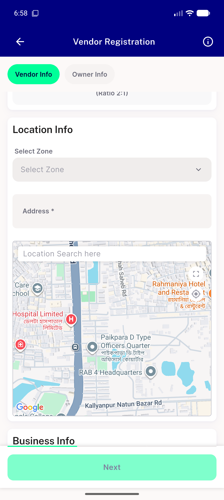
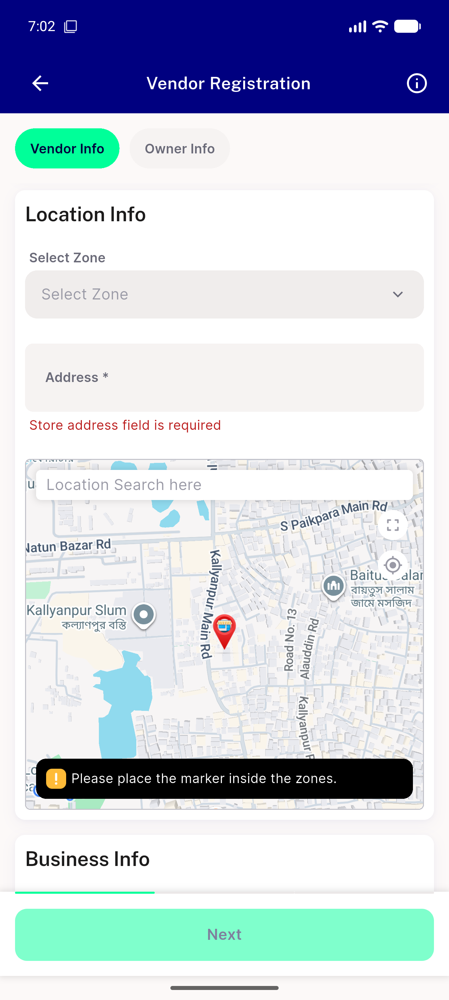

# QA Evidence — NEARS-2002

**PREMISE FALSIFIED — no loop (0 dispatches in 120s hold), no ANR; designed out-of-zone UX confirmed**

**2 screenshot(s).** Click any thumbnail for full resolution.

<table>
<tr>
<td align="center" width="33%"> storereg map out of zone</td>
<td align="center" width="33%"> designed out of zone toast app responsive</td>
</tr>
</table>

### Other artifacts
- [`live-repro-logcat.log`](live-repro-logcat.log)

---
*From `nears/docs/qa-evidence/NEARS-2002/` · public-repo scrub policy (no live secrets; verified clean).*
