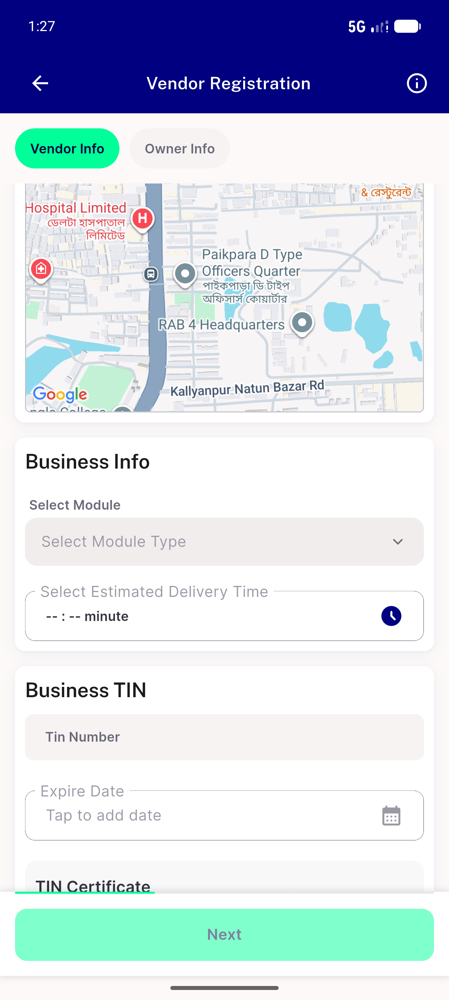
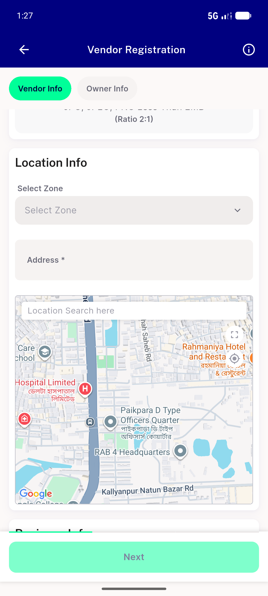
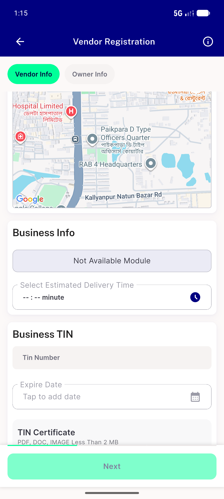
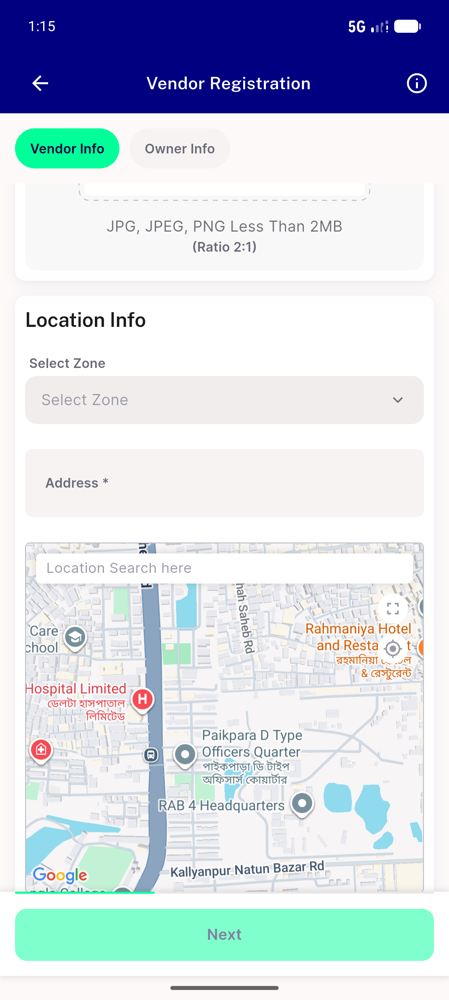
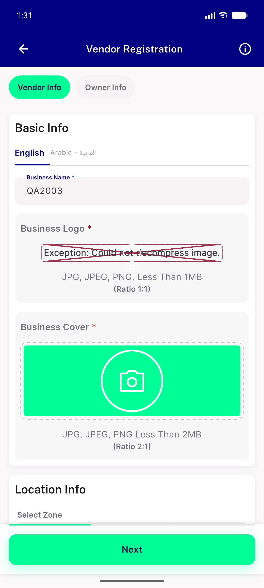
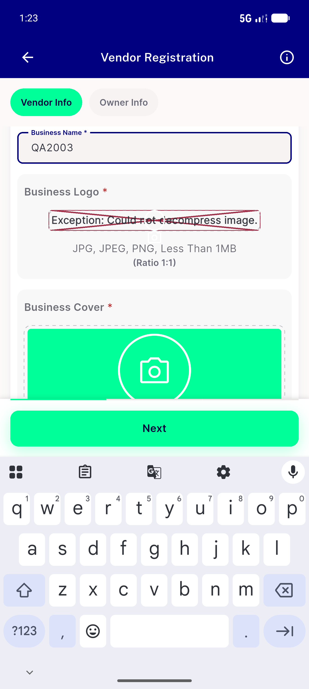
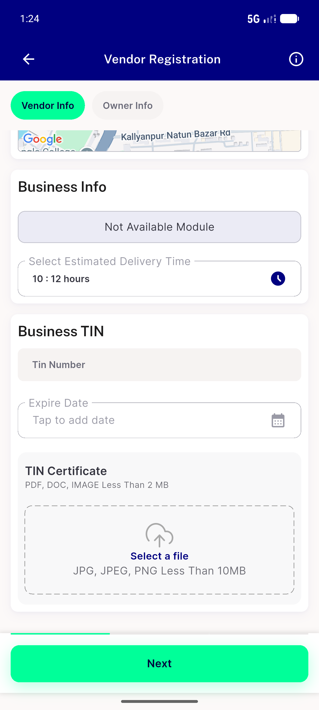
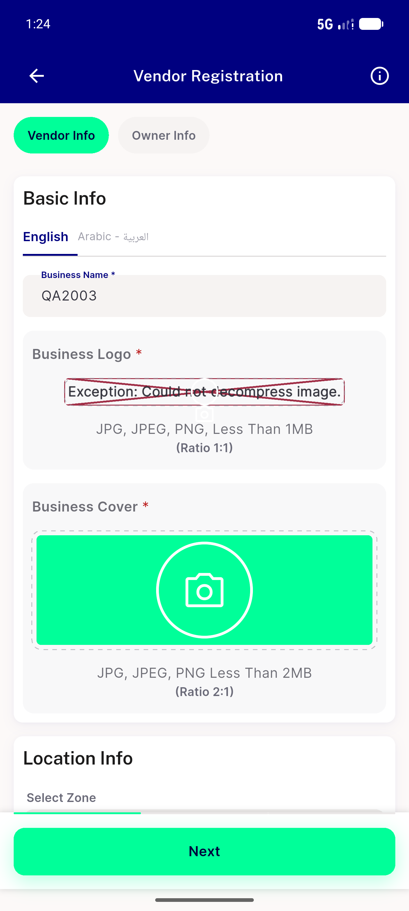
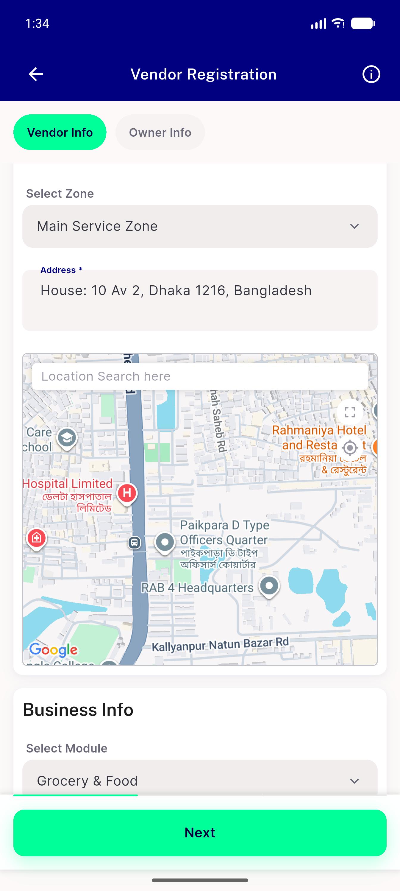
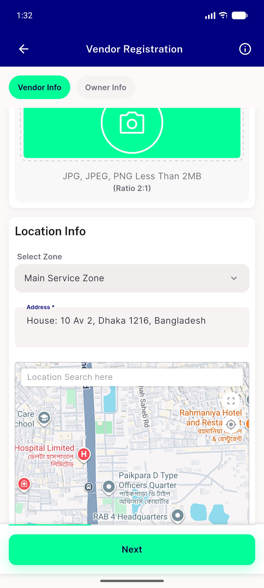

# QA Evidence — NEARS-2003

**PASS — NEARS-2003 zone sentinel -1 + NEARS-2001 step-back fix verified live on emulator-5556**

**11 screenshot(s).** Click any thumbnail for full resolution.

<table>
<tr>
<td align="center" width="33%"> ac1 POST fixed module dropdown enabled</td>
<td align="center" width="33%"> ac1 POST fixed zone unselected</td>
<td align="center" width="33%"> ac1 PRE base module not available</td>
</tr>
<tr>
<td align="center" width="33%"> ac1 PRE base zone unselected</td>
<td align="center" width="33%"> ac3 POST fixed module SURVIVED after stepback</td>
<td align="center" width="33%"> ac3 POST fixed zone SURVIVED after stepback</td>
</tr>
<tr>
<td align="center" width="33%"> ac3 PRE base before step forward</td>
<td align="center" width="33%"> ac3 PRE base module CLEARED after stepback</td>
<td align="center" width="33%"> ac3 PRE base zone CLEARED after stepback</td>
</tr>
<tr>
<td align="center" width="33%"> ac4 fixed fullscreen roundtrip preserved</td>
<td align="center" width="33%"> f1 fixed map after stepback</td>
</tr>
</table>

### Other artifacts
- [`progress.md`](progress.md)

---
*From `nears/docs/qa-evidence/NEARS-2003/` · public-repo scrub policy (no live secrets; verified clean).*
