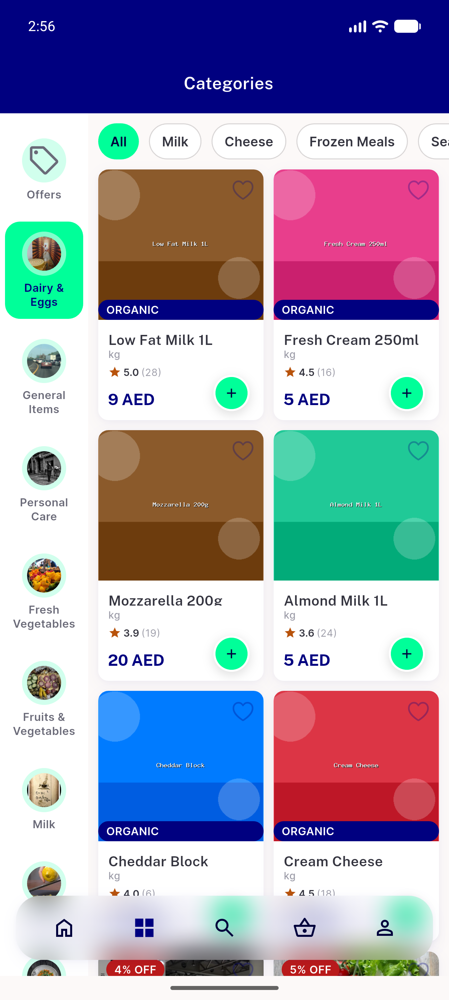
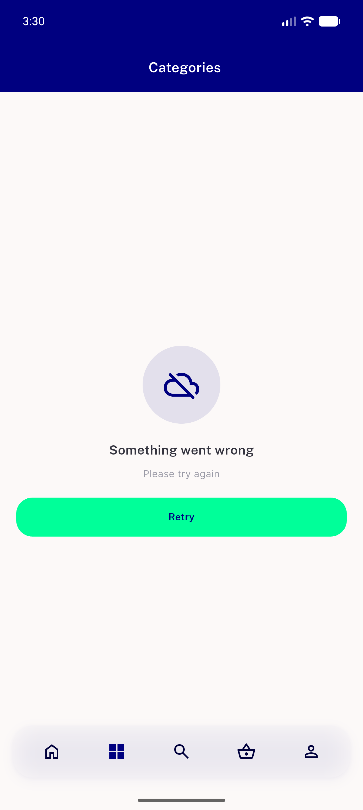
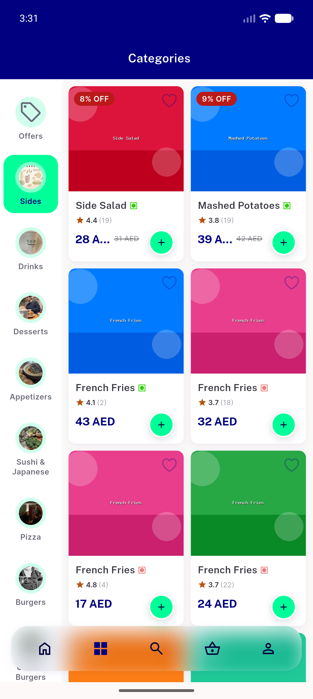
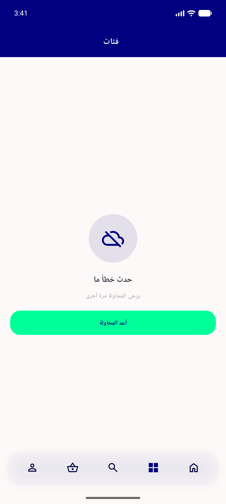
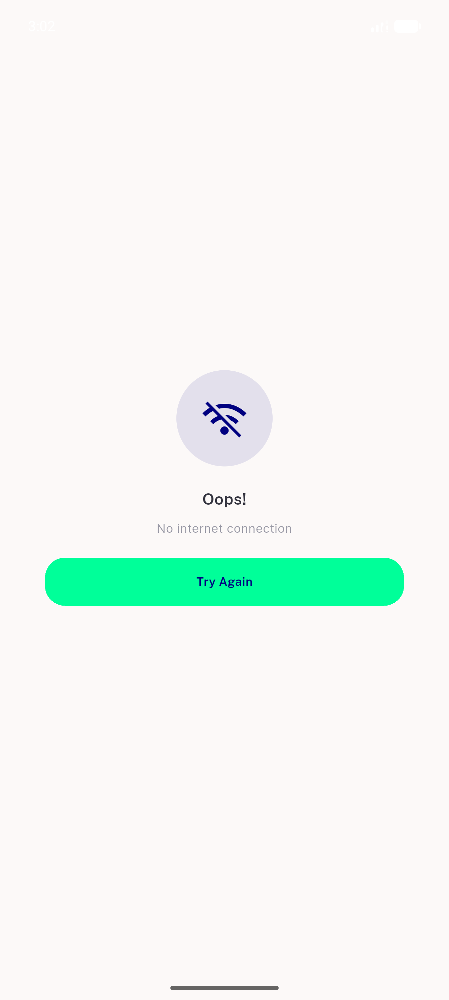
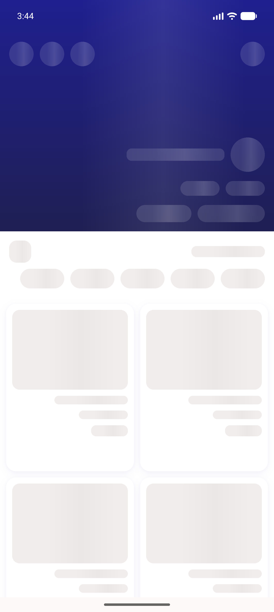
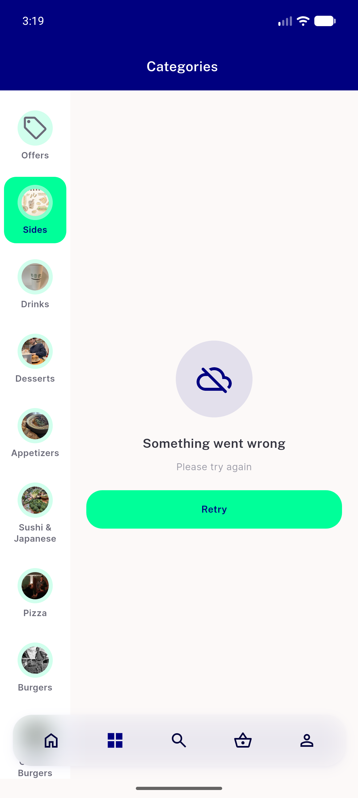
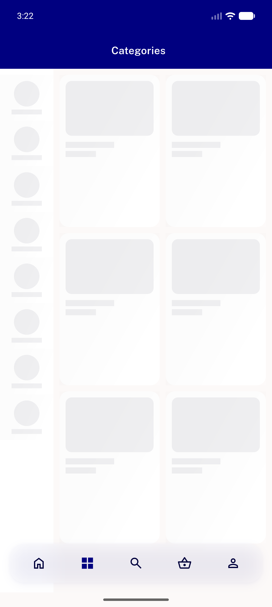
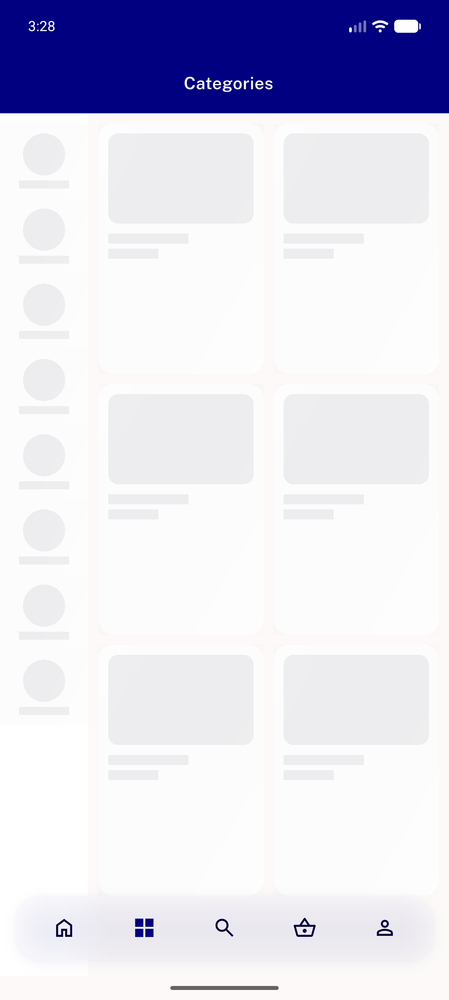

# QA Evidence — NEARS-2013

**PASS — NEARS-2013 category fetch error state: red (pre-fix endless shimmer) and green (NearsErrorRetry + working Retry) both demonstrated on emulator-5556**

**9 screenshot(s).** Click any thumbnail for full resolution.

<table>
<tr>
<td align="center" width="33%"> control 01 categories online BASE build</td>
<td align="center" width="33%"> green 01 fixed error retry state</td>
<td align="center" width="33%"> green 02 fixed after retry list loads</td>
</tr>
<tr>
<td align="center" width="33%"> green 03 fixed error retry arabic rtl</td>
<td align="center" width="33%"> note 01 hard offline routes to nointernetscreen</td>
<td align="center" width="33%"> note 02 store screen zero labelled nodes injector OFF</td>
</tr>
<tr>
<td align="center" width="33%"> red 01 prefix shimmer T12s</td>
<td align="center" width="33%"> red 01 prefix shimmer T15s</td>
<td align="center" width="33%"> red 02 prefix shimmer still after 4min</td>
</tr>
</table>

### Other artifacts
- [`bug-prefix-back-button-test-failure.log`](bug-prefix-back-button-test-failure.log)
- [`progress.md`](progress.md)

---
*From `nears/docs/qa-evidence/NEARS-2013/` · public-repo scrub policy (no live secrets; verified clean).*
