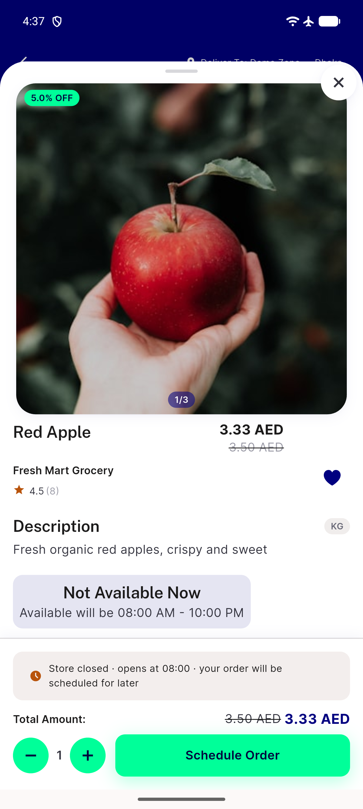
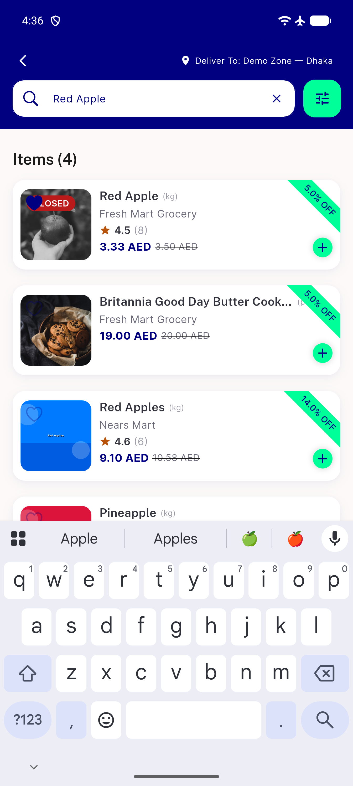
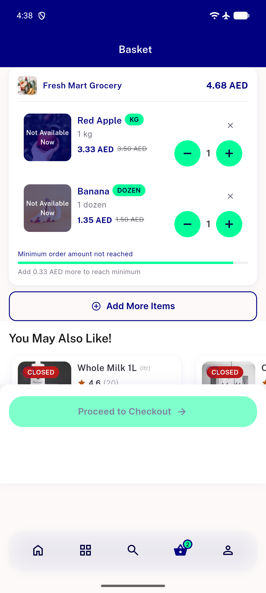
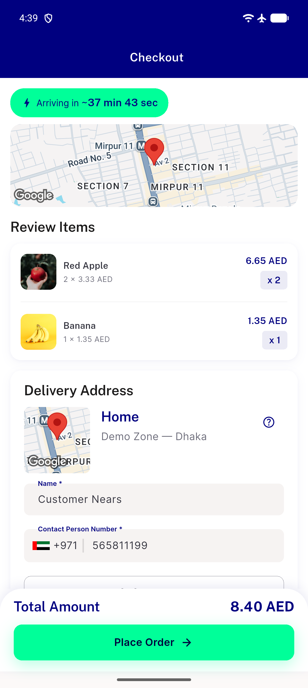

# QA Evidence — NEARS-2020

**PASS — price rounding toFixed round() confirmed live, AC3 exact order_amount match (52.47/52.47)**

**6 screenshot(s).** Click any thumbnail for full resolution.

<table>
<tr>
<td align="center" width="33%"> ac1 item detail rounded</td>
<td align="center" width="33%"> ac1 search results rounded</td>
<td align="center" width="33%"> ac2 cart regression</td>
</tr>
<tr>
<td align="center" width="33%"> ac2 checkout lineitem</td>
<td align="center" width="33%"> ac3 checkout total 52.47</td>
<td align="center" width="33%"> ar locale spotcheck</td>
</tr>
</table>

### Other artifacts
- [`bug-item-widget-renderflex-overflow.log`](bug-item-widget-renderflex-overflow.log)

---
*From `nears/docs/qa-evidence/NEARS-2020/` · public-repo scrub policy (no live secrets; verified clean).*
