# QA Evidence — NEARS-2026

**PASS — AC1/AC2/AC3/AC4 all demonstrated live on emulator-5556; polygon+marker+camera restored on step-back, fresh entry unaffected**

**13 screenshot(s).** Click any thumbnail for full resolution.

<table>
<tr>
<td align="center" width="33%"><a href="ac1-ac2-ac3-after-stepback-full.png">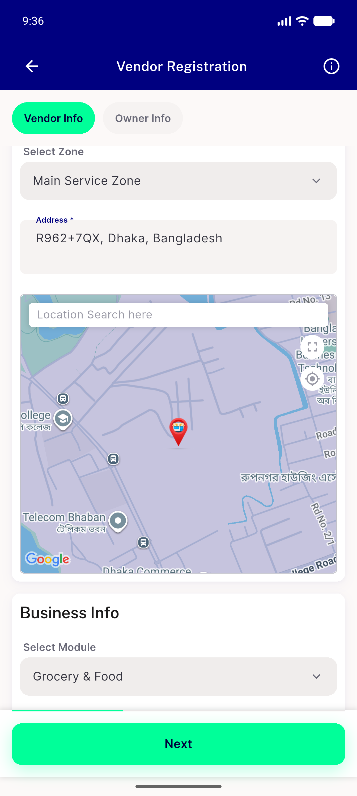</a> ac1 ac2 ac3 after stepback full</td>
<td align="center" width="33%"><a href="ac1-ac2-ac3-after-stepback-map.png">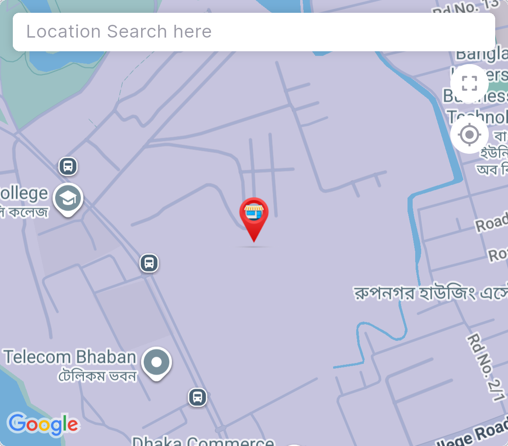</a> ac1 ac2 ac3 after stepback map</td>
<td align="center" width="33%"><a href="ac4-cold-entry-full.png">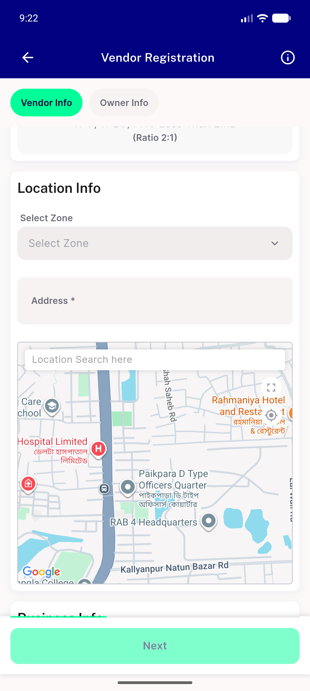</a> ac4 cold entry full</td>
</tr>
<tr>
<td align="center" width="33%"><a href="ac4-cold-entry-map.png">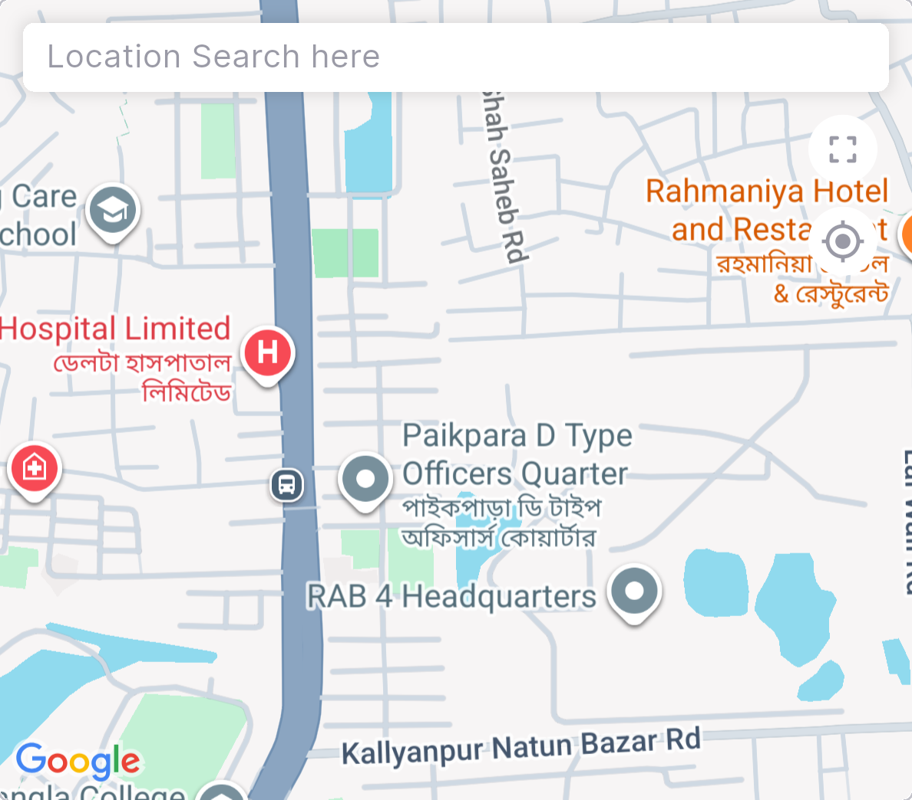</a> ac4 cold entry map</td>
<td align="center" width="33%"><a href="ac4-fresh-reentry-full.png">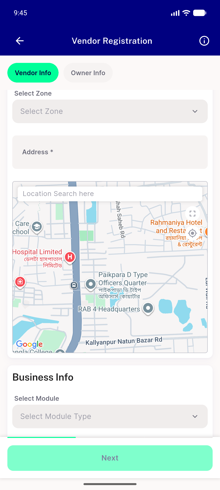</a> ac4 fresh reentry full</td>
<td align="center" width="33%"> ac4 fresh reentry map</td>
</tr>
<tr>
<td align="center" width="33%"><a href="nears2057-module-dropdown-populated-after-stepback.png">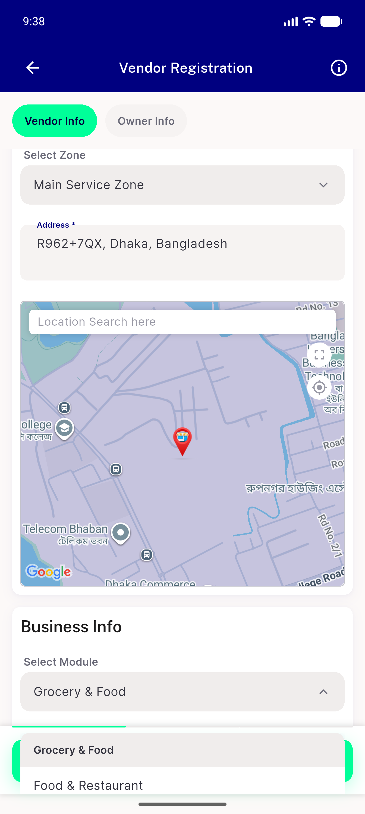</a> nears2057 module dropdown populated after stepback</td>
<td align="center" width="33%"><a href="outofzone-banner-and-disabled-next.png">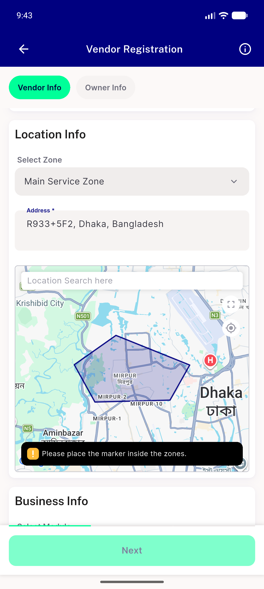</a> outofzone banner and disabled next</td>
<td align="center" width="33%"><a href="predeparture-full.png">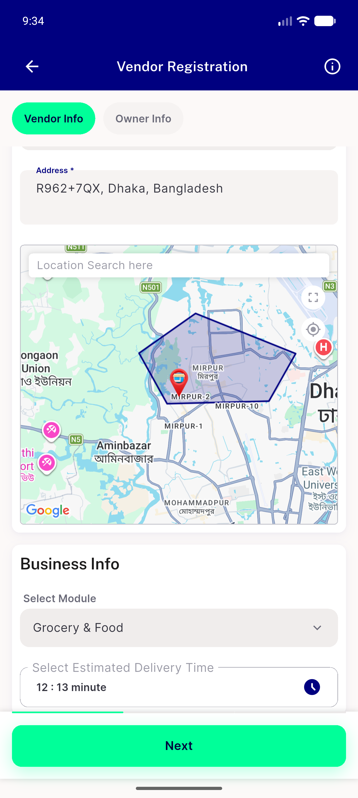</a> predeparture full</td>
</tr>
<tr>
<td align="center" width="33%"><a href="predeparture-map.png">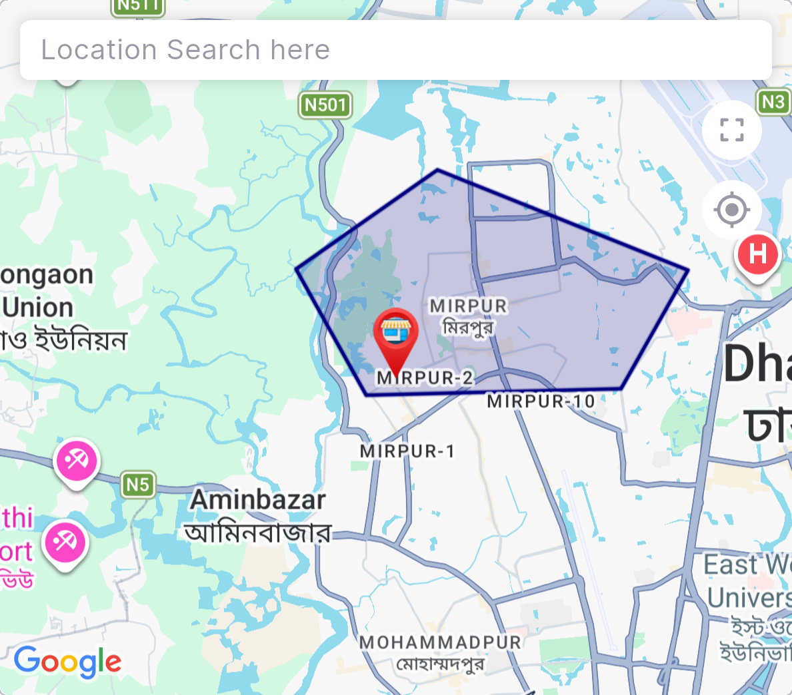</a> predeparture map</td>
<td align="center" width="33%"><a href="q8-fullscreen-map-known-default-centre.png">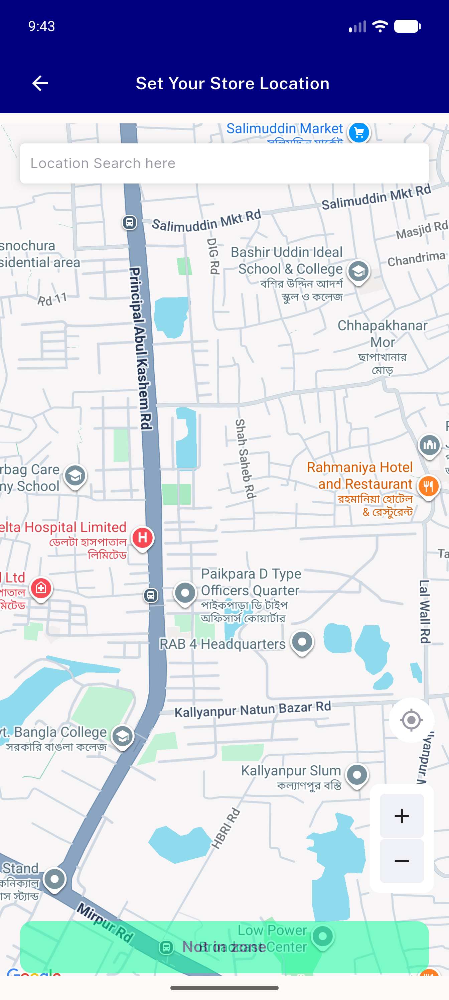</a> q8 fullscreen map known default centre</td>
<td align="center" width="33%"><a href="step-zone-selected-full.png">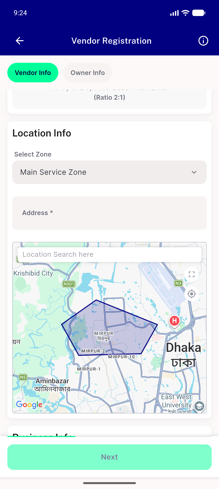</a> step zone selected full</td>
</tr>
<tr>
<td align="center" width="33%"><a href="step-zone-selected-map.png">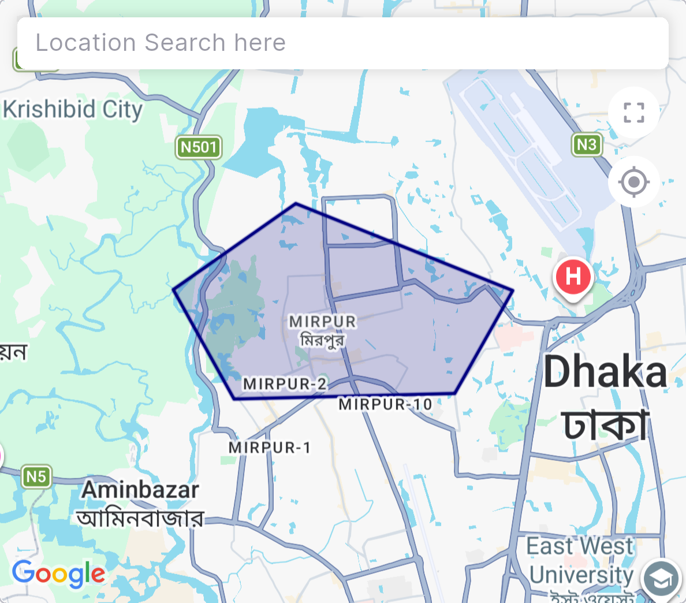</a> step zone selected map</td>
</tr>
</table>

### Other artifacts
- [`progress.md`](progress.md)

---
*From `nears/docs/qa-evidence/NEARS-2026/` · public-repo scrub policy (no live secrets; verified clean).*
