# QA Evidence — NEARS-2027

**PASS (3/3 reachable ACs) — desktop submit blocks on validation, no RangeError; AC1 zone-unset NOT TESTED (env-blocked)**

**12 screenshot(s).** Click any thumbnail for full resolution.

<table>
<tr>
<td align="center" width="33%"><a href="00-launch.png">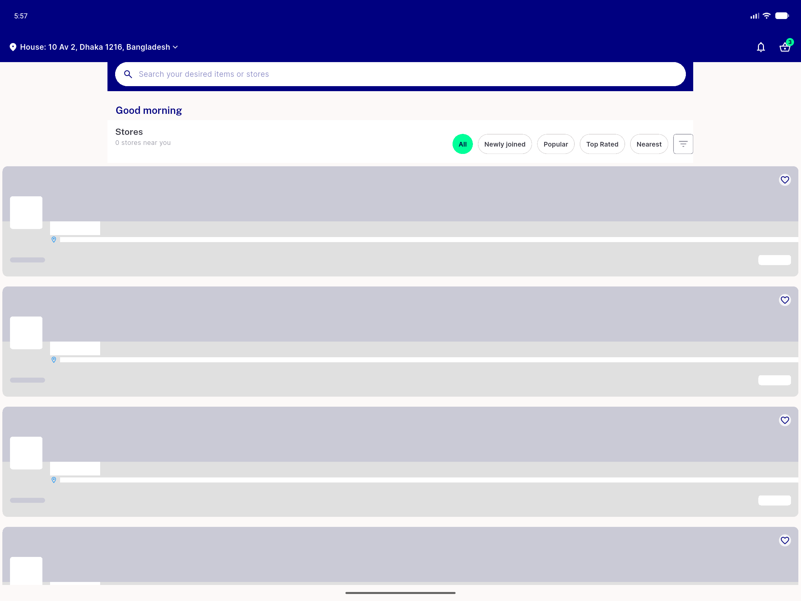</a> launch</td>
<td align="center" width="33%"><a href="01-mobile-arm-control.png">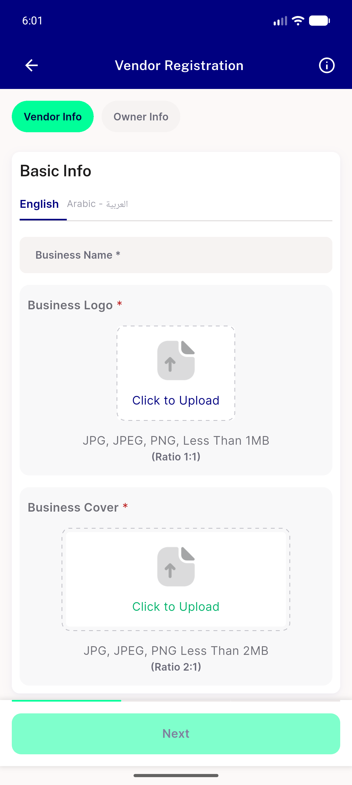</a> mobile arm control</td>
<td align="center" width="33%"><a href="02-desktop-arm-control.png">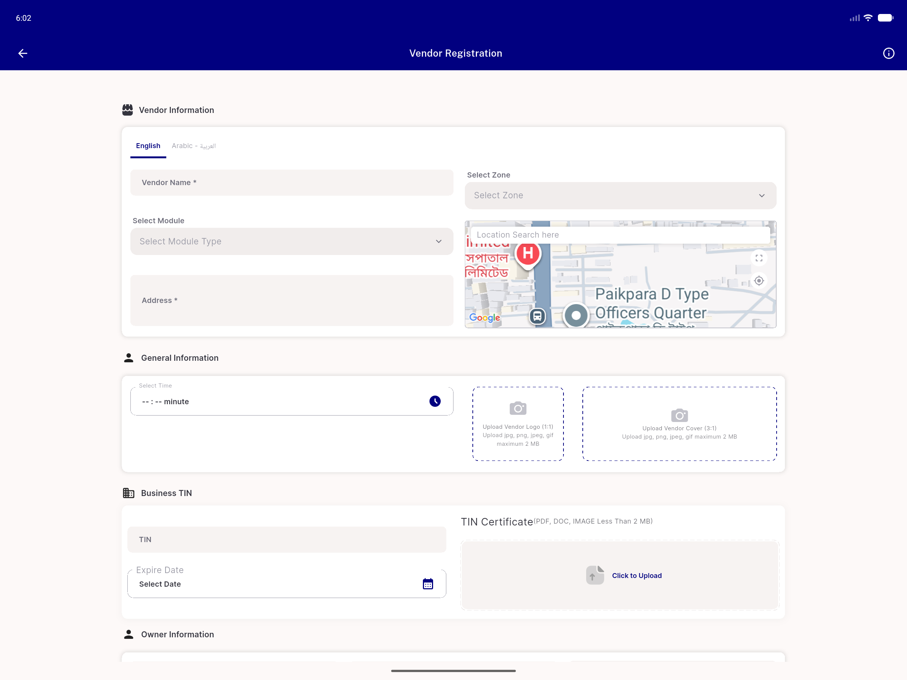</a> desktop arm control</td>
</tr>
<tr>
<td align="center" width="33%"><a href="03-zone-autoselected.png">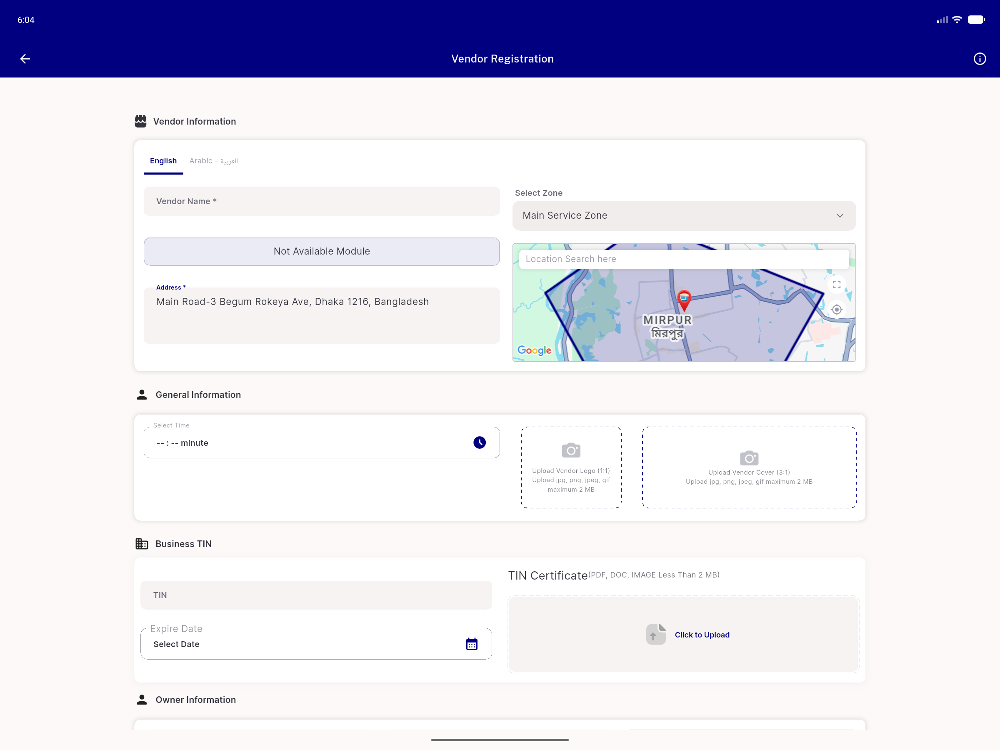</a> zone autoselected</td>
<td align="center" width="33%"><a href="04-state-after-zone-select.png">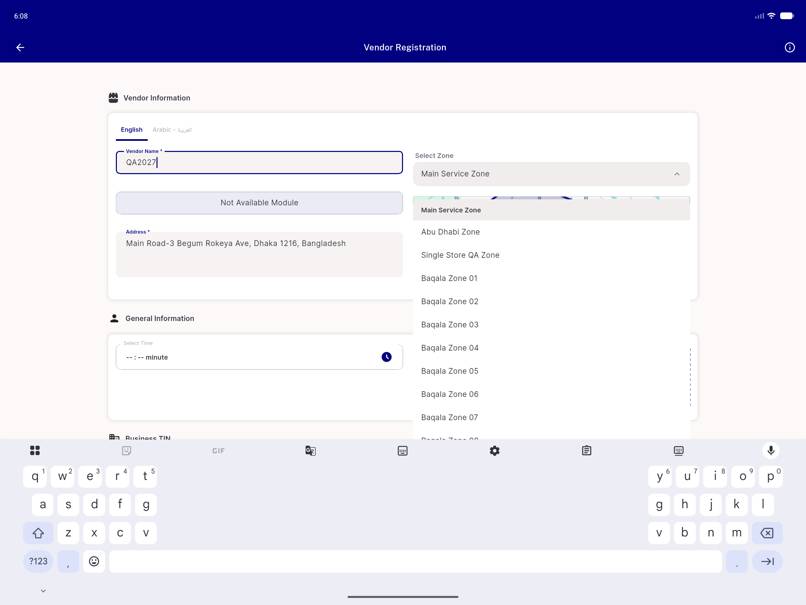</a> state after zone select</td>
<td align="center" width="33%"><a href="05-scroll-check.png">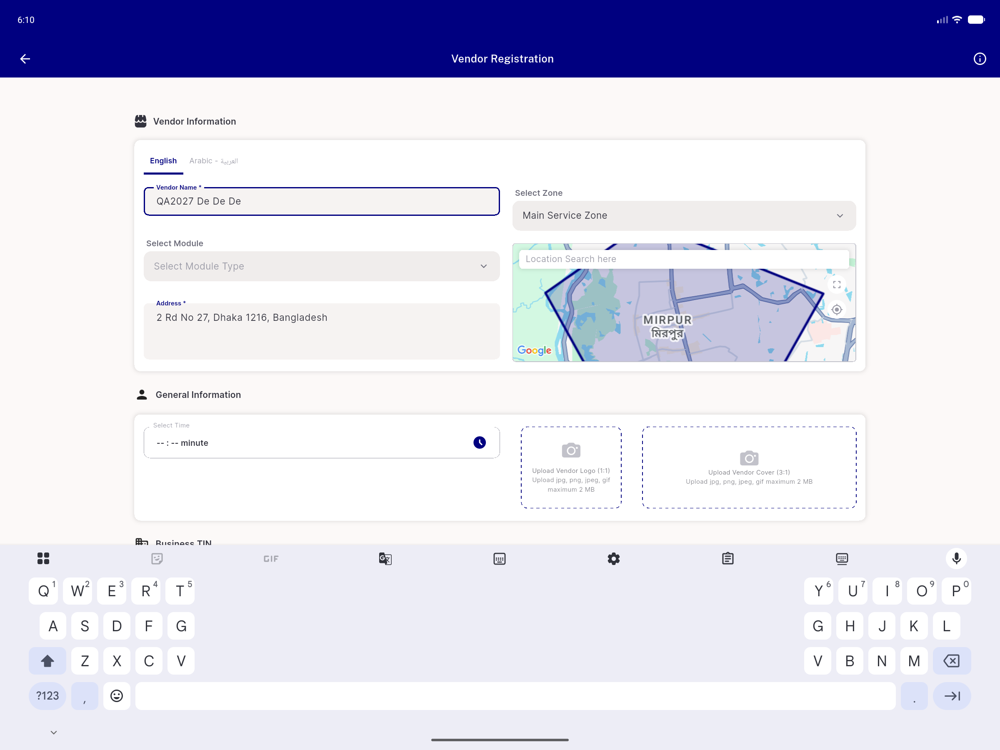</a> scroll check</td>
</tr>
<tr>
<td align="center" width="33%"><a href="06-ac1-module-unset-blocked.png">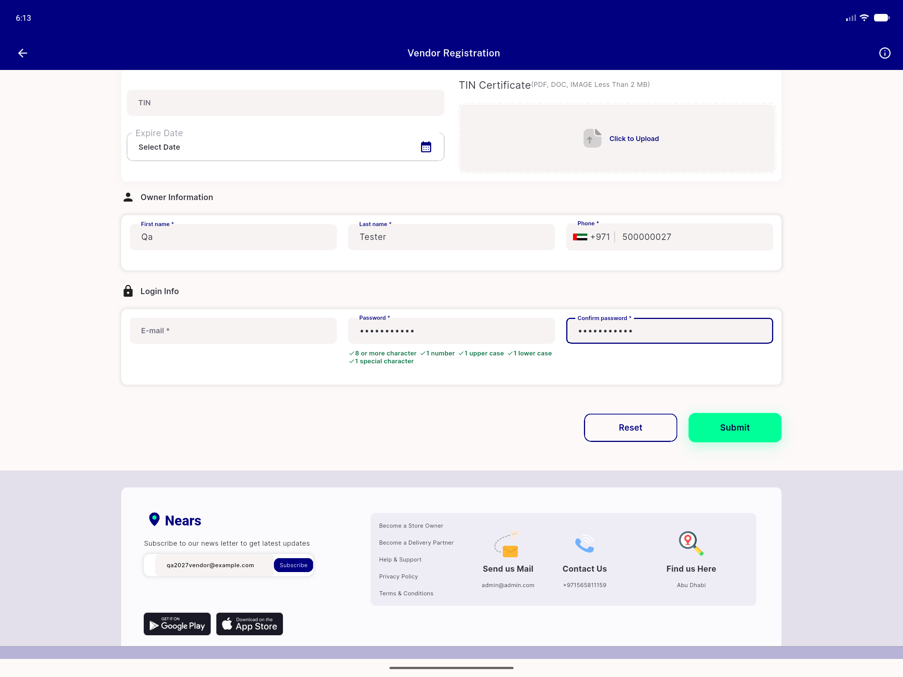</a> ac1 module unset blocked</td>
<td align="center" width="33%"><a href="07-ac1-module-unset-snackbar.png">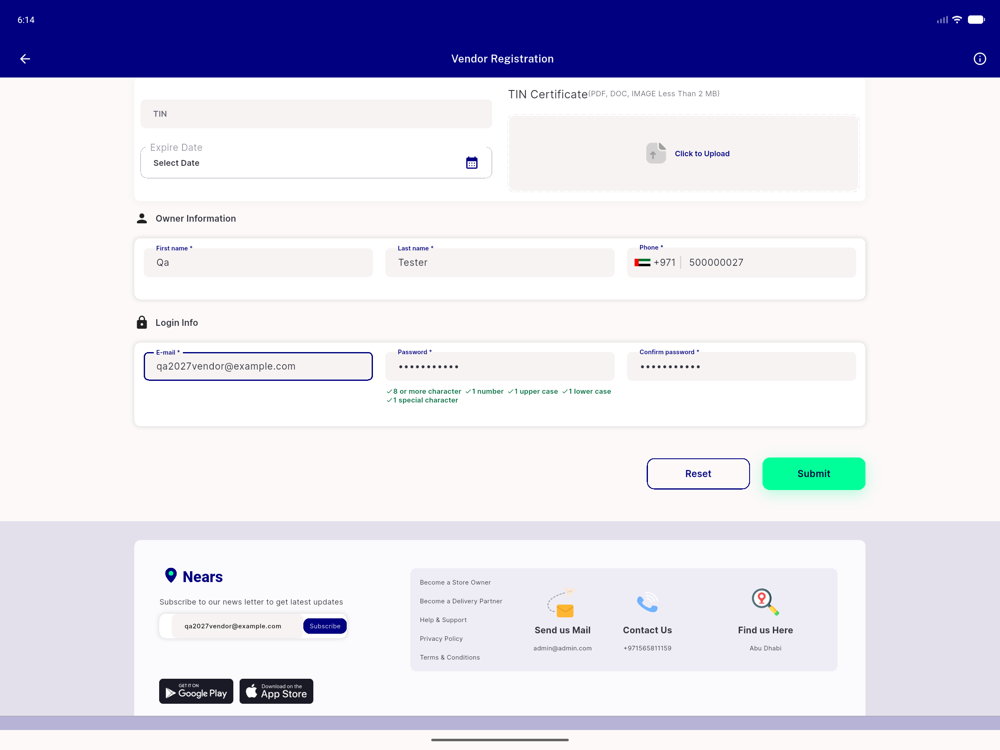</a> ac1 module unset snackbar</td>
<td align="center" width="33%"><a href="08-time-picker.png">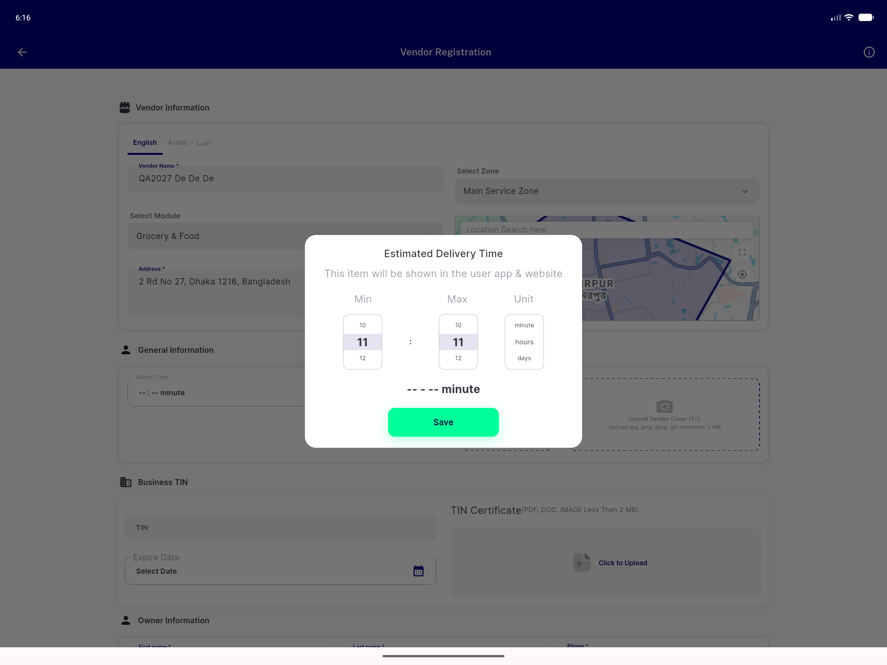</a> time picker</td>
</tr>
<tr>
<td align="center" width="33%"><a href="09-ac2-advanced-to-0.9.png">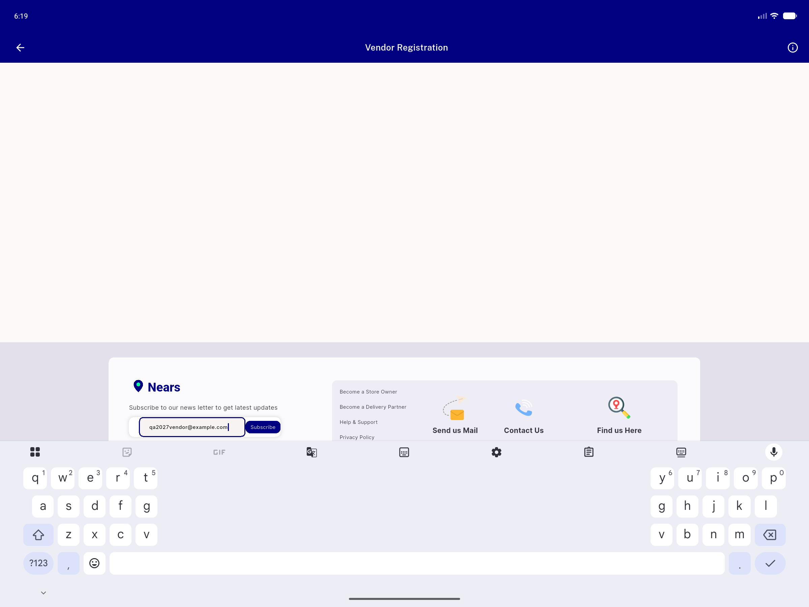</a> ac2 advanced to 0.9</td>
<td align="center" width="33%"><a href="10-mobile-step1.png">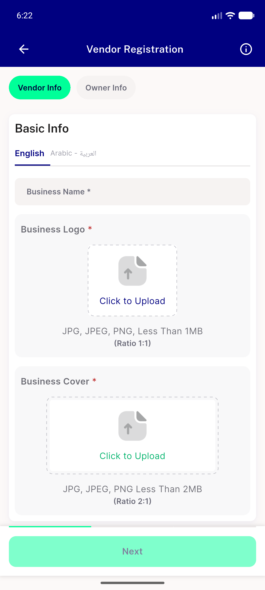</a> mobile step1</td>
<td align="center" width="33%"><a href="11-mobile-arm-regression.png">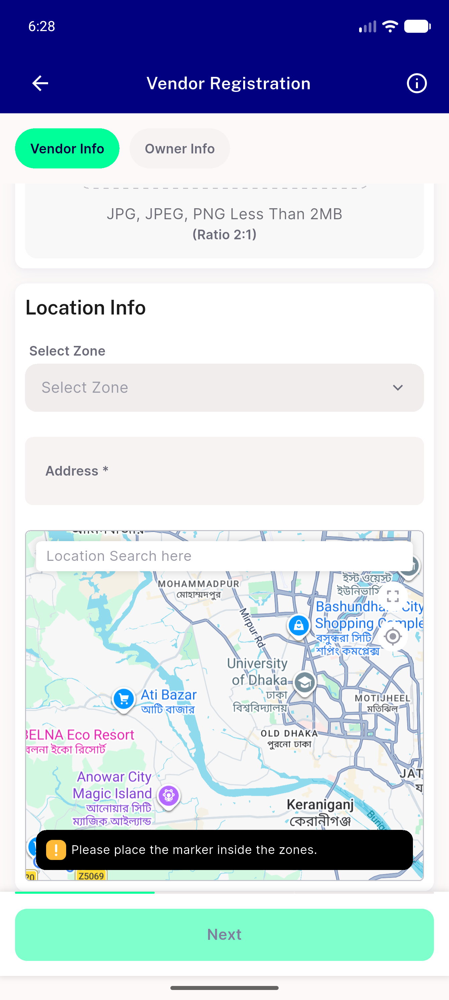</a> mobile arm regression</td>
</tr>
</table>

### Other artifacts
- [`ac3-two-taps-no-rangeerror.log`](ac3-two-taps-no-rangeerror.log)
- [`progress.md`](progress.md)

---
*From `nears/docs/qa-evidence/NEARS-2027/` · public-repo scrub policy (no live secrets; verified clean).*
