# QA Evidence — NEARS-2029

**PASS — module dropdown disabled+cued until a zone is picked (AC1 mobile+desktop, AC2 guard); AC3 NOT TESTED live (NEARS-2058)**

**12 screenshot(s).** Click any thumbnail for full resolution.

<table>
<tr>
<td align="center" width="33%"><a href="ac1-01-module-disabled-please-select-zone.png">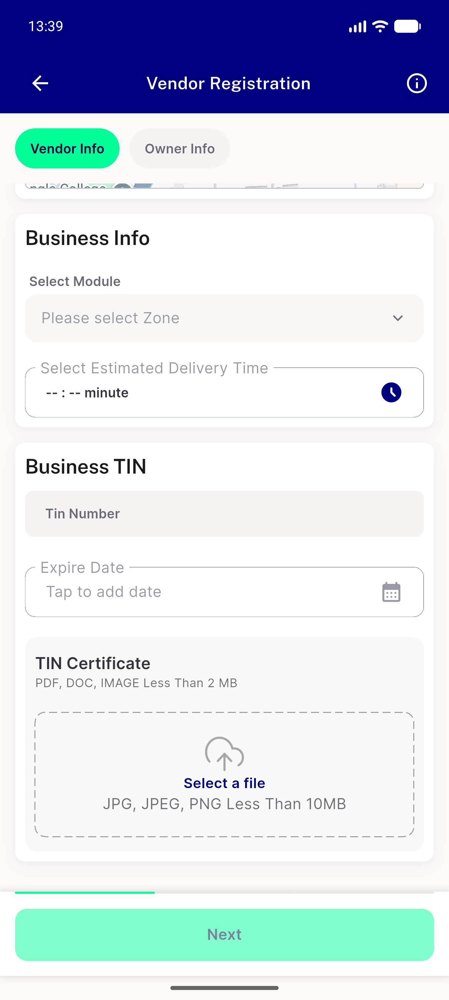</a> ac1 01 module disabled please select zone</td>
<td align="center" width="33%"> ac1 02 after tap no overlay</td>
<td align="center" width="33%"><a href="ac1-03-sidebyside-disabled-top-enabled-bottom.png">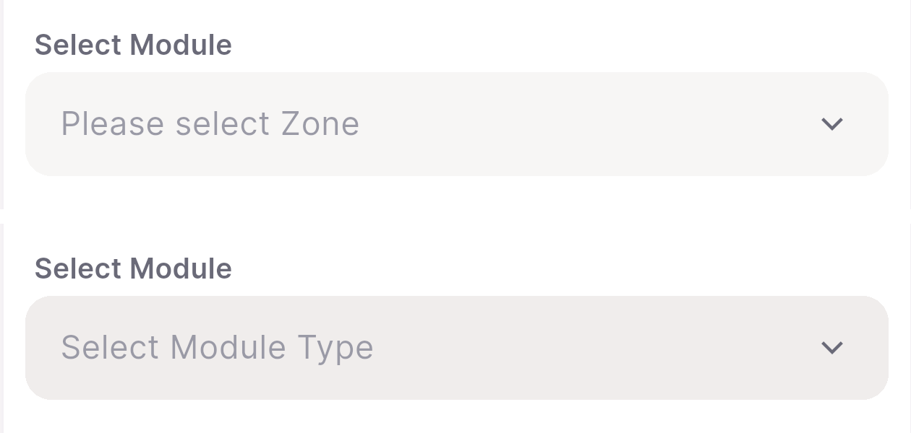</a> ac1 03 sidebyside disabled top enabled bottom</td>
</tr>
<tr>
<td align="center" width="33%"><a href="ac1-04-desktop-arm-disabled-1600x1200dp.png">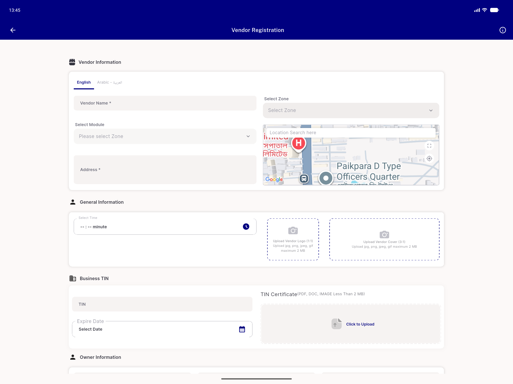</a> ac1 04 desktop arm disabled 1600x1200dp</td>
<td align="center" width="33%"><a href="ac2-01-module-enabled-after-zone.png">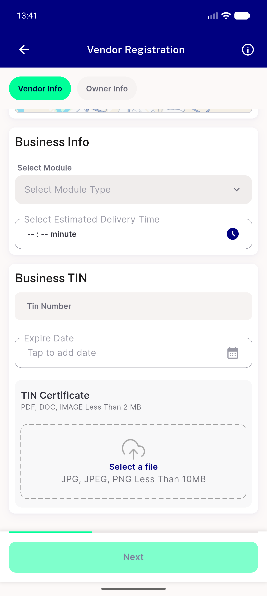</a> ac2 01 module enabled after zone</td>
<td align="center" width="33%"><a href="ac2-02-module-overlay-zone3-modules.png">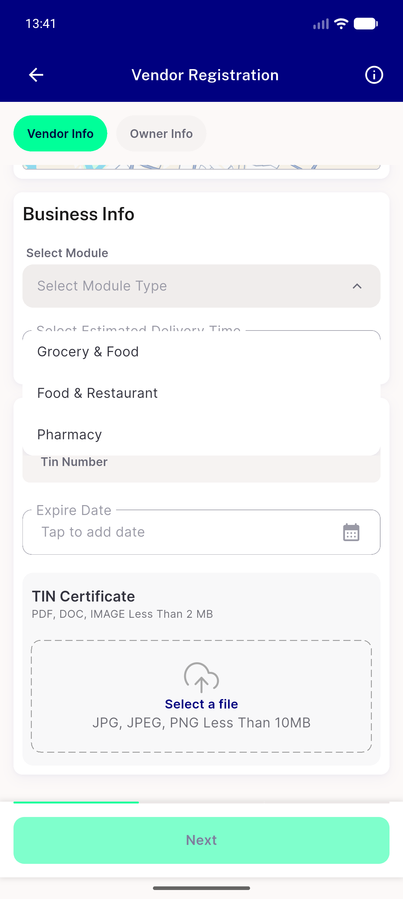</a> ac2 02 module overlay zone3 modules</td>
</tr>
<tr>
<td align="center" width="33%"><a href="prefix-01-vendor-info-top.png">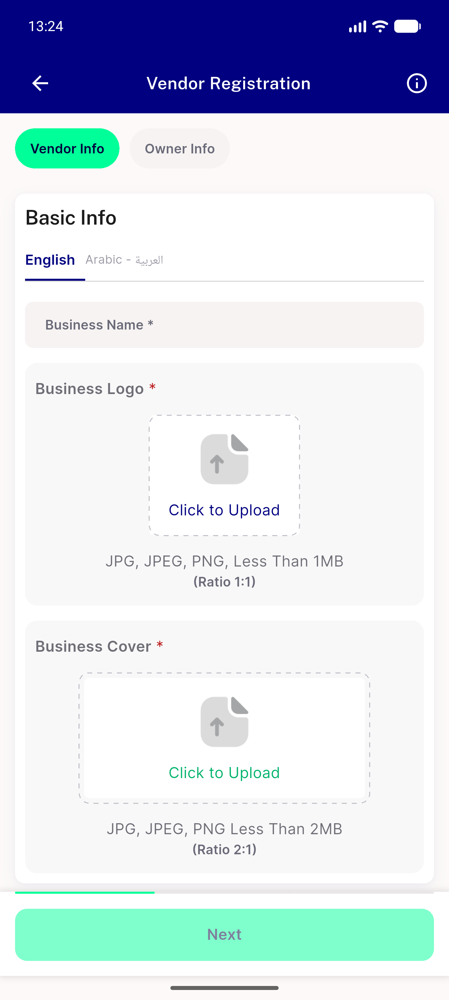</a> prefix 01 vendor info top</td>
<td align="center" width="33%"><a href="prefix-02-module-trigger-enabled.png">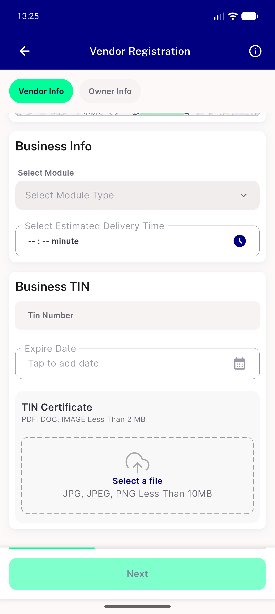</a> prefix 02 module trigger enabled</td>
<td align="center" width="33%"><a href="prefix-03-module-overlay-open-nonempty.png">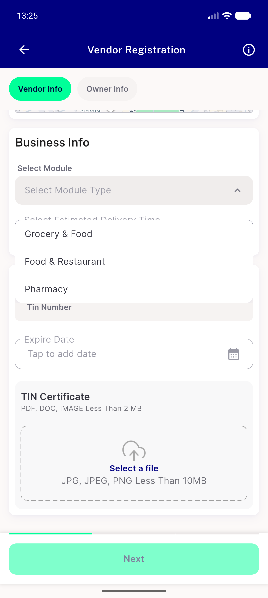</a> prefix 03 module overlay open nonempty</td>
</tr>
<tr>
<td align="center" width="33%"><a href="regr-01-nears2057-not-available-module-unchanged.png">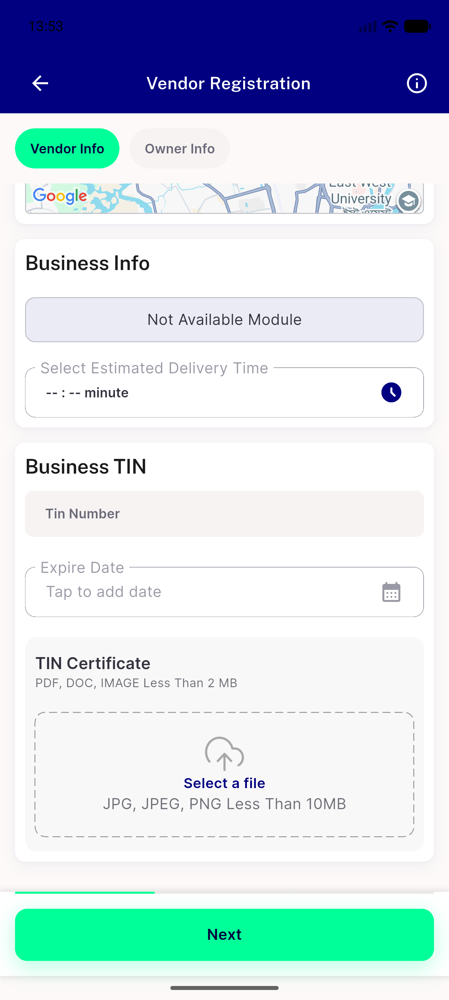</a> regr 01 nears2057 not available module unchanged</td>
<td align="center" width="33%"><a href="rtl-01-module-disabled-arabic.png">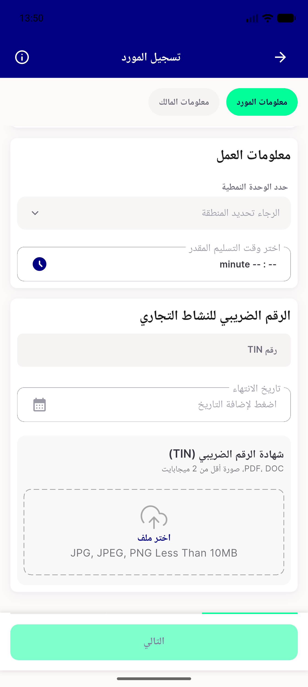</a> rtl 01 module disabled arabic</td>
<td align="center" width="33%"><a href="rtl-02-crop-trigger.png">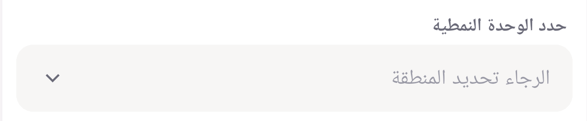</a> rtl 02 crop trigger</td>
</tr>
</table>

### Other artifacts
- [`bug-module-zone-param-ignored.log`](bug-module-zone-param-ignored.log)
- [`progress.md`](progress.md)

---
*From `nears/docs/qa-evidence/NEARS-2029/` · public-repo scrub policy (no live secrets; verified clean).*
