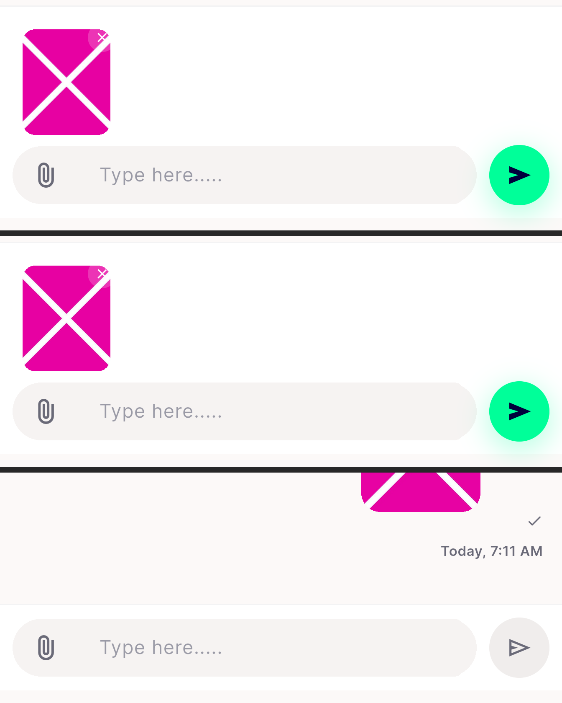
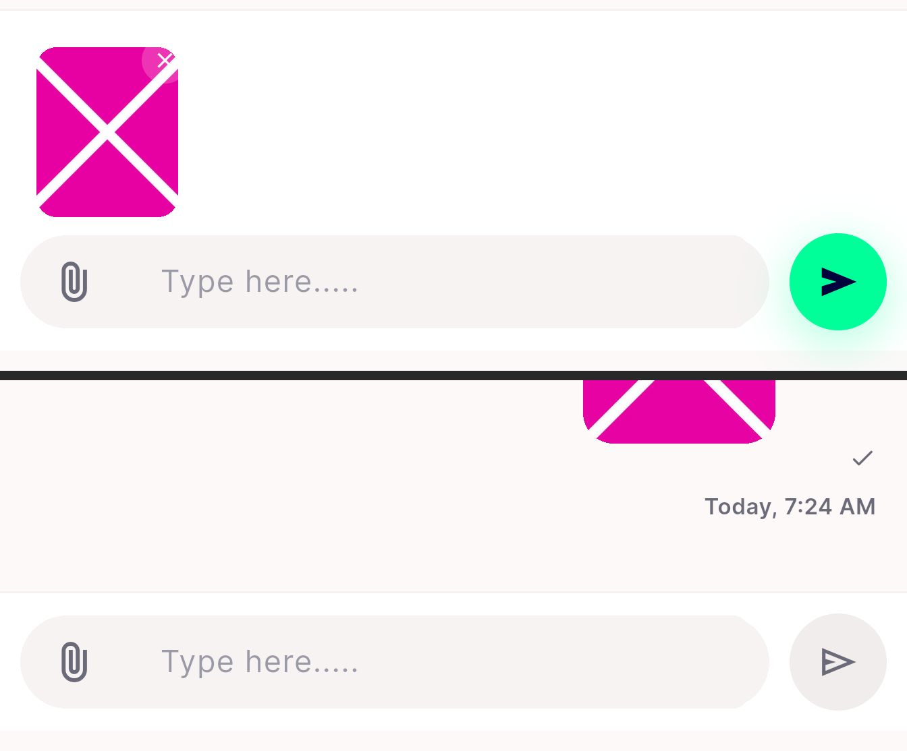

# QA Evidence — NEARS-2037

**PASS — staged chat attachments cleared at logout; RED reproduced on base 4081ca9a, GREEN on fix HEAD**

**3 screenshot(s).** Click any thumbnail for full resolution.

<table>
<tr>
<td align="center" width="33%"> ac1 composer red vs green</td>
<td align="center" width="33%"> ac2 stage and send no logout</td>
<td align="center" width="33%"> p9 vendor thread after relogin</td>
</tr>
</table>

---
*From `nears/docs/qa-evidence/NEARS-2037/` · public-repo scrub policy (no live secrets; verified clean).*
