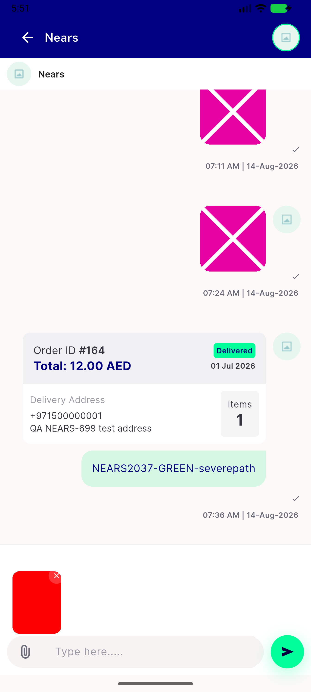
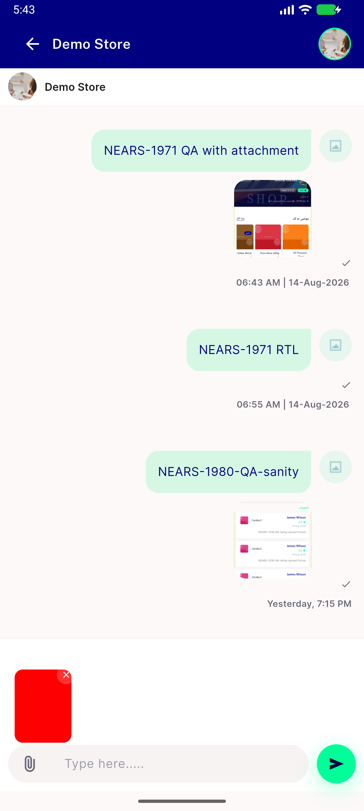

# QA Evidence — NEARS-2038

**FAIL — AC1 device-level a11y-bounds miss confirmed live; AC2/AC3/AC4/AC5/AC6/AC7 pass**

**2 screenshot(s).** Click any thumbnail for full resolution.

<table>
<tr>
<td align="center" width="33%"> ac6 badge visual position</td>
<td align="center" width="33%"> bug ac1 announced bounds miss</td>
</tr>
</table>

### Other artifacts
- [`bug-ac1-announced-bounds-miss-dump.xml`](bug-ac1-announced-bounds-miss-dump.xml)

---
*From `nears/docs/qa-evidence/NEARS-2038/` · public-repo scrub policy (no live secrets; verified clean).*
