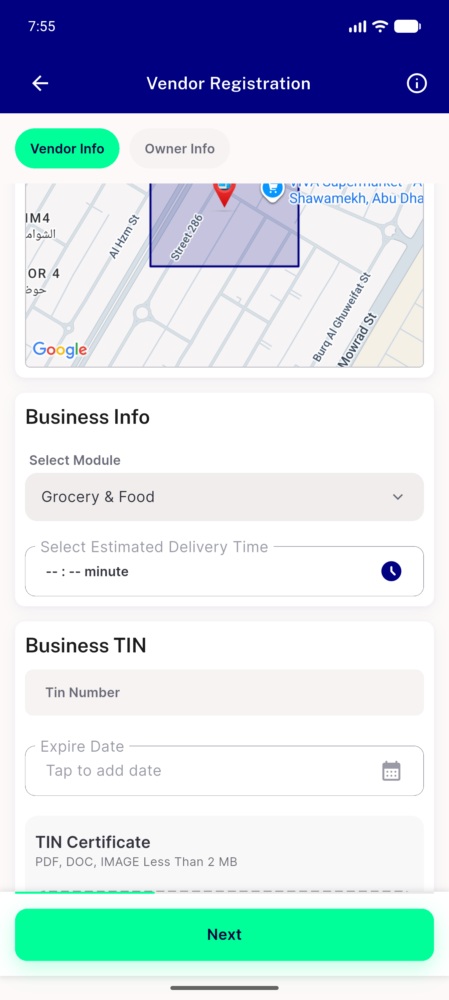
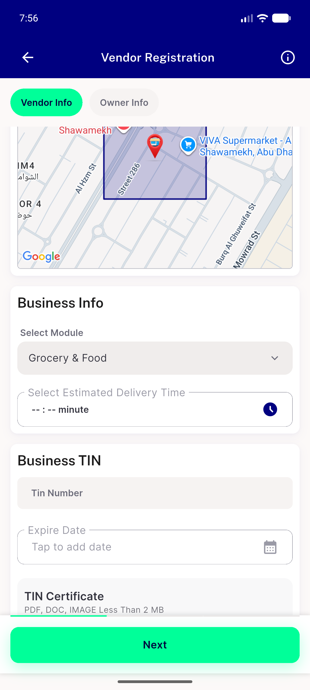
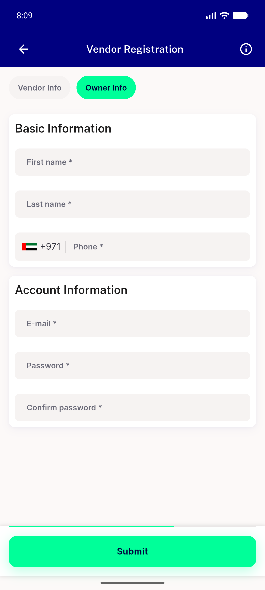
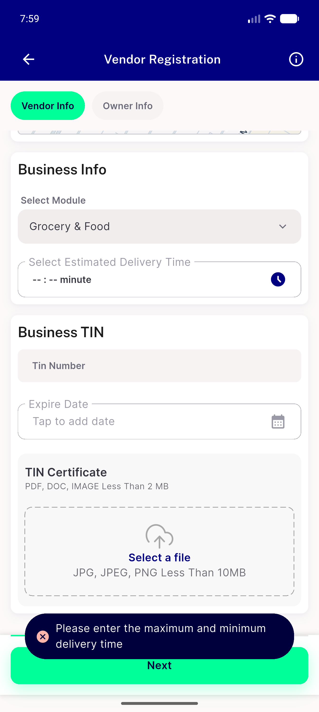
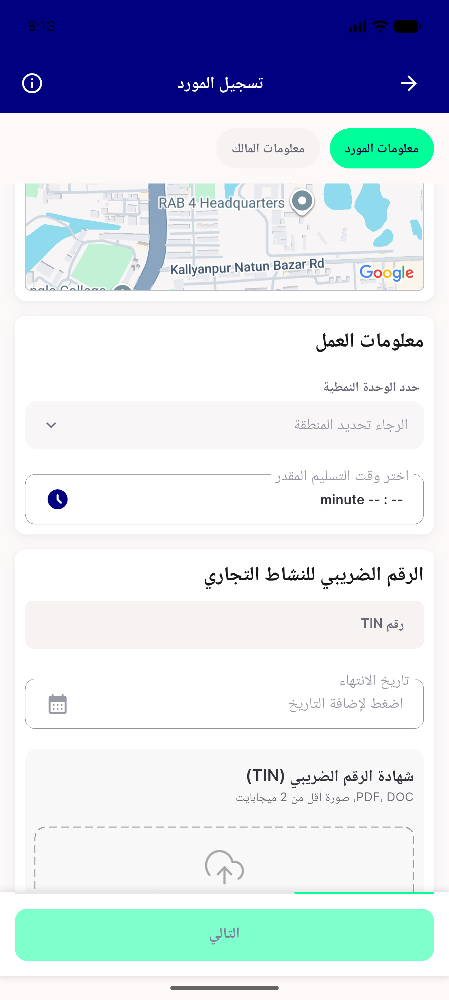
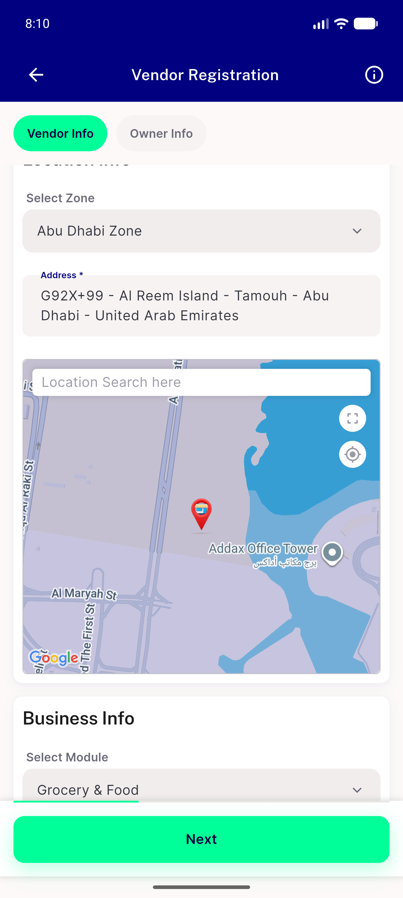

# QA Evidence — NEARS-2057

**PASS — NEARS-2057 module reload after map-driven zone detect (emulator-5554, debug APK @ 40440b44)**

**6 screenshot(s).** Click any thumbnail for full resolution.

<table>
<tr>
<td align="center" width="33%"> ac1 ac3 module selectable after map detect</td>
<td align="center" width="33%"> ac1 module selected after map detect</td>
<td align="center" width="33%"> ac3 step2 owner info submit reachable</td>
</tr>
<tr>
<td align="center" width="33%"> ac3 submit gate past module delivery time</td>
<td align="center" width="33%"> regression rtl arabic module select</td>
<td align="center" width="33%"> regression stepback polygon restored</td>
</tr>
</table>

### Other artifacts
- [`bug-module-endpoint-not-zone-scoped.log`](bug-module-endpoint-not-zone-scoped.log)

---
*From `nears/docs/qa-evidence/NEARS-2057/` · public-repo scrub policy (no live secrets; verified clean).*
