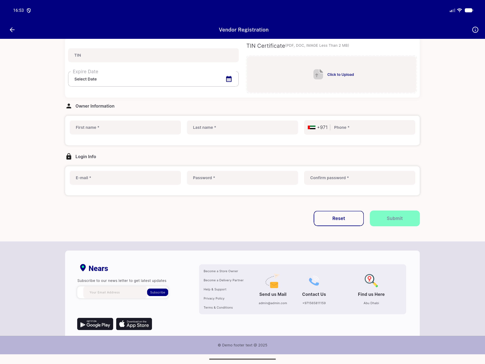

# QA Evidence — NEARS-2059

**PASS — zero live RenderFlex overflow at footer_view.dart at 1600x1200dp and 1400x1000dp; positive control fired in the same logcat buffer**

**2 screenshot(s).** Click any thumbnail for full resolution.

<table>
<tr>
<td align="center" width="33%"> ac1 1400x1000dp footer bottom</td>
<td align="center" width="33%"> ac1 1600x1200dp footer bottom</td>
</tr>
</table>

### Other artifacts
- [`ac2-subject-vs-control-split.log`](ac2-subject-vs-control-split.log)
- [`control-nrating-item-sheet.log`](control-nrating-item-sheet.log)
- [`static-analysis.md`](static-analysis.md)

---
*From `nears/docs/qa-evidence/NEARS-2059/` · public-repo scrub policy (no live secrets; verified clean).*
