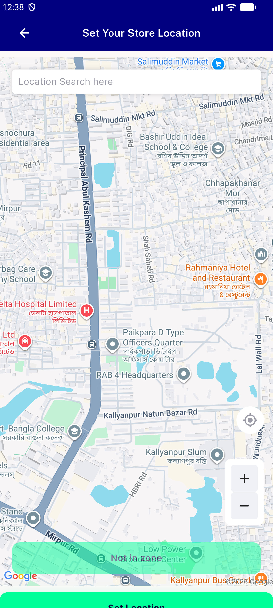
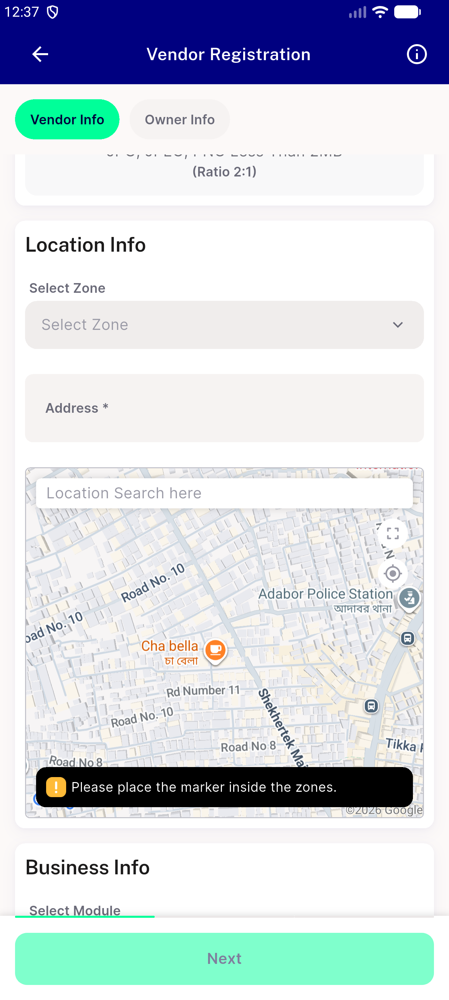
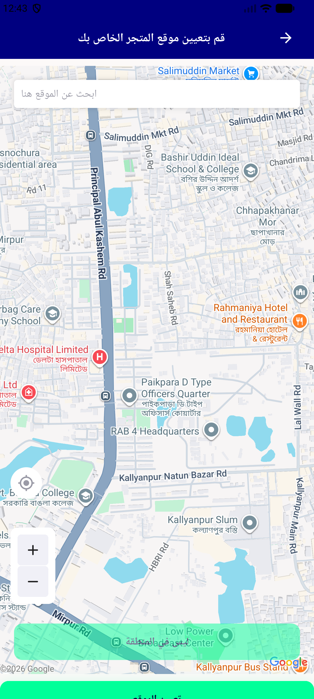
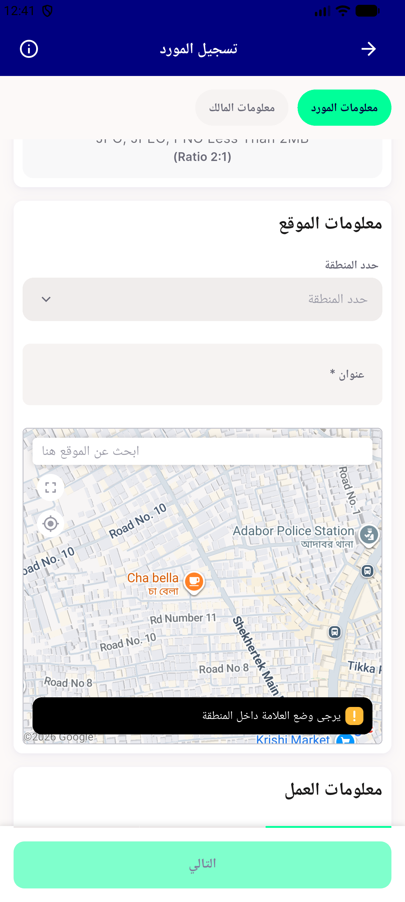

# QA Evidence — NEARS-2075

**PASS - RTL map overlay controls mirror with 15dp inset intact (emulator-5554, sha 2147f779)**

**4 screenshot(s).** Click any thumbnail for full resolution.

<table>
<tr>
<td align="center" width="33%"> ac1 ltr fullscreen map</td>
<td align="center" width="33%"> ac1 ltr inline map</td>
<td align="center" width="33%"> ac1 rtl fullscreen map</td>
</tr>
<tr>
<td align="center" width="33%"> ac1 rtl inline map</td>
</tr>
</table>

### Other artifacts
- [`bug-rtl-search-hint-not-mirrored.log`](bug-rtl-search-hint-not-mirrored.log)

---
*From `nears/docs/qa-evidence/NEARS-2075/` · public-repo scrub policy (no live secrets; verified clean).*
