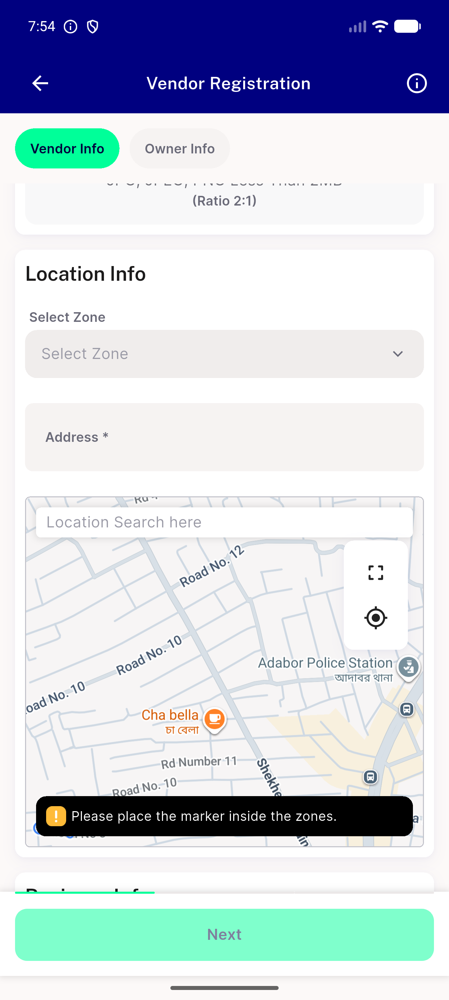

# QA Evidence — NEARS-2076

**PASS — map overlay cluster consolidated, both controls 44x44dp, distinct a11y nodes, RTL mirrors correctly, fullscreen arm pixel-unchanged**

**1 screenshot(s).** Click any thumbnail for full resolution.

<table>
<tr>
<td align="center" width="33%"> ac1 ac2 cluster after</td>
</tr>
</table>

### Other artifacts
- [`ac5-a11y-dump-ltr-distinct-buttons.xml`](ac5-a11y-dump-ltr-distinct-buttons.xml)
- [`ac6-a11y-dump-rtl-mirrored.xml`](ac6-a11y-dump-rtl-mirrored.xml)
- [`ac7-a11y-dump-fullscreen-arm-unchanged.xml`](ac7-a11y-dump-fullscreen-arm-unchanged.xml)

---
*From `nears/docs/qa-evidence/NEARS-2076/` · public-repo scrub policy (no live secrets; verified clean).*
