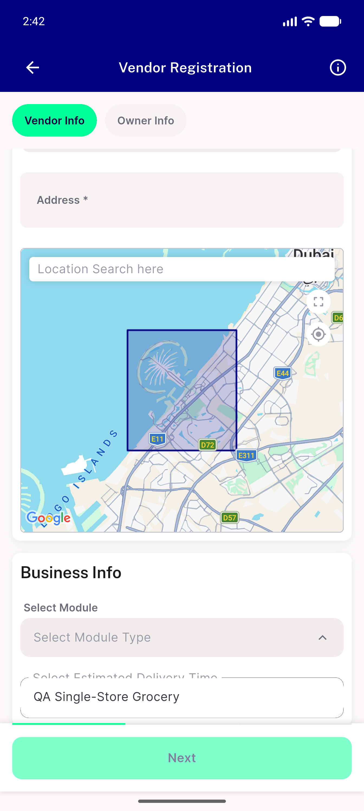
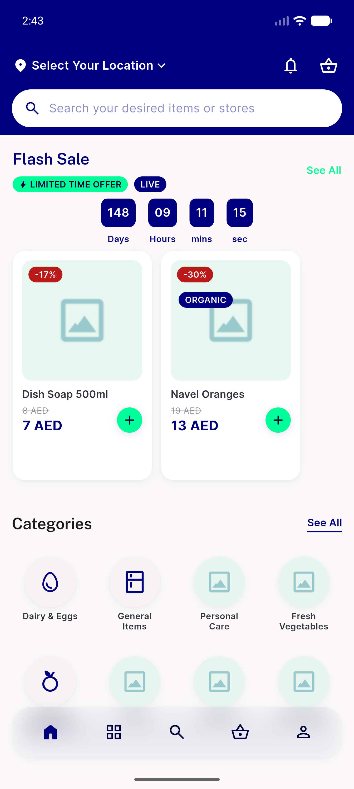
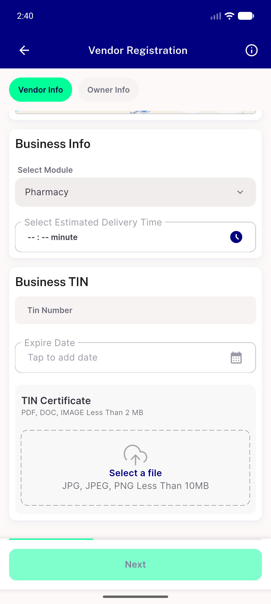

# QA Evidence — NEARS-2079

**PASS — NEARS-2079 module zone query param, 3/3 AC met, emulator-5556, SHA 18591582**

**3 screenshot(s).** Click any thumbnail for full resolution.

<table>
<tr>
<td align="center" width="33%"> ac2 zone3 dropdown only qa single store grocery</td>
<td align="center" width="33%"> ac3 customer home default zone unchanged</td>
<td align="center" width="33%"> ac3 zone2 default pharmacy selected</td>
</tr>
</table>

---
*From `nears/docs/qa-evidence/NEARS-2079/` · public-repo scrub policy (no live secrets; verified clean).*
