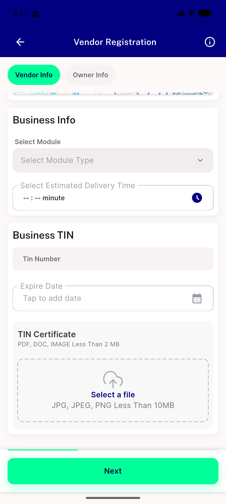
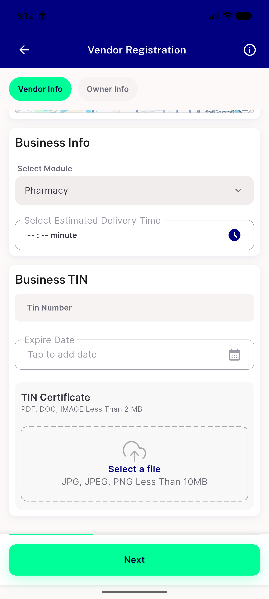
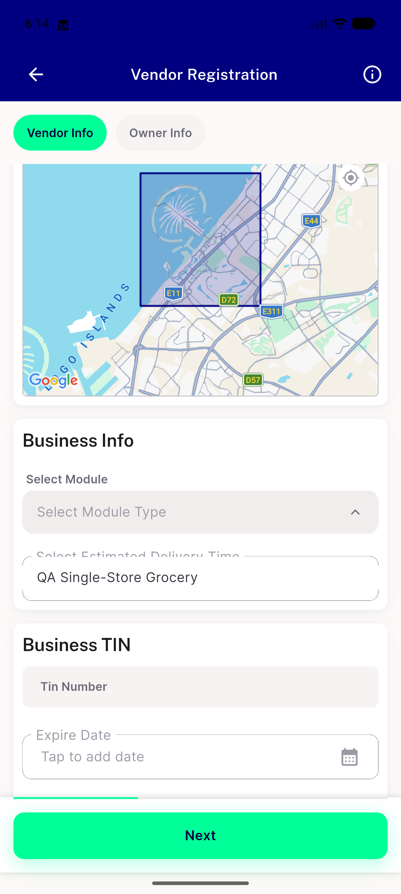
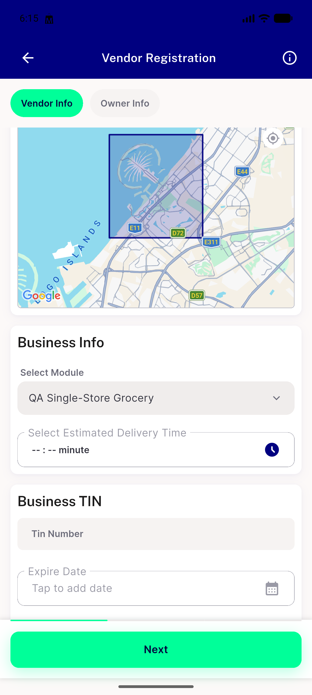

# QA Evidence — NEARS-2082

**PASS — NEARS-2082 module empty-gate: AC1 by widget test (M3/M4, independently re-reddened), AC2 live on emulator-5554**

**5 screenshot(s).** Click any thumbnail for full resolution.

<table>
<tr>
<td align="center" width="33%"> ac2 01 select enabled</td>
<td align="center" width="33%"> ac2 02 dropdown open</td>
<td align="center" width="33%"> ac2 03 module selected</td>
</tr>
<tr>
<td align="center" width="33%"> ac2 04 single module zone</td>
<td align="center" width="33%"> ac2 05 single module selected</td>
</tr>
</table>

---
*From `nears/docs/qa-evidence/NEARS-2082/` · public-repo scrub policy (no live secrets; verified clean).*
