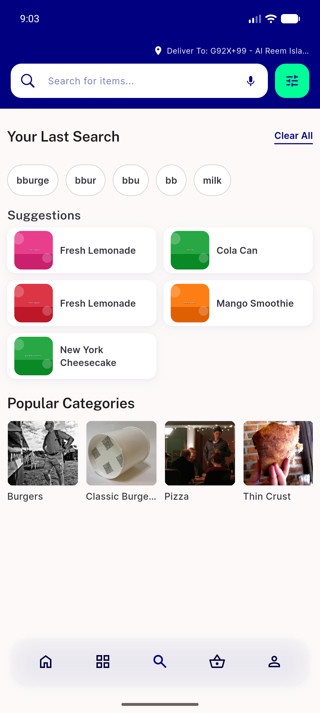
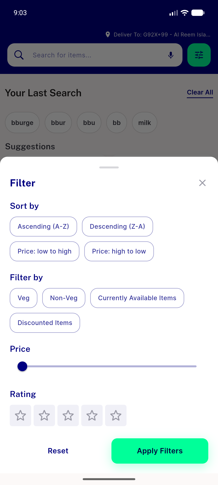
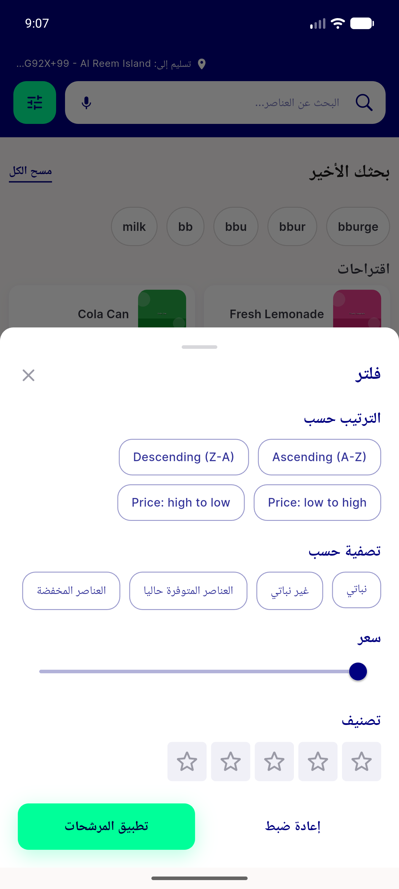

# QA Evidence — NEARS-2084

**PASS — NEARS-2084 dashboard-tab header a11y, 4/4 AC met, emulator-5556**

**4 screenshot(s).** Click any thumbnail for full resolution.

<table>
<tr>
<td align="center" width="33%"> ac1 ac2 dashboard tab arm header</td>
<td align="center" width="33%"> ac1 filter sheet opened dashboard arm</td>
<td align="center" width="33%"> bug arabic sort labels not relocalised</td>
</tr>
<tr>
<td align="center" width="33%"> rtl arabic dashboard arm filter sheet</td>
</tr>
</table>

### Other artifacts
- [`progress.md`](progress.md)

---
*From `nears/docs/qa-evidence/NEARS-2084/` · public-repo scrub policy (no live secrets; verified clean).*
