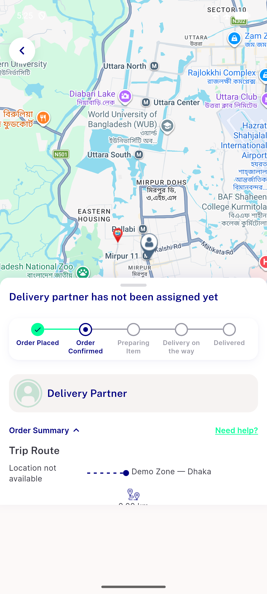
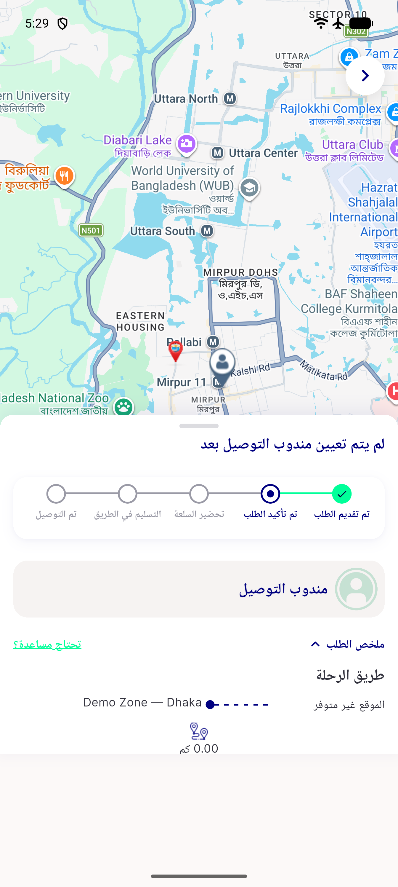
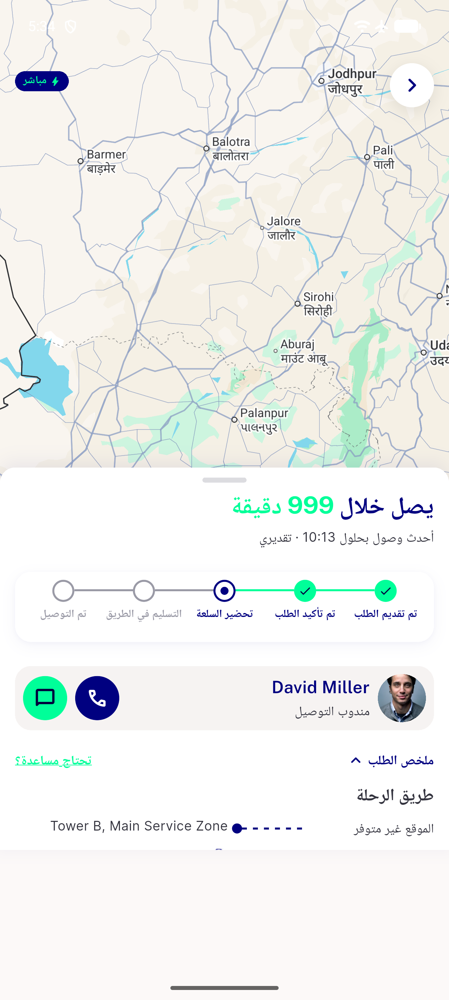

# QA Evidence — NEARS-2088

**PASS — trip-route location_unavailable fallback verified LTR+RTL, flex proportions unchanged, no overflow/exceptions, i18n keys present, 37/37 automated**

**4 screenshot(s).** Click any thumbnail for full resolution.

<table>
<tr>
<td align="center" width="33%"> ac1 ltr 91129 no partner</td>
<td align="center" width="33%"> ac1 rtl 91129 no partner</td>
<td align="center" width="33%"> ac2 control 91124 assigned partner</td>
</tr>
<tr>
<td align="center" width="33%"> regression 91133 takeaway real address</td>
</tr>
</table>

---
*From `nears/docs/qa-evidence/NEARS-2088/` · public-repo scrub policy (no live secrets; verified clean).*
