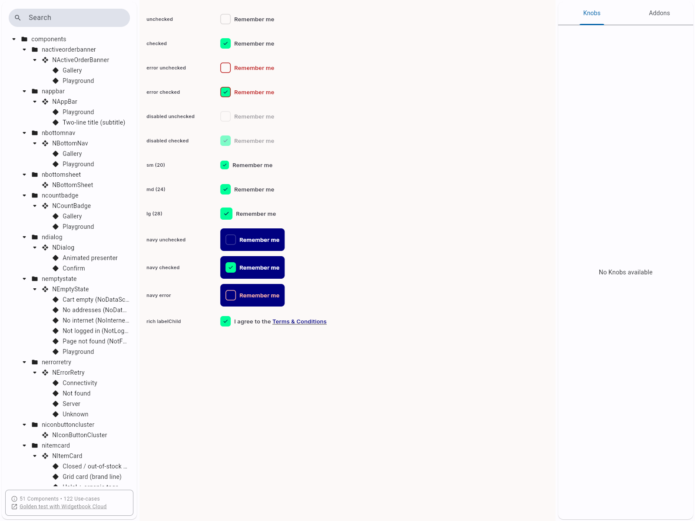
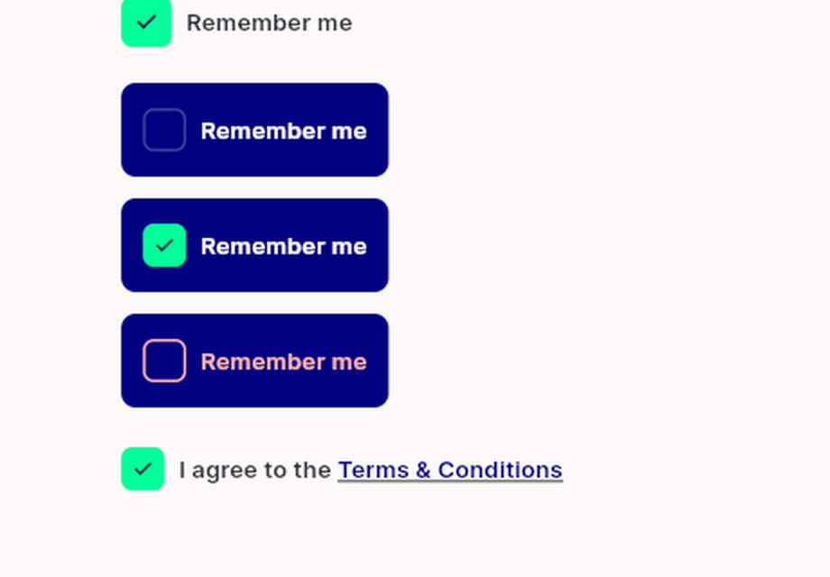

# QA Evidence — NEARS-2093

**PASS - NCheckbox navy contrast fix verified live on widgetbook DLS fixture**

**2 screenshot(s).** Click any thumbnail for full resolution.

<table>
<tr>
<td align="center" width="33%"> ncheckbox gallery full</td>
<td align="center" width="33%"> ncheckbox navy rows crop</td>
</tr>
</table>

---
*From `nears/docs/qa-evidence/NEARS-2093/` · public-repo scrub policy (no live secrets; verified clean).*
