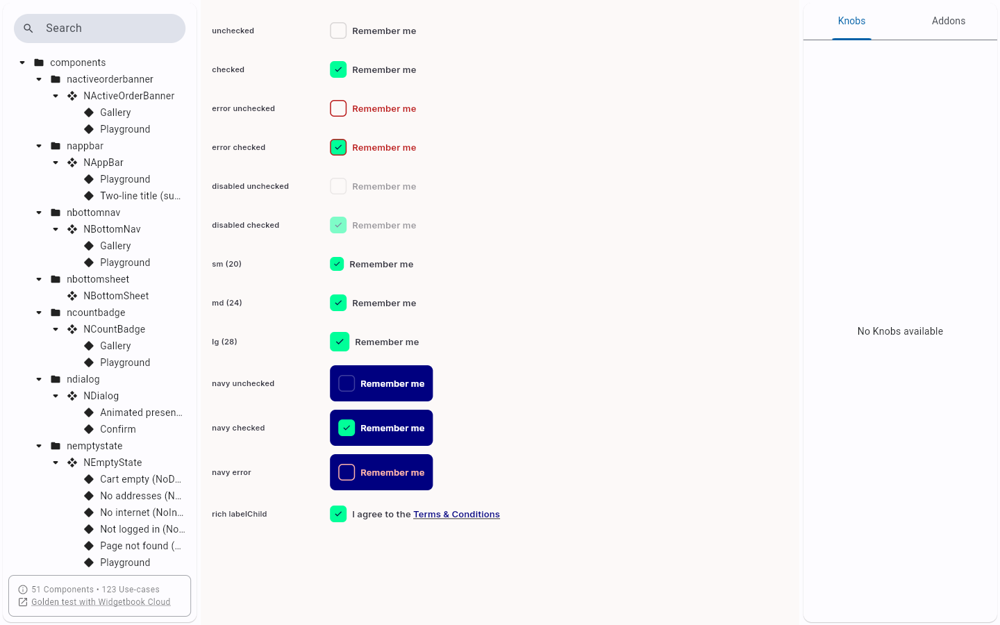

# QA Evidence — NEARS-2095

**PASS — NCheckbox.rich factory: 32/32 unit + 4/4 widgetbook story + widgetbook gallery visual confirmed**

**1 screenshot(s).** Click any thumbnail for full resolution.

<table>
<tr>
<td align="center" width="33%"> wb ncheckbox gallery rich</td>
</tr>
</table>

### Other artifacts
- [`progress.md`](progress.md)

---
*From `nears/docs/qa-evidence/NEARS-2095/` · public-repo scrub policy (no live secrets; verified clean).*
