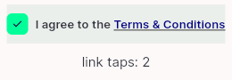
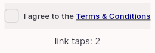
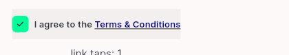
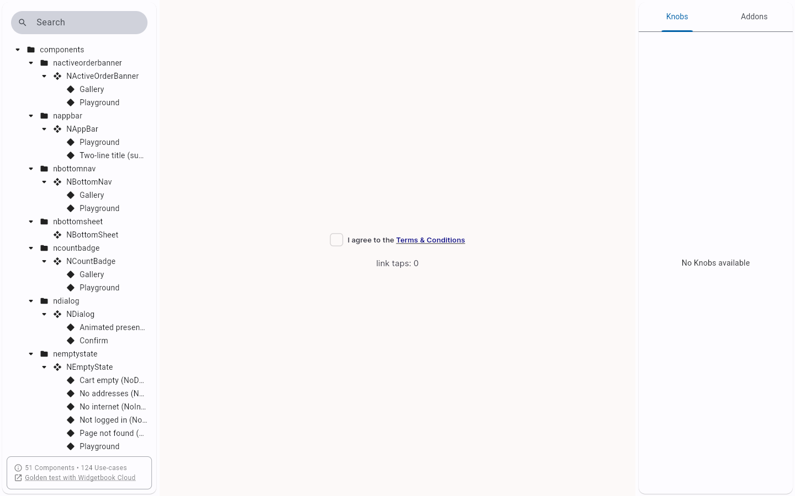
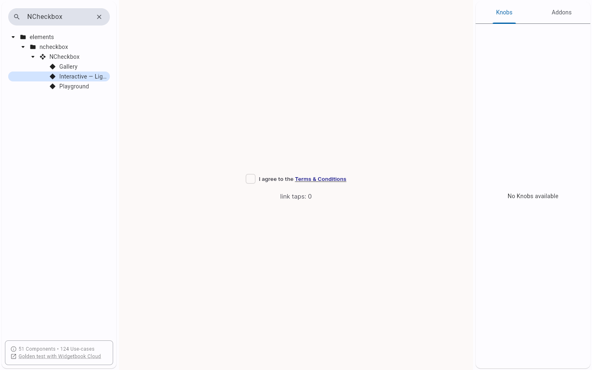
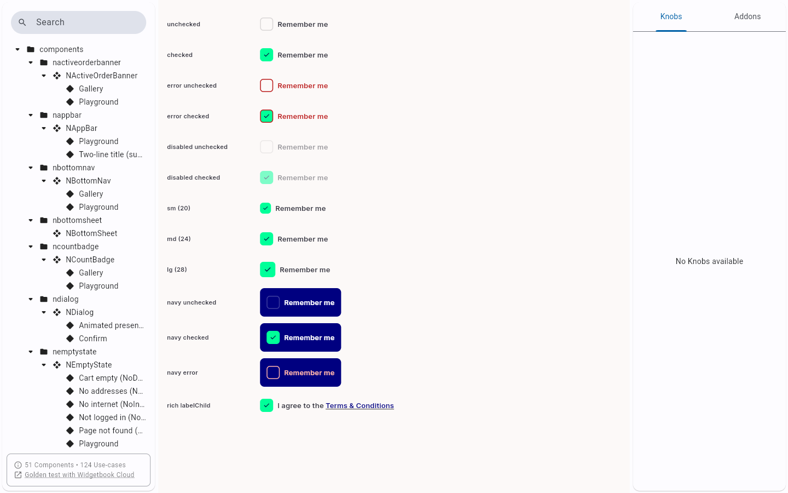
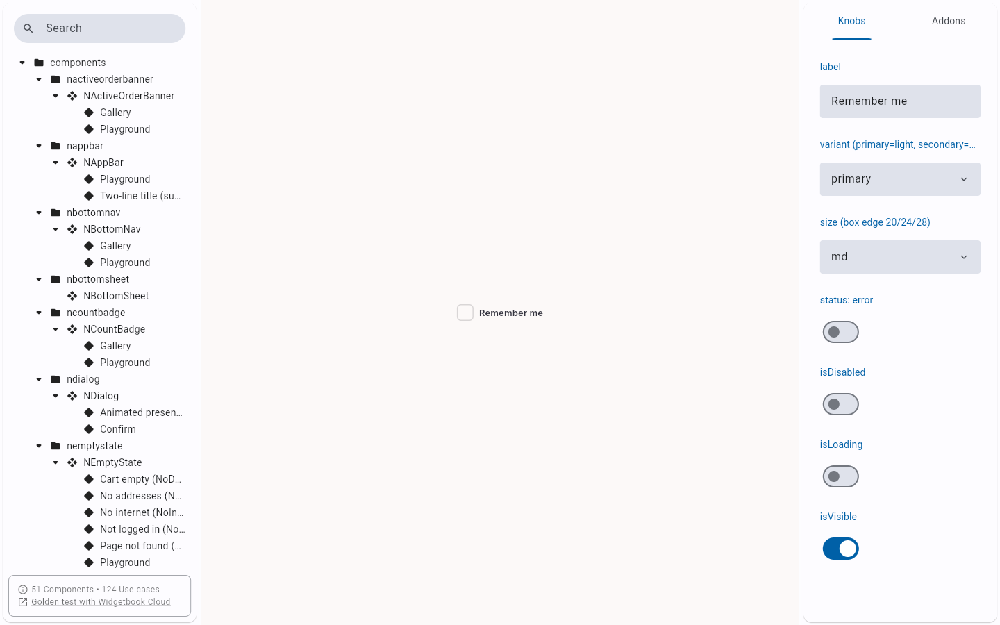

# QA Evidence — NEARS-2096

**PASS — delta cycle 2, AC2 focus self-heal reproduced live (no Tab press), AC1 regression clean, 14/14 automated green**

**11 screenshot(s).** Click any thumbnail for full resolution.

<table>
<tr>
<td align="center" width="33%"> ac1 cycle2 elsewhere tap toggles</td>
<td align="center" width="33%"> ac1 cycle2 link tap no toggle</td>
<td align="center" width="33%"> ac1 label tap toggles</td>
</tr>
<tr>
<td align="center" width="33%"> ac1 link tap no toggle</td>
<td align="center" width="33%"> ac2 cycle2 collapse immediate</td>
<td align="center" width="33%"> ac2 cycle2 fresh mount</td>
</tr>
<tr>
<td align="center" width="33%"> ac2 cycle2 selfheal after wait</td>
<td align="center" width="33%"> ac2 light surface tree confirmed</td>
<td align="center" width="33%"> bug ncheckbox focus ring not rendered</td>
</tr>
<tr>
<td align="center" width="33%"> regression gallery</td>
<td align="center" width="33%"> regression playground</td>
</tr>
</table>

### Other artifacts
- [`ac2-cycle2-focus-timeline.log`](ac2-cycle2-focus-timeline.log)
- [`progress.md`](progress.md)

---
*From `nears/docs/qa-evidence/NEARS-2096/` · public-repo scrub policy (no live secrets; verified clean).*
