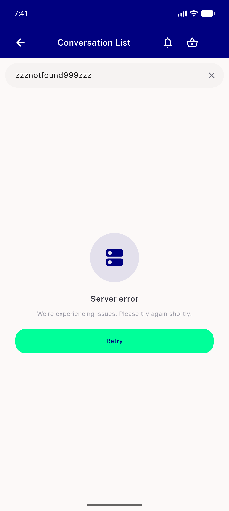
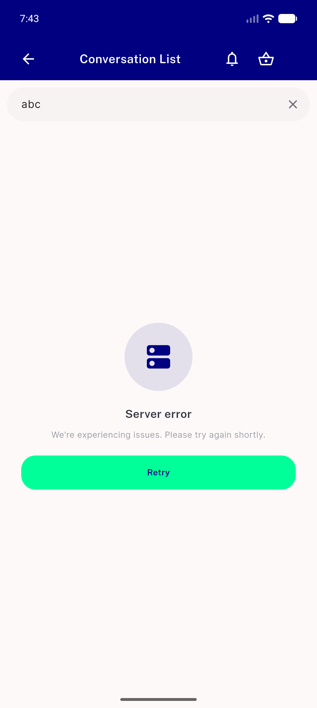
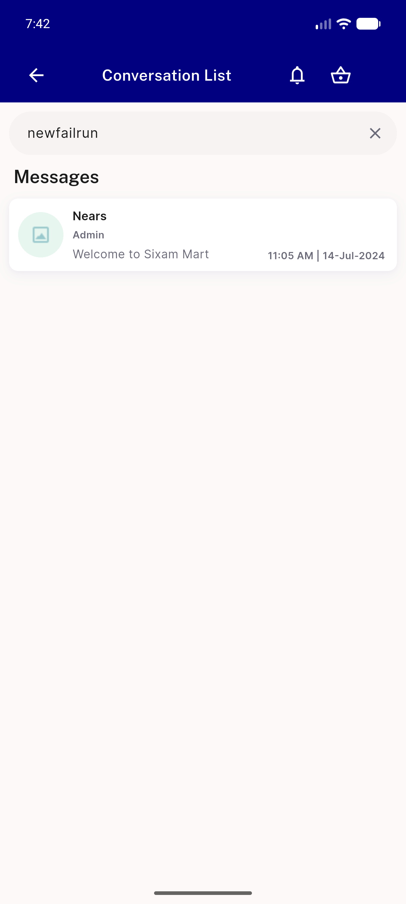
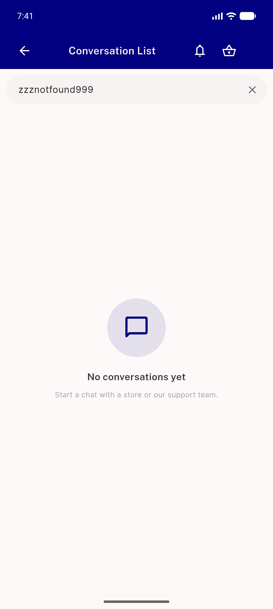

# QA Evidence — NEARS-2105

**PASS — all 5 ACs demonstrated live, emulator-5556, chat suite 248/248**

**4 screenshot(s).** Click any thumbnail for full resolution.

<table>
<tr>
<td align="center" width="33%"> ac2 search error state</td>
<td align="center" width="33%"> ac4 abc query error not masked</td>
<td align="center" width="33%"> ac4 retry recovers</td>
</tr>
<tr>
<td align="center" width="33%"> ac5 zero result search</td>
</tr>
</table>

---
*From `nears/docs/qa-evidence/NEARS-2105/` · public-repo scrub policy (no live secrets; verified clean).*
