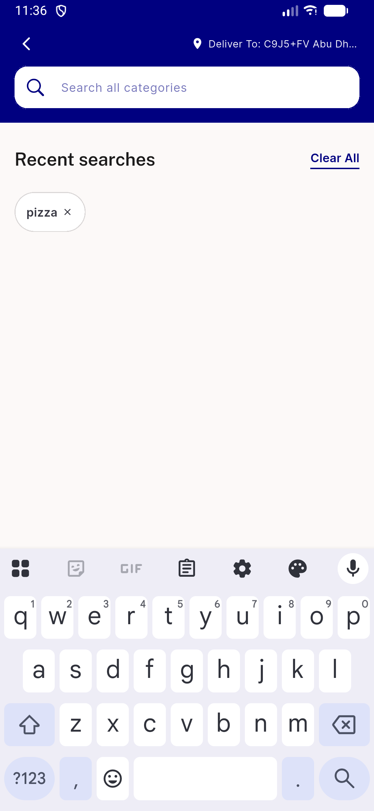

# QA Evidence — NEARS-2128

**PASS — NEARS-2128 live QA: container:true fix verified on-device, RTL, no regressions**

**3 screenshot(s).** Click any thumbnail for full resolution.

<table>
<tr>
<td align="center" width="33%"> ac rtl spotcheck recent searches</td>
<td align="center" width="33%"> ac1 ac3 idle recent search</td>
<td align="center" width="33%"> ac7 visual no regression category chips</td>
</tr>
</table>

### Other artifacts
- [`ac-rtl-spotcheck-recent-searches-dump.xml`](ac-rtl-spotcheck-recent-searches-dump.xml)
- [`ac1-ac3-idle-recent-search-dump.xml`](ac1-ac3-idle-recent-search-dump.xml)

---
*From `nears/docs/qa-evidence/NEARS-2128/` · public-repo scrub policy (no live secrets; verified clean).*
