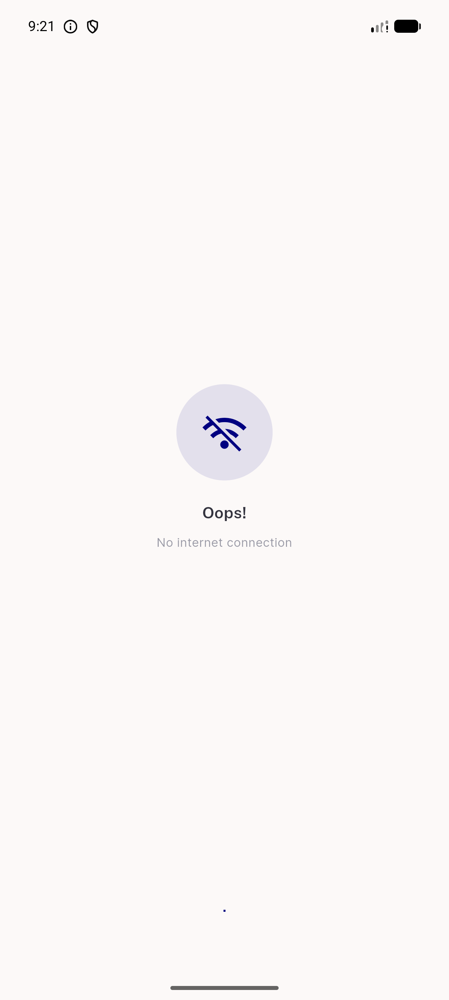
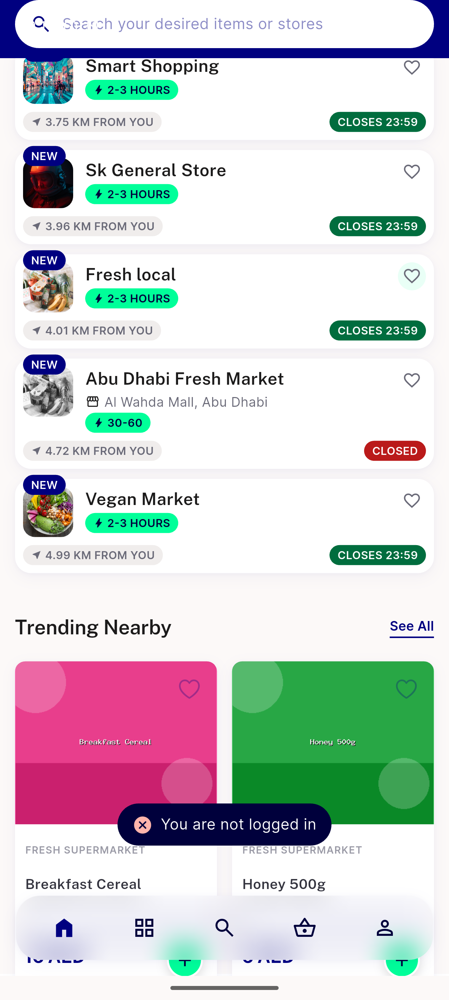
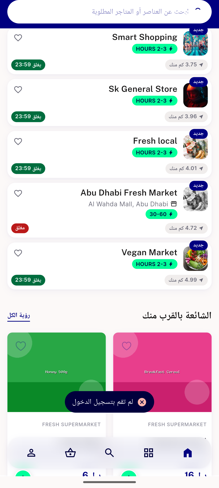
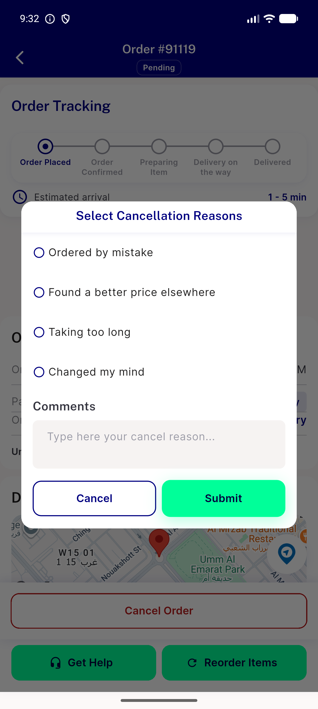
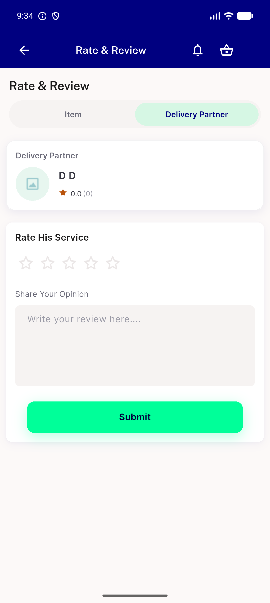
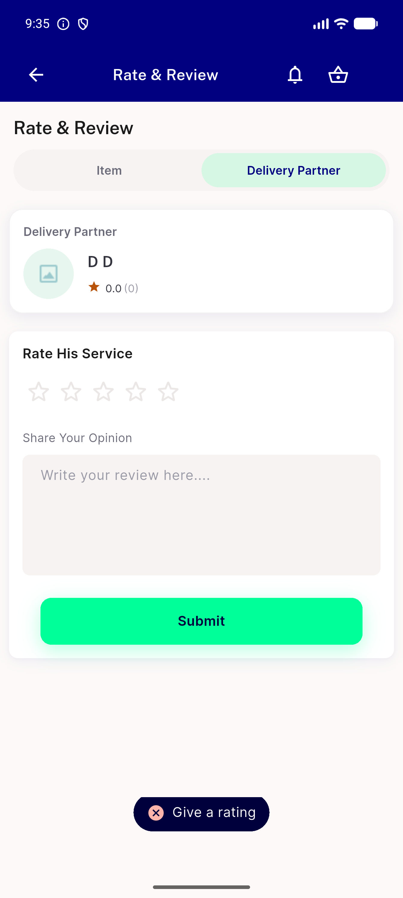
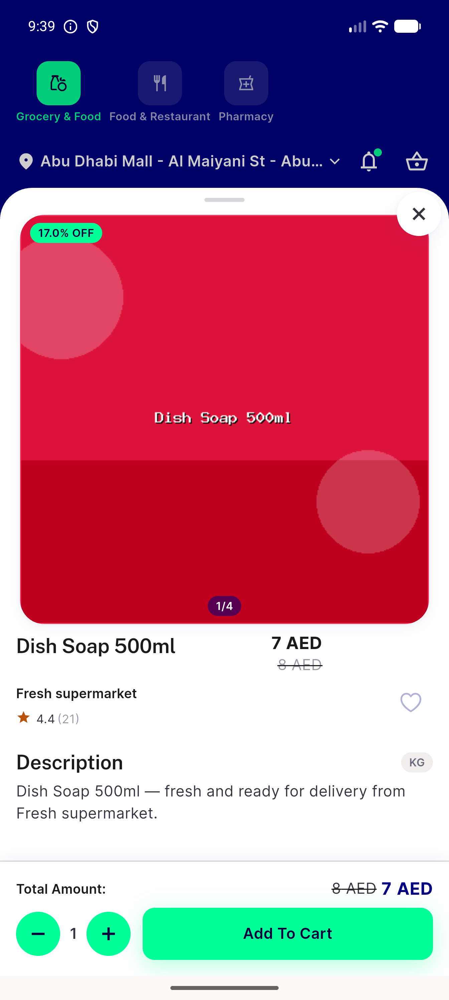
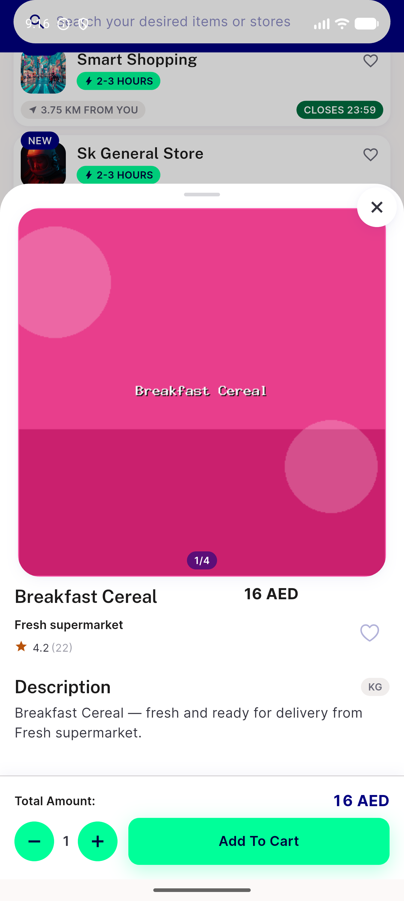
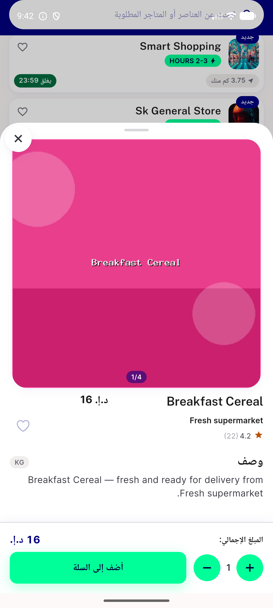

# QA Evidence — NEARS-2133

**FAIL - invisible toast regression in Get.dialog/Get.bottomSheet contexts after getXSnackBar revert**

**11 screenshot(s).** Click any thumbnail for full resolution.

<table>
<tr>
<td align="center" width="33%"> ac1 2 deliveryman review 0star</td>
<td align="center" width="33%"> ac1 2 guest favourite itemcard after</td>
<td align="center" width="33%"> ac1 2 nointernet tryagain</td>
</tr>
<tr>
<td align="center" width="33%"> ac2 3way storecard baseline</td>
<td align="center" width="33%"> ac8 rtl nsnackbar guest favourite</td>
<td align="center" width="33%"> bug cancellationdialogue emptycomment invisible toast</td>
</tr>
<tr>
<td align="center" width="33%"> bug control deliverymanreview toast visible frame1</td>
<td align="center" width="33%"> bug control deliverymanreview toast visible</td>
<td align="center" width="33%"> bug itembottomsheet favourite invisible toast v2</td>
</tr>
<tr>
<td align="center" width="33%"> bug itembottomsheet favourite invisible toast</td>
<td align="center" width="33%"> bug itembottomsheet rtl invisible toast</td>
</tr>
</table>

### Other artifacts
- [`bug-itembottomsheet-favourite-invisible-toast-dump.xml`](bug-itembottomsheet-favourite-invisible-toast-dump.xml)

---
*From `nears/docs/qa-evidence/NEARS-2133/` · public-repo scrub policy (no live secrets; verified clean).*
