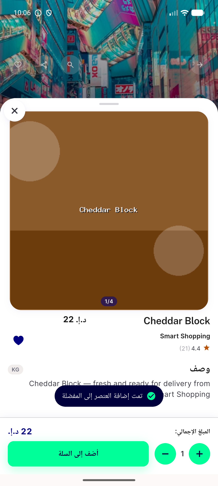
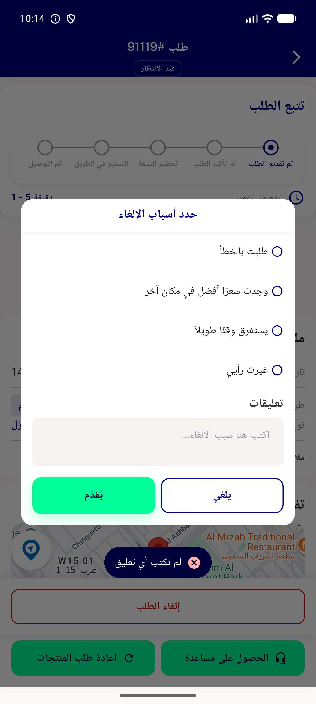

# QA Evidence — NEARS-2133

**fix-cycle-2 delta re-QA PASS — item_bottom_sheet.dart + cancellation_dialogue_widget.dart toast visibility confirmed live over modal contexts (NEARS-2367 fix verified)**

**2 screenshot(s).** Click any thumbnail for full resolution.

<table>
<tr>
<td align="center" width="33%"> ac1 item bottom sheet favourite toast visible ar</td>
<td align="center" width="33%"> ac2 cancellation empty comment toast</td>
</tr>
</table>

---
*From `nears/docs/qa-evidence/NEARS-2133/` · public-repo scrub policy (no live secrets; verified clean).*
