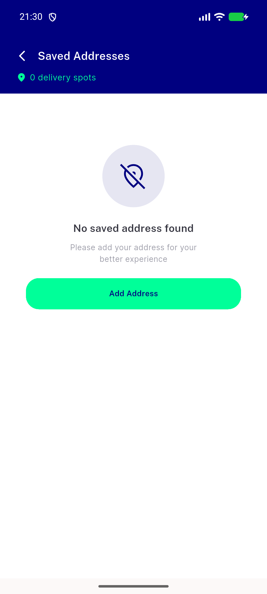
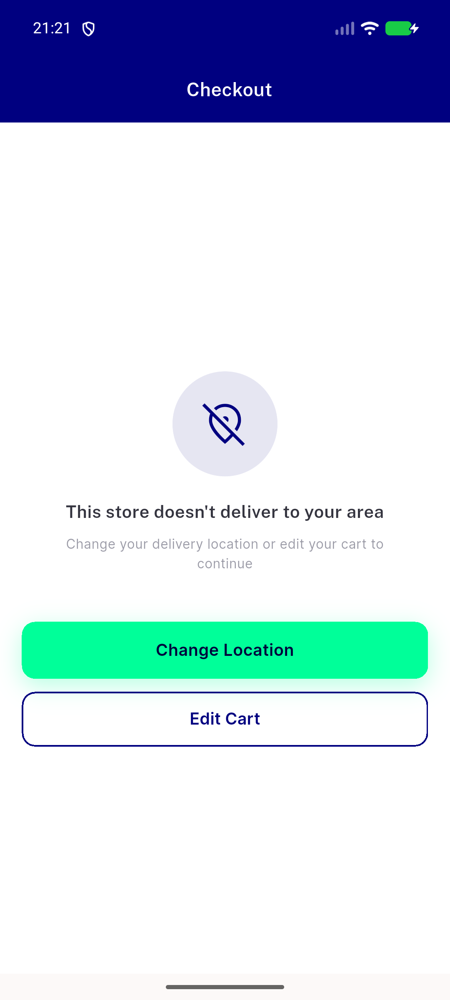
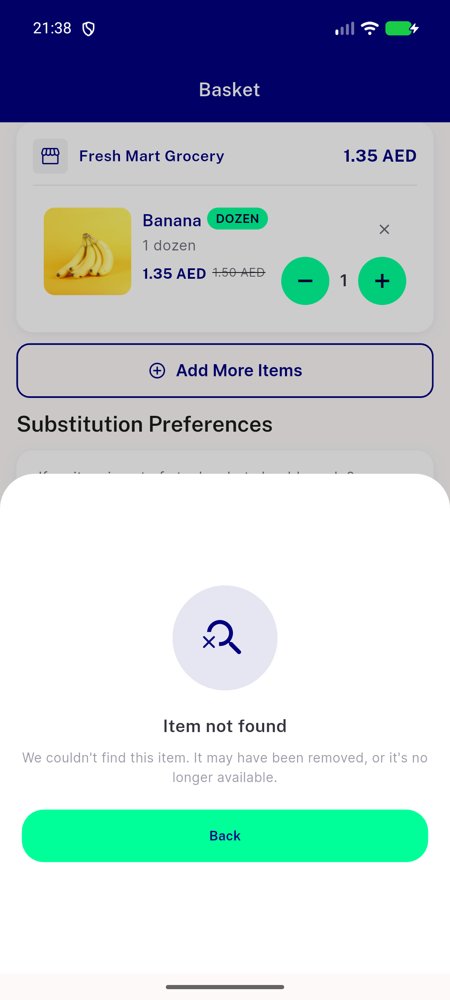

# QA Evidence — NEARS-2134

**PASS — icon-token swap verified live at all 3 NEmptyState call sites (Symbols.location_off), doc spot-checked accurate, 1 pre-existing unrelated logging-classification gap noted (non-blocking)**

**4 screenshot(s).** Click any thumbnail for full resolution.

<table>
<tr>
<td align="center" width="33%"> ac4 address empty</td>
<td align="center" width="33%"> ac4 checkout outofzone</td>
<td align="center" width="33%"> ac4 itembottomsheet notfound unchanged</td>
</tr>
<tr>
<td align="center" width="33%"> ac4 itembottomsheet outofzone</td>
</tr>
</table>

### Other artifacts
- [`bug-item-details-outofzone-unclassified-fail.log`](bug-item-details-outofzone-unclassified-fail.log)

---
*From `nears/docs/qa-evidence/NEARS-2134/` · public-repo scrub policy (no live secrets; verified clean).*
