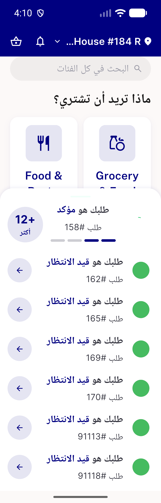
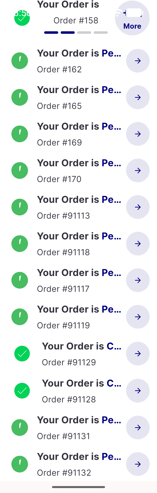
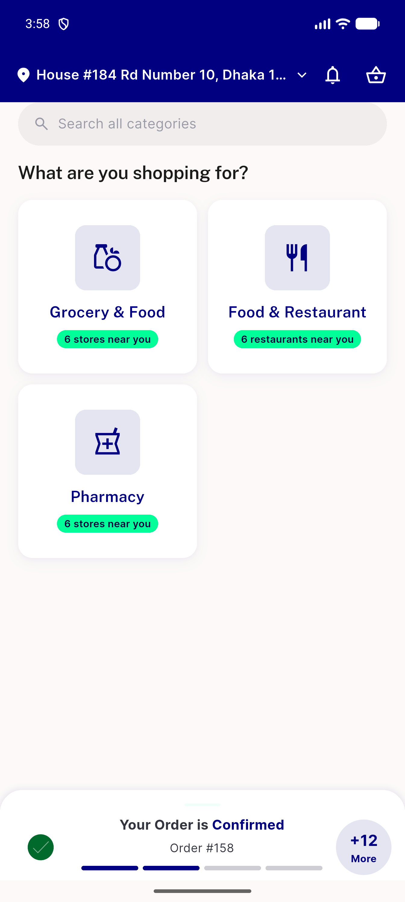
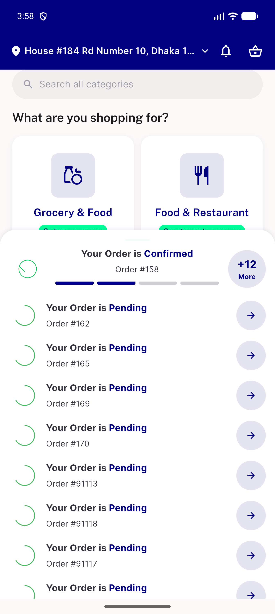
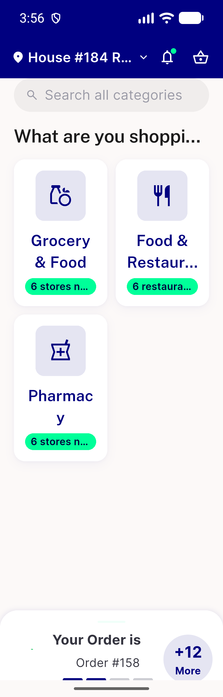
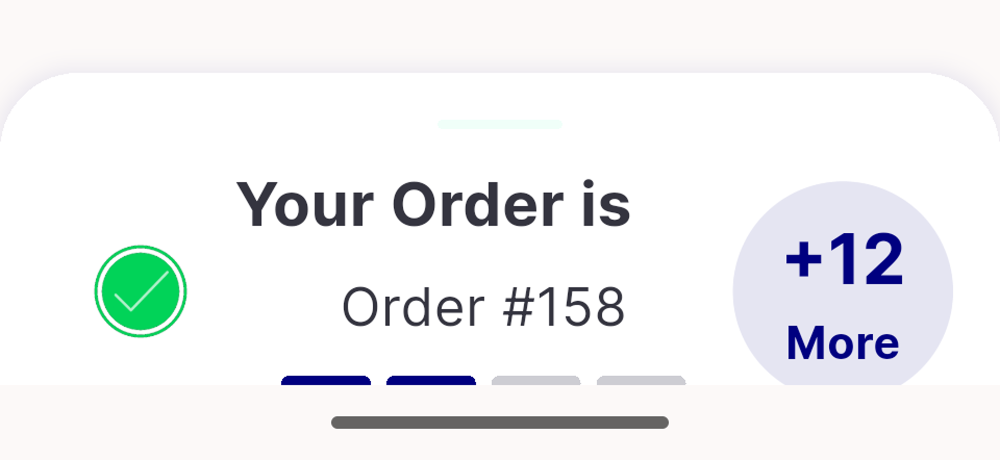
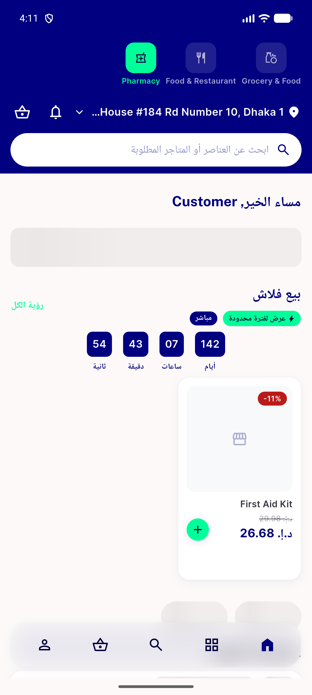

# QA Evidence — NEARS-2141

**QA re-entry: FAIL — zero-overflow AC met but collapsed-row status text goes invisible at 320dp/1.3x (English)**

**9 screenshot(s).** Click any thumbnail for full resolution.

<table>
<tr>
<td align="center" width="33%"> ac rtl 320dp 1.3x collapsed</td>
<td align="center" width="33%"> ac rtl 320dp 1.3x expanded</td>
<td align="center" width="33%"> ac rtl standard mirrored</td>
</tr>
<tr>
<td align="center" width="33%"> ac1 expanded 13row 320dp 1.3x zero overflow</td>
<td align="center" width="33%"> ac2 standard 100pct confirmed visible</td>
<td align="center" width="33%"> ac2 standard 100pct pending visible</td>
</tr>
<tr>
<td align="center" width="33%"> bug collapsed 320dp 1.3x status text invisible</td>
<td align="center" width="33%"> bug collapsed status zoom zero pixels</td>
<td align="center" width="33%"> regression nonfood module home pharmacy</td>
</tr>
</table>

### Other artifacts
- [`bug-collapsed-status-invisible.log`](bug-collapsed-status-invisible.log)

---
*From `nears/docs/qa-evidence/NEARS-2141/` · public-repo scrub policy (no live secrets; verified clean).*
