# QA Evidence — NEARS-2142

**PASS (cycle 2, HEAD 9a831aa7) — AC1 fixed: product-name box now exceeds natural line height on both real consumers, LTR+RTL, at 320dp/1.3x; AC2 unchanged. One new unrelated pre-existing regression-candidate noted (store_card_widget.dart)**

**13 screenshot(s).** Click any thumbnail for full resolution.

<table>
<tr>
<td align="center" width="33%"> home rail 100pct std</td>
<td align="center" width="33%"><a href="02-item-that-you-love-320dp-13x.png">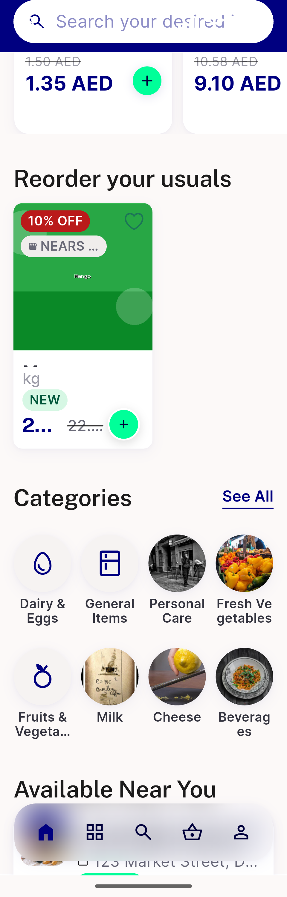</a> item that you love 320dp 13x</td>
<td align="center" width="33%"><a href="03-store-screen-grid-320dp-13x.png">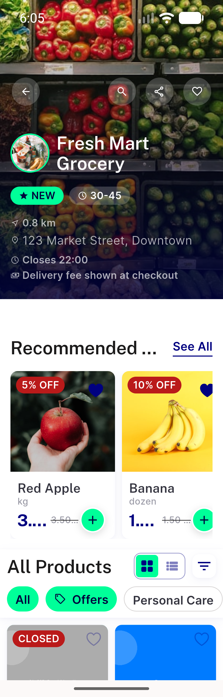</a> store screen grid 320dp 13x</td>
</tr>
<tr>
<td align="center" width="33%"><a href="03b-store-screen-grid-320dp-13x-scrolled.png">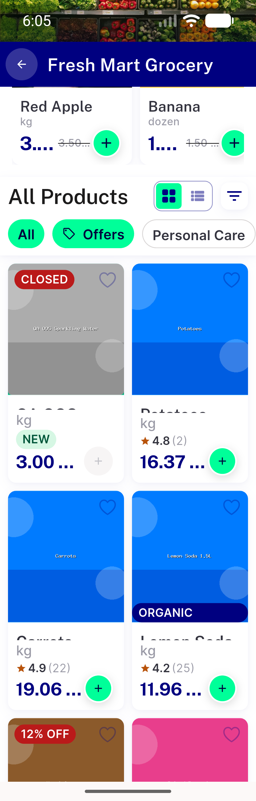</a> 03b store screen grid 320dp 13x scrolled</td>
<td align="center" width="33%"><a href="04-category-screen-100pct-std.png">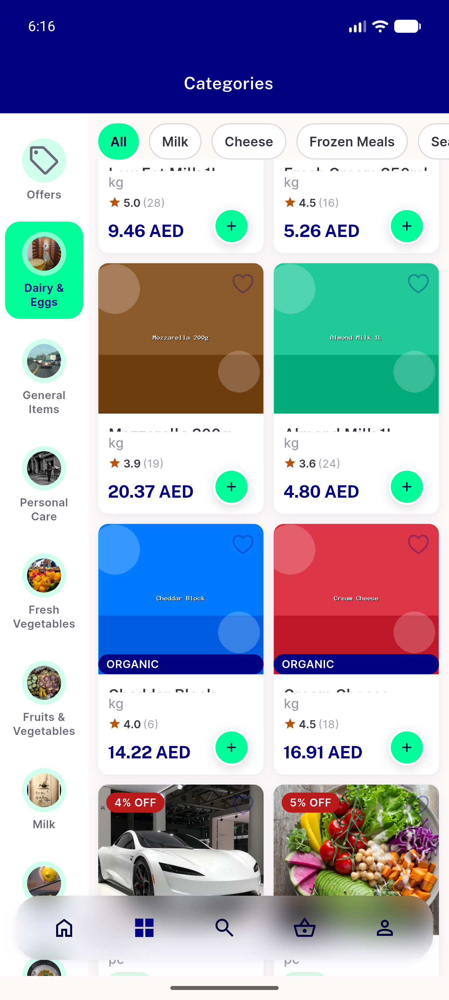</a> category screen 100pct std</td>
<td align="center" width="33%"><a href="04b-category-screen-100pct-std.png">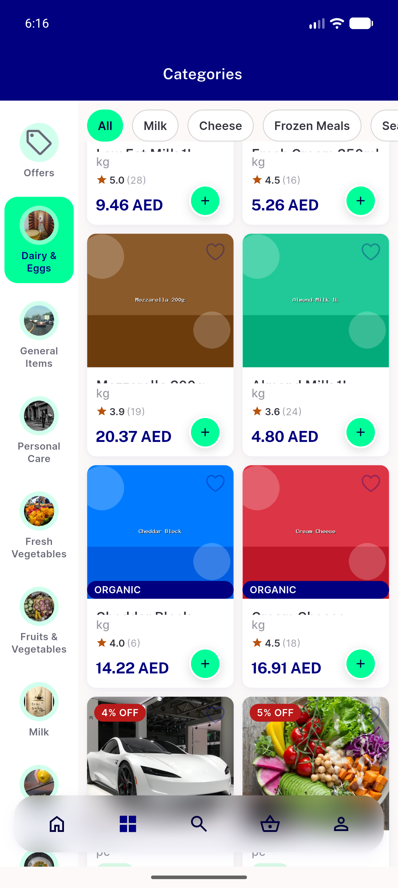</a> 04b category screen 100pct std</td>
</tr>
<tr>
<td align="center" width="33%"> cycle2 item that you love 320dp 13x FIXED</td>
<td align="center" width="33%"><a href="05b-cycle2-mango-card-320dp-13x-FIXED.png">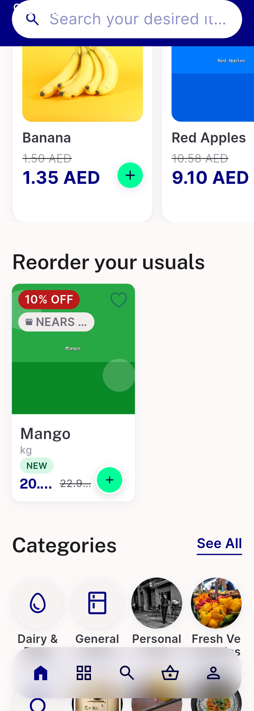</a> 05b cycle2 mango card 320dp 13x FIXED</td>
<td align="center" width="33%"><a href="06-cycle2-store-grid-rtl-320dp-13x-FIXED.png">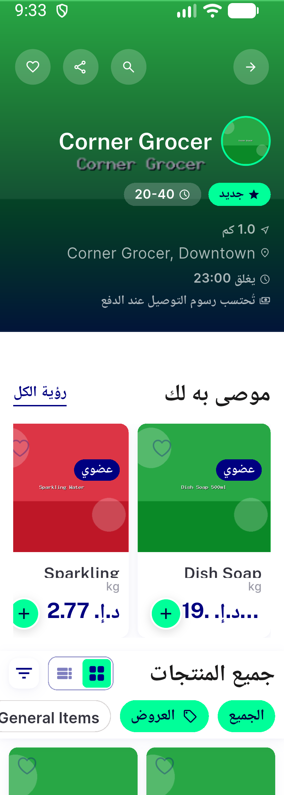</a> cycle2 store grid rtl 320dp 13x FIXED</td>
</tr>
<tr>
<td align="center" width="33%"><a href="07-cycle2-store-grid-ltr-320dp-13x-FIXED.png">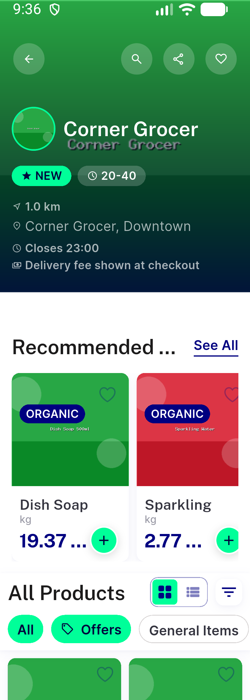</a> cycle2 store grid ltr 320dp 13x FIXED</td>
<td align="center" width="33%"><a href="08-cycle2-store-grid-100pct-std-baseline.png">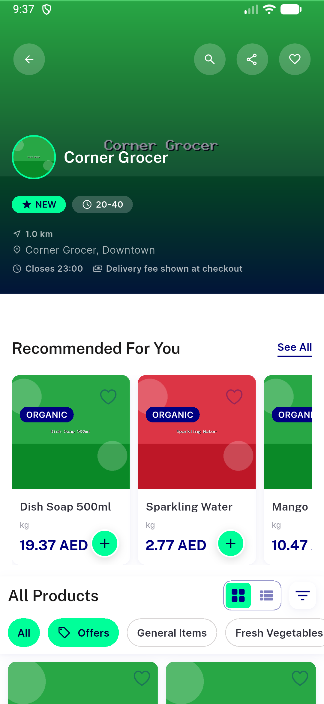</a> cycle2 store grid 100pct std baseline</td>
<td align="center" width="33%"><a href="bug-name-squeeze-mango-crop.png">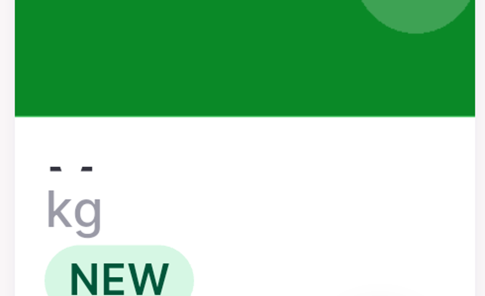</a> bug name squeeze mango crop</td>
</tr>
<tr>
<td align="center" width="33%"><a href="bug-name-squeeze-potatoes-crop.png">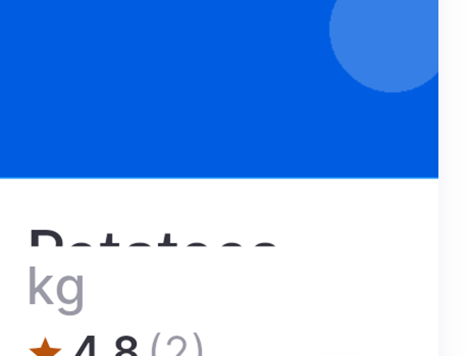</a> bug name squeeze potatoes crop</td>
</tr>
</table>

### Other artifacts
- [`bug-name-squeeze-rendertree-evidence.log`](bug-name-squeeze-rendertree-evidence.log)
- [`cycle2-rendertree-evidence.log`](cycle2-rendertree-evidence.log)
- [`progress.md`](progress.md)
- [`regression-category-screen-rendertree.log`](regression-category-screen-rendertree.log)

---
*From `nears/docs/qa-evidence/NEARS-2142/` · public-repo scrub policy (no live secrets; verified clean).*
