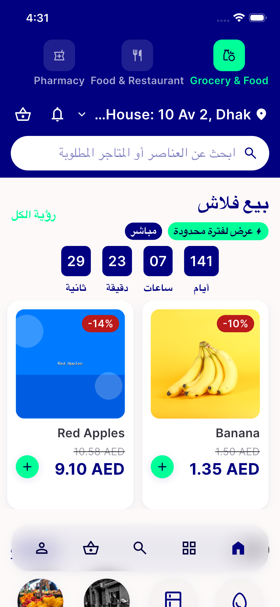
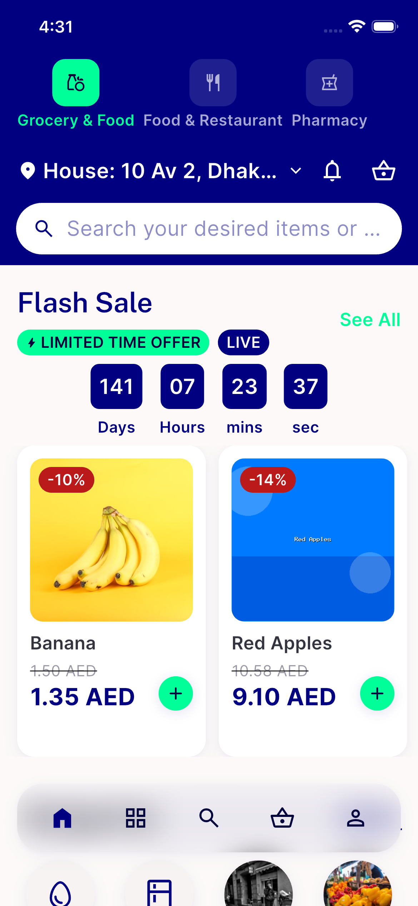
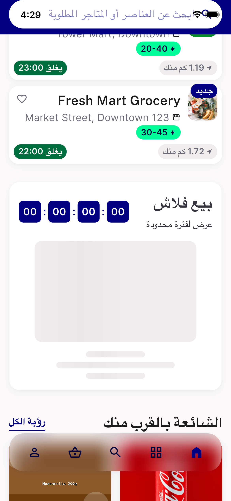
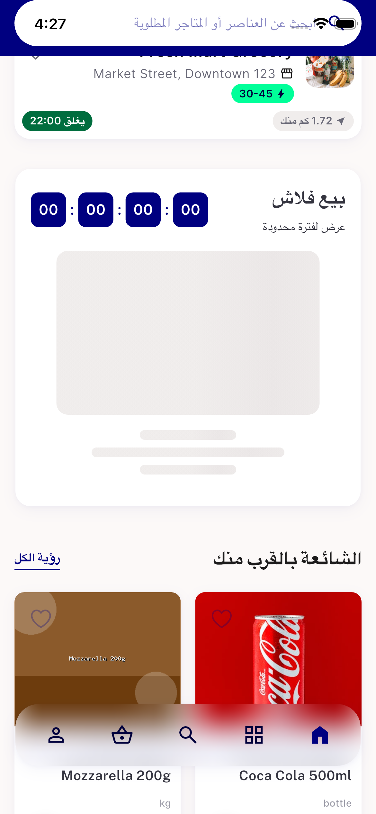
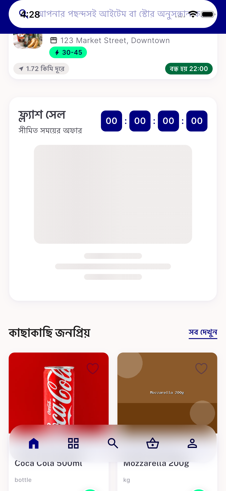
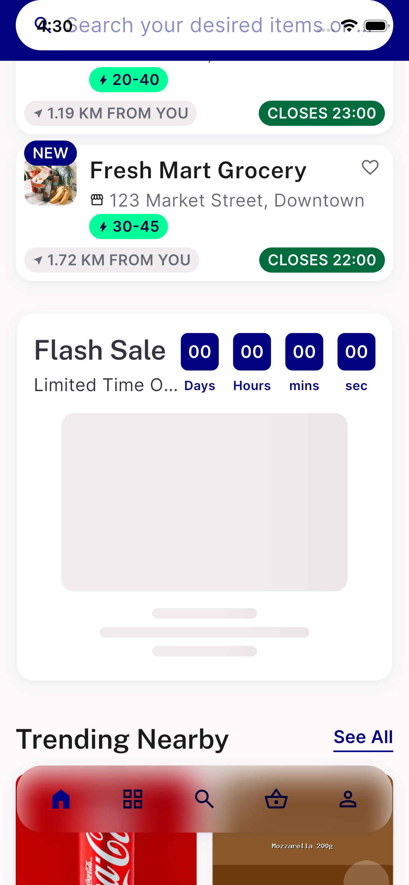
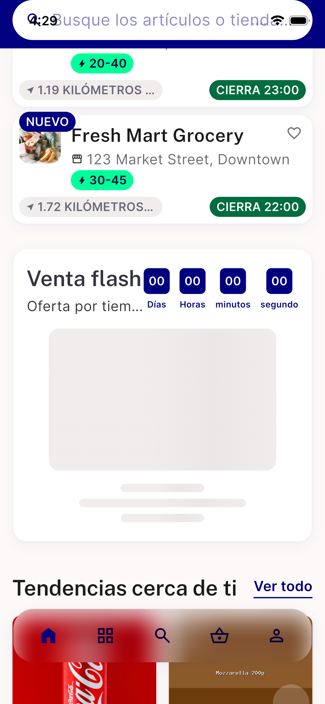
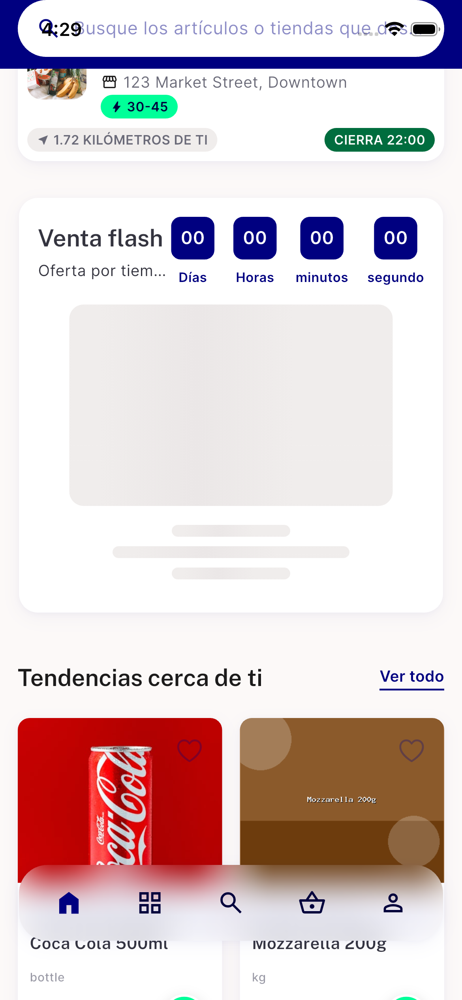

# QA Evidence — NEARS-2143

**PASS — iOS QA (platform switch from Android device-pool exhaustion), ar/bn shimmer compact form legible, zero RenderFlex overflow en/ar/bn/es @1.3x, loaded header (NEARS-2144 territory) unaffected**

**10 screenshot(s).** Click any thumbnail for full resolution.

<table>
<tr>
<td align="center" width="33%"> loaded header ar</td>
<td align="center" width="33%"> loaded header en</td>
<td align="center" width="33%"> shimmer ar compact 1.3x</td>
</tr>
<tr>
<td align="center" width="33%"> shimmer ar compact</td>
<td align="center" width="33%"> shimmer bn compact 1.3x</td>
<td align="center" width="33%"> shimmer bn compact</td>
</tr>
<tr>
<td align="center" width="33%"> shimmer en full 1.3x</td>
<td align="center" width="33%"> shimmer en full</td>
<td align="center" width="33%"> shimmer es full 1.3x</td>
</tr>
<tr>
<td align="center" width="33%"> shimmer es full</td>
</tr>
</table>

### Other artifacts
- [`bug-compact-semantics-unpadded-digit.log`](bug-compact-semantics-unpadded-digit.log)

---
*From `nears/docs/qa-evidence/NEARS-2143/` · public-repo scrub policy (no live secrets; verified clean).*
