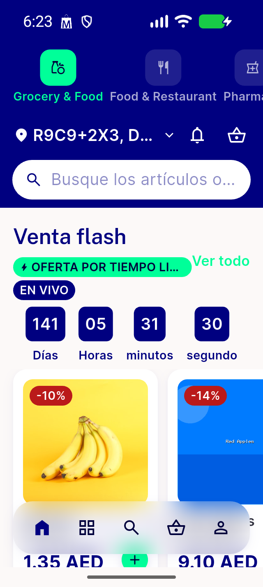
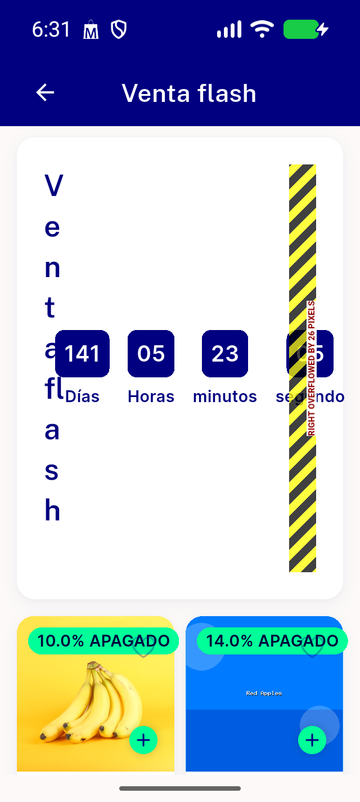
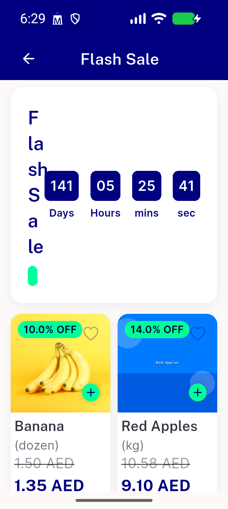
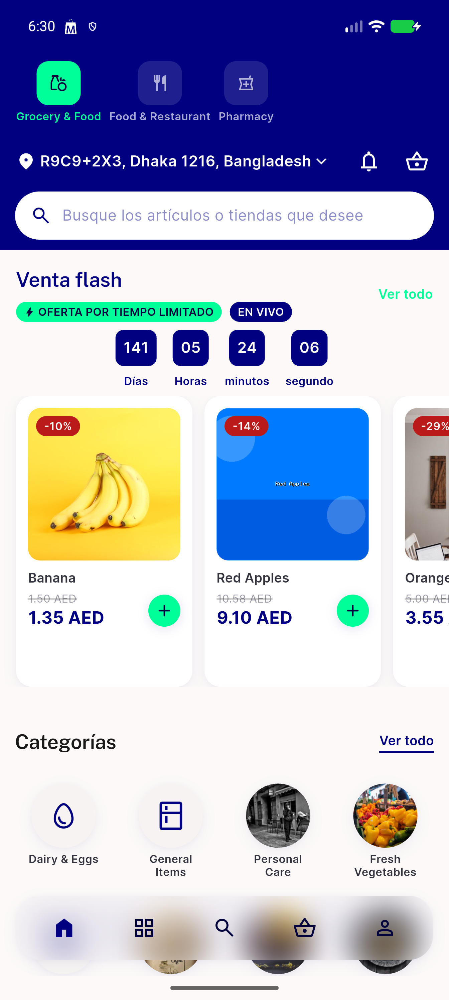

# QA Evidence — NEARS-2144

**PASS: NEARS-2144 flash-sale timer shrink guard verified live (en/ar/bn/es @ 320dp/1.3x, zero overflow); pre-existing unrelated overflow found in flash_product_card_widget.dart (regression, not blocking)**

**7 screenshot(s).** Click any thumbnail for full resolution.

<table>
<tr>
<td align="center" width="33%"> ac2 ar 320dp 1.3x</td>
<td align="center" width="33%"> ac2 bn 320dp 1.3x</td>
<td align="center" width="33%"> ac2 en 320dp 1.3x</td>
</tr>
<tr>
<td align="center" width="33%"> ac2 es 320dp 1.3x</td>
<td align="center" width="33%"> bug flash product card overflow 320dp</td>
<td align="center" width="33%"> regression details screen en 320dp</td>
</tr>
<tr>
<td align="center" width="33%"> regression es normal width</td>
</tr>
</table>

---
*From `nears/docs/qa-evidence/NEARS-2144/` · public-repo scrub policy (no live secrets; verified clean).*
