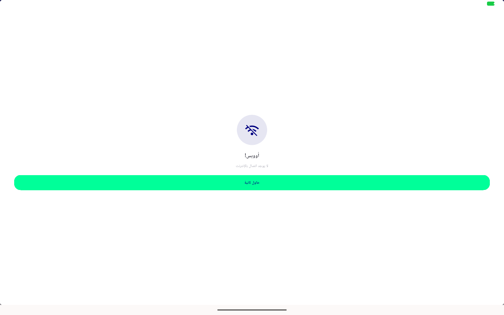

# QA Evidence — NEARS-2145

**FAIL (delta re-QA, cycle 2/attempt 2, NEARS-2439): desktop connectivityFailed still renders phone full-screen shell, not ConnectivityRetryDialogCard — reproduced 2x fresh cold-start on emulator-5564**

**2 screenshot(s).** Click any thumbnail for full resolution.

<table>
<tr>
<td align="center" width="33%"> bug desktop connectivityfailed still fullscreen cycle2 repro1</td>
<td align="center" width="33%"> bug desktop connectivityfailed still fullscreen cycle2 repro2</td>
</tr>
</table>

### Other artifacts
- [`bug-desktop-connectivityfailed-still-fullscreen-cycle2-repro1-dump.xml`](bug-desktop-connectivityfailed-still-fullscreen-cycle2-repro1-dump.xml)
- [`bug-desktop-connectivityfailed-still-fullscreen-cycle2-repro2-dump.xml`](bug-desktop-connectivityfailed-still-fullscreen-cycle2-repro2-dump.xml)
- [`bug-desktop-connectivityfailed-still-fullscreen-cycle2-repro2.log`](bug-desktop-connectivityfailed-still-fullscreen-cycle2-repro2.log)

---
*From `nears/docs/qa-evidence/NEARS-2145/` · public-repo scrub policy (no live secrets; verified clean).*
