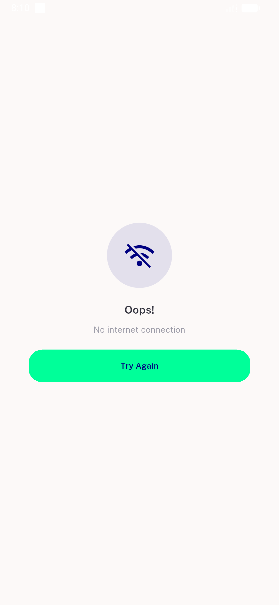
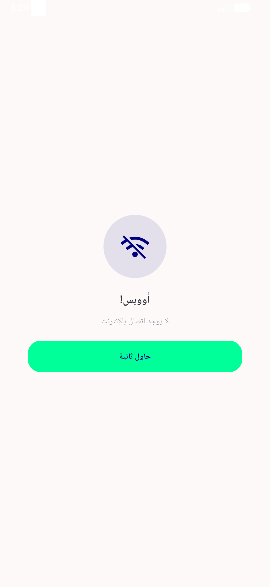
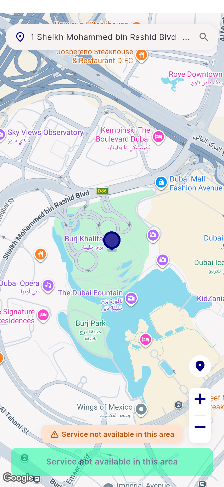
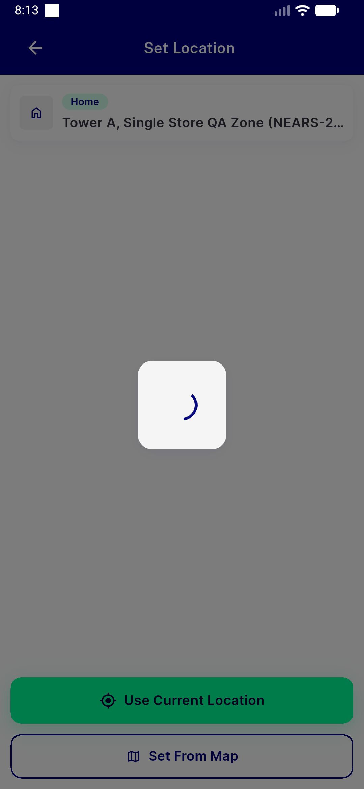
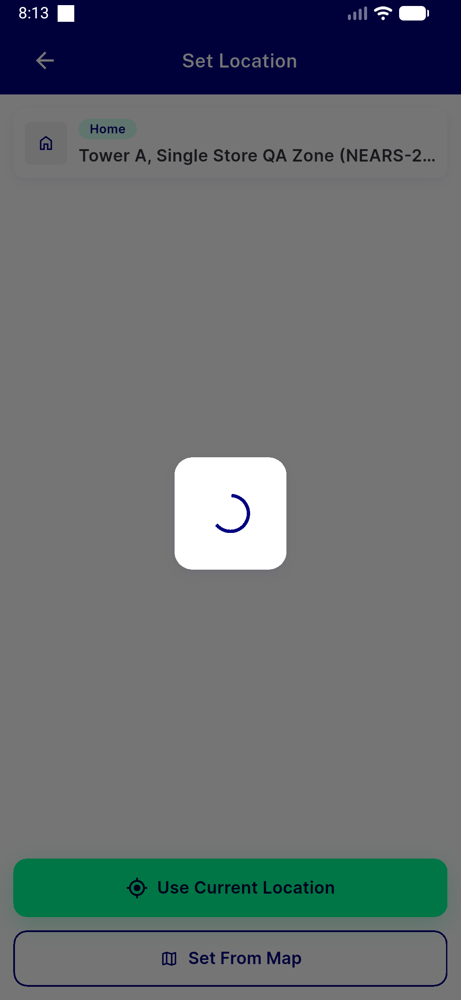
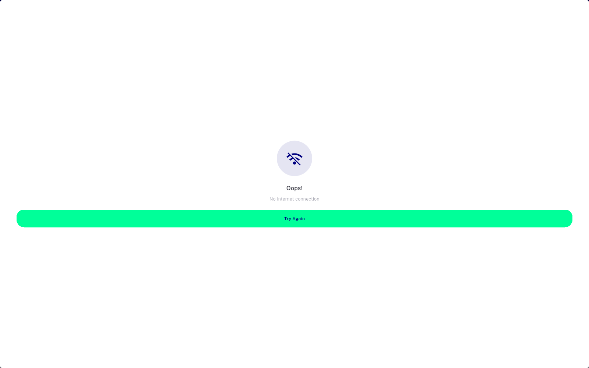

# QA Evidence — NEARS-2145

**PASS-with-findings: AC1+AC2 demonstrated live; desktop-width connectivity-failed card unreachable (task_bug, non-AC-breaking)**

**7 screenshot(s).** Click any thumbnail for full resolution.

<table>
<tr>
<td align="center" width="33%"> ac desktop connectivity card</td>
<td align="center" width="33%"> ac1 phone connectivity failed</td>
<td align="center" width="33%"> ac1 phone rtl connectivity failed</td>
</tr>
<tr>
<td align="center" width="33%"> ac2 outofzone pickmap</td>
<td align="center" width="33%"> ac2 outofzone snackbar attempt1</td>
<td align="center" width="33%"> ac2 outofzone snackbar attempt2</td>
</tr>
<tr>
<td align="center" width="33%"> bug desktop connectivityfailed fullscreen not card</td>
</tr>
</table>

---
*From `nears/docs/qa-evidence/NEARS-2145/` · public-repo scrub policy (no live secrets; verified clean).*
