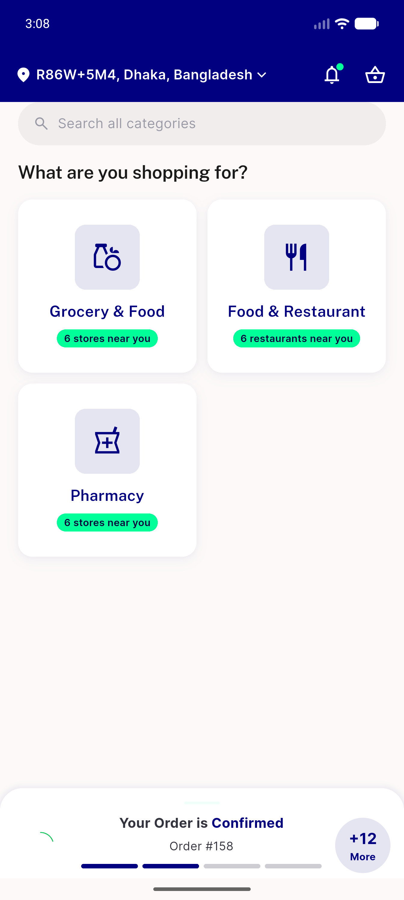
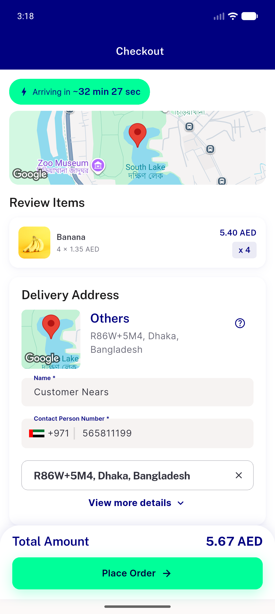
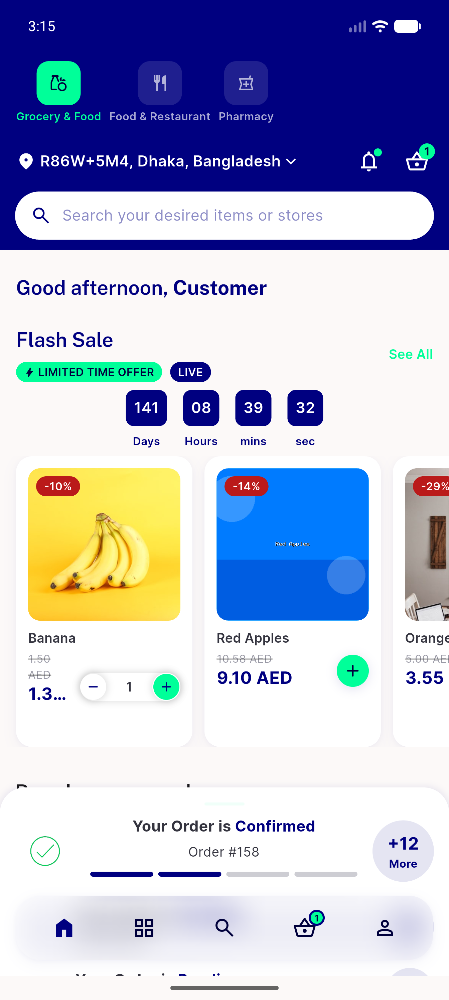
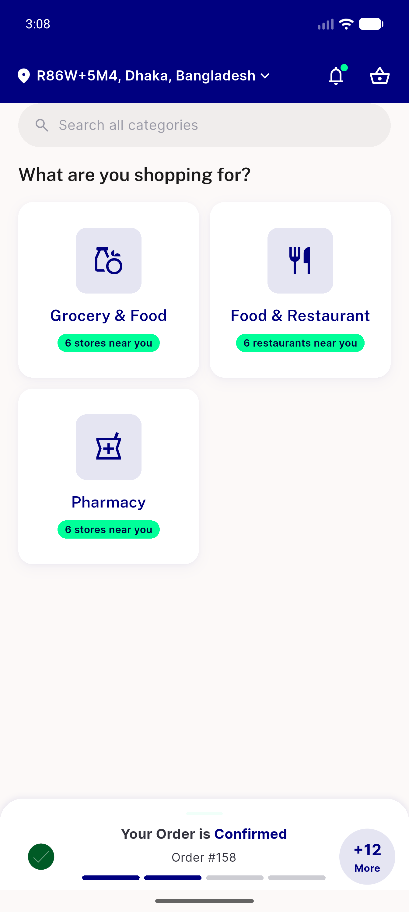
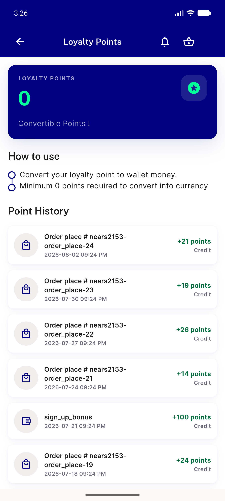
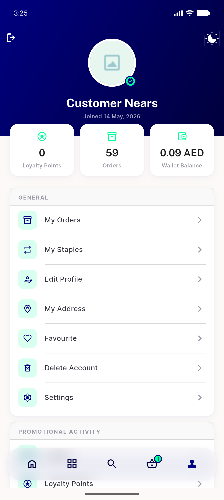

# QA Evidence — NEARS-2150

**PASS - live-device happy-path demo + regression sweep clean (delta cycle 2, device-availability retry)**

**7 screenshot(s).** Click any thumbnail for full resolution.

<table>
<tr>
<td align="center" width="33%"> boot</td>
<td align="center" width="33%"> checkout surge</td>
<td align="center" width="33%"> grocery home</td>
</tr>
<tr>
<td align="center" width="33%"> home module 5566</td>
<td align="center" width="33%"> home screen</td>
<td align="center" width="33%"> loyalty points</td>
</tr>
<tr>
<td align="center" width="33%"> profile screen dbg</td>
</tr>
</table>

### Other artifacts
- [`bug-distance-parse-outofzone.log`](bug-distance-parse-outofzone.log)

---
*From `nears/docs/qa-evidence/NEARS-2150/` · public-repo scrub policy (no live secrets; verified clean).*
