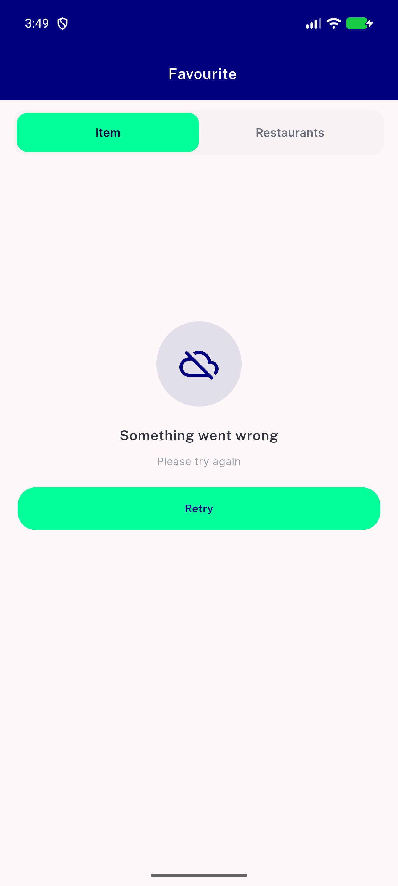

# QA Evidence — NEARS-2154

**PASS - wallet back-arrow canPop-first fix verified live on emulator-5560 (AC2 notif+live-stack, AC3 ordinary entry, both app-bar arrow and system BACK consistent)**

**1 screenshot(s).** Click any thumbnail for full resolution.

<table>
<tr>
<td align="center" width="33%"> ac2 backarrow lands favourite</td>
</tr>
</table>

### Other artifacts
- [`progress.md`](progress.md)

---
*From `nears/docs/qa-evidence/NEARS-2154/` · public-repo scrub policy (no live secrets; verified clean).*
