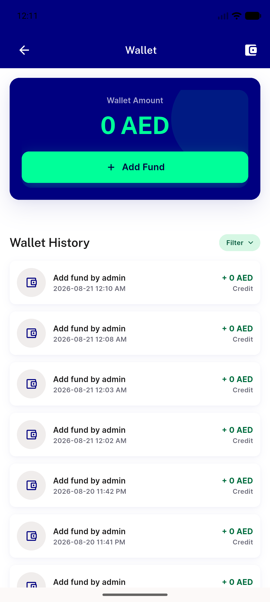

# QA Evidence — NEARS-2156

**cycle-1 delta re-QA PASS: AC3 confirmed fixed 2/2, TB-2156-1 closed**

**6 screenshot(s).** Click any thumbnail for full resolution.

<table>
<tr>
<td align="center" width="33%"> attempt3 module select mislanding</td>
<td align="center" width="33%"> cycle1 attempt1 notification tray</td>
<td align="center" width="33%"> cycle1 attempt1 wallet landing</td>
</tr>
<tr>
<td align="center" width="33%"> cycle1 attempt2 notification tray</td>
<td align="center" width="33%"> cycle1 attempt2 wallet landing</td>
<td align="center" width="33%"> cycle1 regression cold launch moduleselect</td>
</tr>
</table>

### Other artifacts
- [`cycle1-attempt1-logcat.log`](cycle1-attempt1-logcat.log)
- [`cycle1-attempt2-logcat.log`](cycle1-attempt2-logcat.log)
- [`cycle1-regression-cold-launch-logcat.log`](cycle1-regression-cold-launch-logcat.log)
- [`logcat-attempt1-full.log`](logcat-attempt1-full.log)
- [`logcat-attempt2-full.log`](logcat-attempt2-full.log)
- [`logcat-attempt3-full.log`](logcat-attempt3-full.log)
- [`progress.md`](progress.md)

---
*From `nears/docs/qa-evidence/NEARS-2156/` · public-repo scrub policy (no live secrets; verified clean).*
