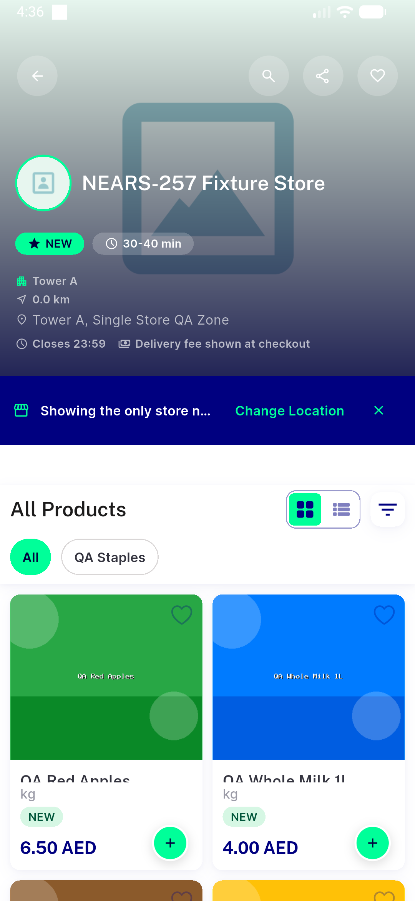

# QA Evidence — NEARS-2158

**PASS — kill_coldstart.sh AC1 (3/3 consecutive clean kills, stopped_flag=false, PID-verified) + AC2 (real FCM push cold-started killed app, new pid, tap foregrounded) live-confirmed on emulator-5568**

**1 screenshot(s).** Click any thumbnail for full resolution.

<table>
<tr>
<td align="center" width="33%"> ac2 cold start notification screen</td>
</tr>
</table>

### Other artifacts
- [`ac1-ac2-live-run.log`](ac1-ac2-live-run.log)
- [`bug-device-pool-saturated.log`](bug-device-pool-saturated.log)
- [`selftest-devicefree.log`](selftest-devicefree.log)

---
*From `nears/docs/qa-evidence/NEARS-2158/` · public-repo scrub policy (no live secrets; verified clean).*
