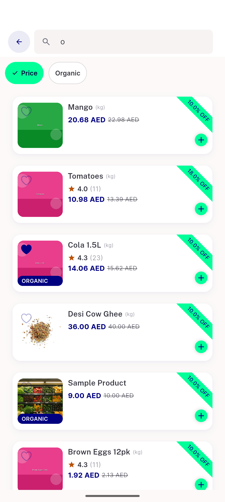
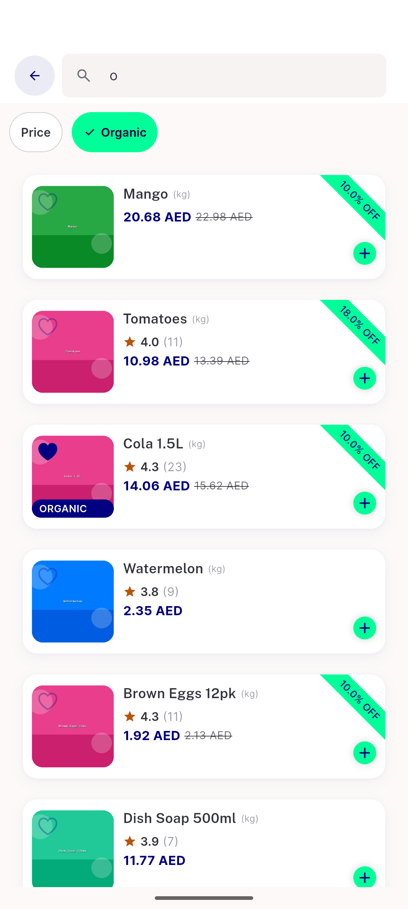
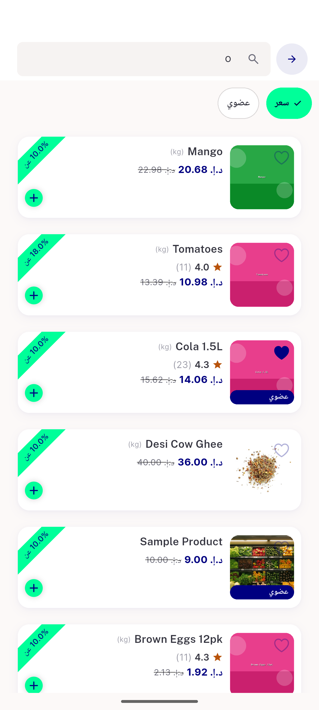
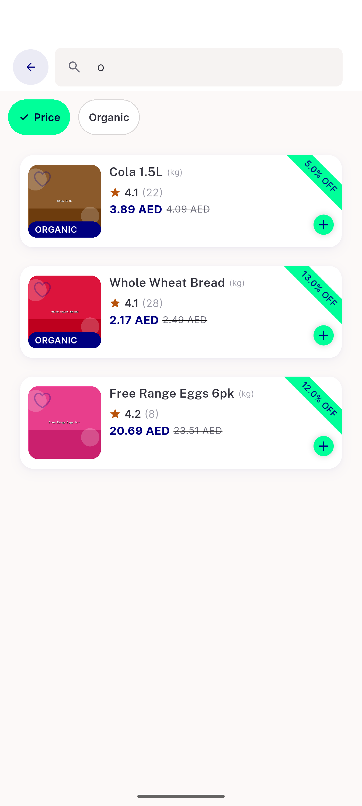

# QA Evidence — NEARS-2160

**PASS — search discount filter wired, verified store1+store38, LTR+RTL, filter=[discounted] on wire**

**6 screenshot(s).** Click any thumbnail for full resolution.

<table>
<tr>
<td align="center" width="33%"> ac1 store1 price on</td>
<td align="center" width="33%"> ac2 store1 organic on</td>
<td align="center" width="33%"> ac3 rtl store1 price on</td>
</tr>
<tr>
<td align="center" width="33%"> ac3 store38 price on</td>
<td align="center" width="33%"> regression browsegrid discounted</td>
<td align="center" width="33%"> regression filter sheet before</td>
</tr>
</table>

### Other artifacts
- [`ac1-wire-request-log.txt`](ac1-wire-request-log.txt)
- [`bug-otel-export-noise.log`](bug-otel-export-noise.log)

---
*From `nears/docs/qa-evidence/NEARS-2160/` · public-repo scrub policy (no live secrets; verified clean).*
