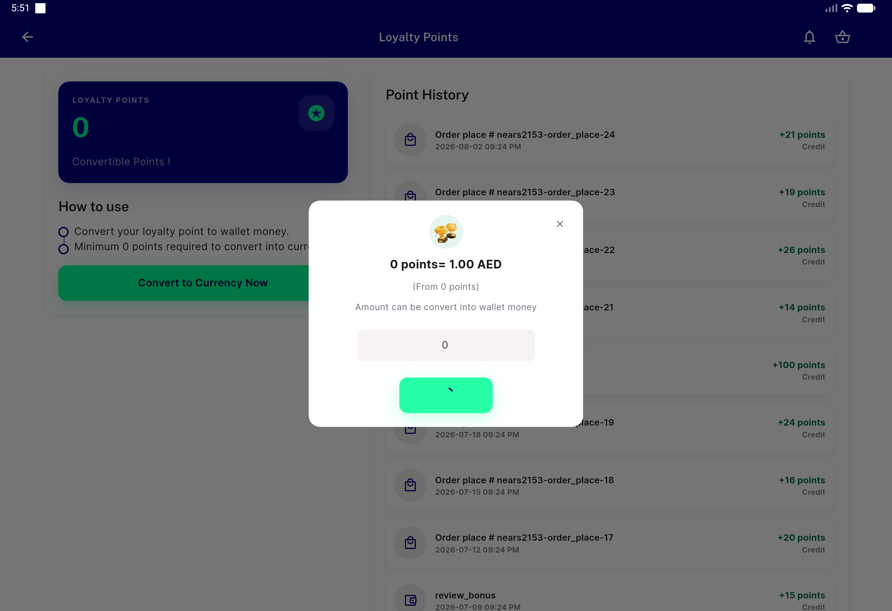
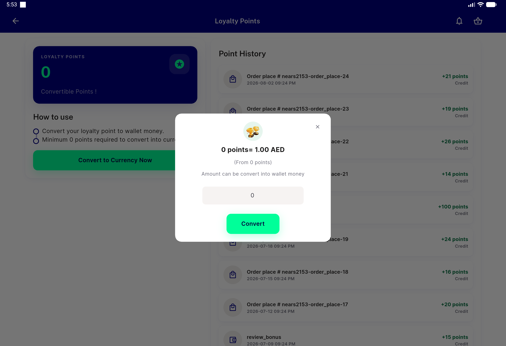
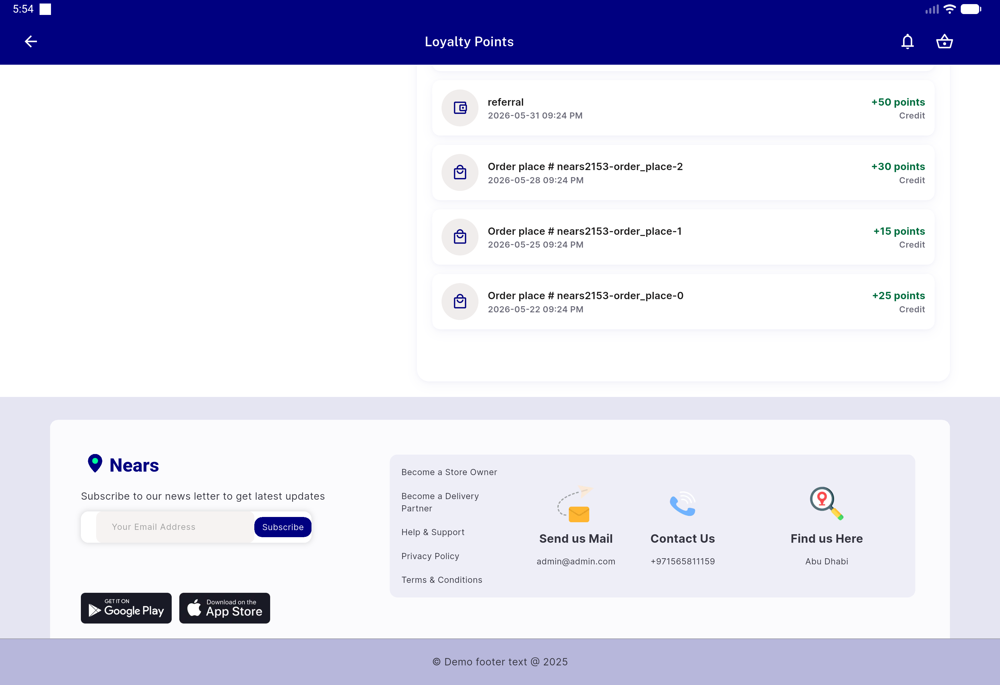
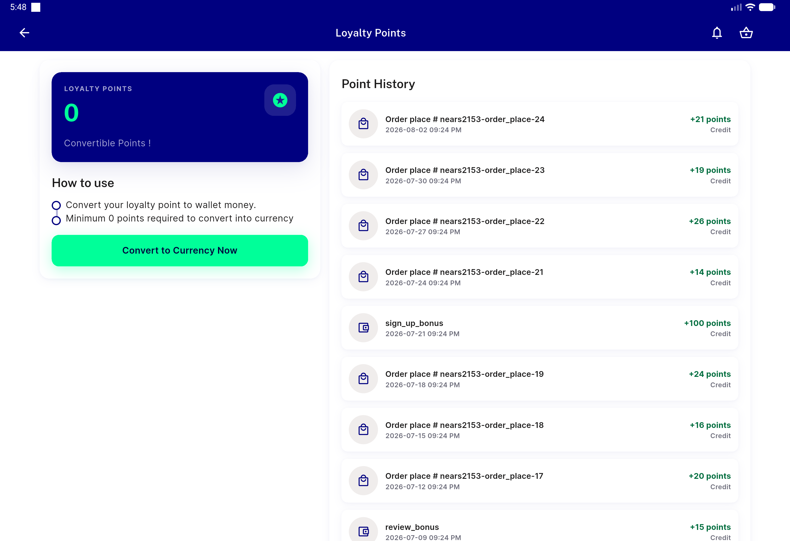

# QA Evidence — NEARS-2165

**PASS — light mode, emulator-5568, commit c3be3be1: AC1 fallback (structural+unit-test) + AC2 live regression**

**4 screenshot(s).** Click any thumbnail for full resolution.

<table>
<tr>
<td align="center" width="33%"> ac1 ac2 convert cta spinner inflight</td>
<td align="center" width="33%"> ac2 convert cta spinner cleared after resolve</td>
<td align="center" width="33%"> ac2 history loadmore standalone success</td>
</tr>
<tr>
<td align="center" width="33%"> ac2 loyalty screen baseline</td>
</tr>
</table>

### Other artifacts
- [`ac1-network-timing-logcat.log`](ac1-network-timing-logcat.log)

---
*From `nears/docs/qa-evidence/NEARS-2165/` · public-repo scrub policy (no live secrets; verified clean).*
