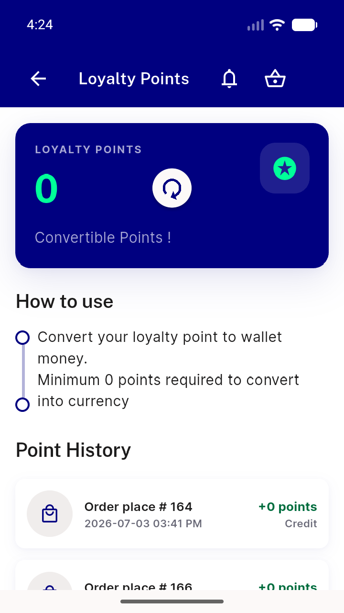
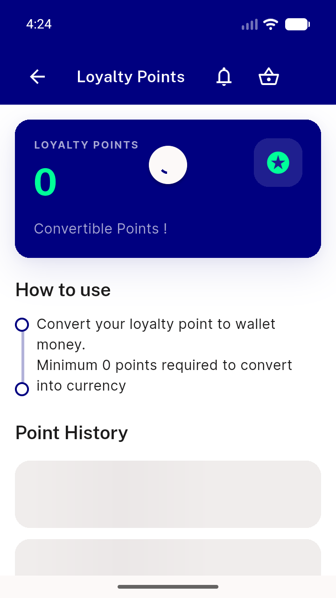
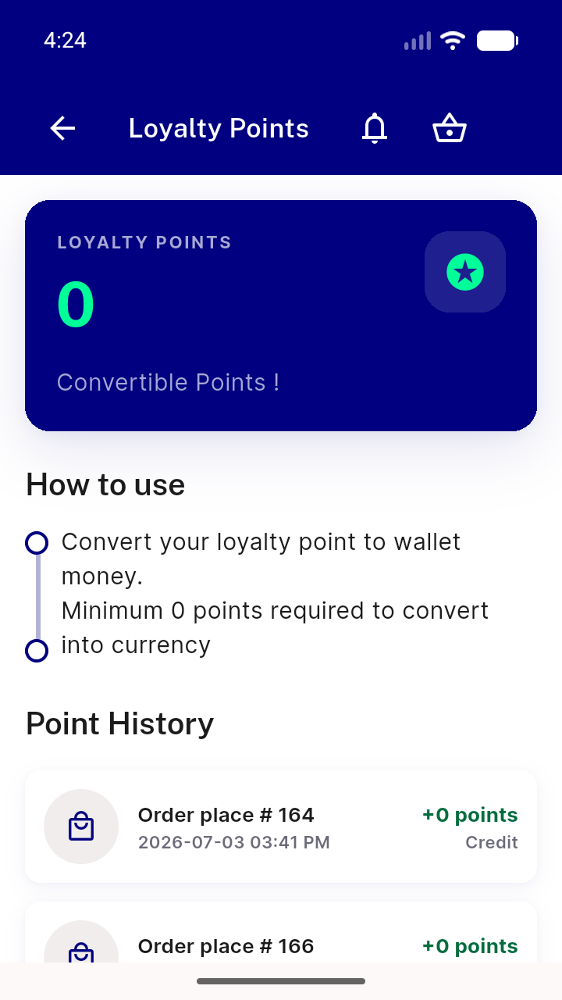

# QA Evidence — NEARS-2166

**PASS — pull-to-refresh spinner holds until both userInfo+transactions settle (NEARS-2166 fix cycle 1)**

**3 screenshot(s).** Click any thumbnail for full resolution.

<table>
<tr>
<td align="center" width="33%"> ac1 pull t0 spinner appears</td>
<td align="center" width="33%"> ac1 pull t300ms spinner holds inflight</td>
<td align="center" width="33%"> ac1 pull t800ms spinner retracted data settled</td>
</tr>
</table>

---
*From `nears/docs/qa-evidence/NEARS-2166/` · public-repo scrub policy (no live secrets; verified clean).*
