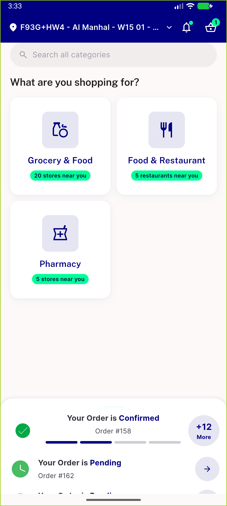
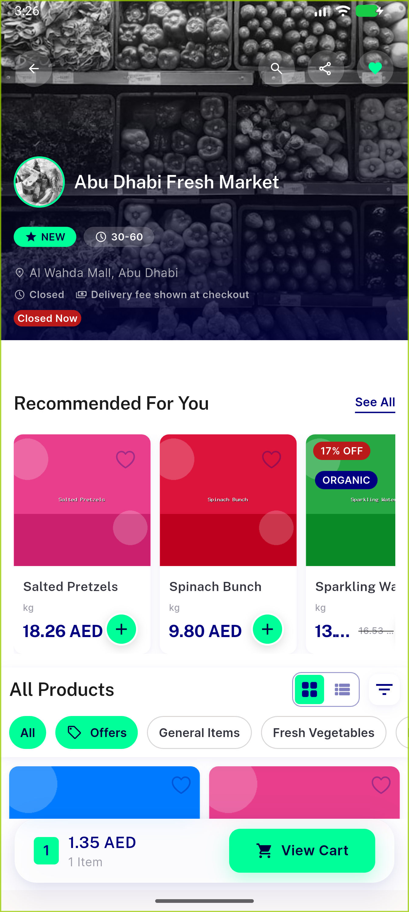

# QA Evidence — NEARS-2172

**PASS - live device retry, module null-guard verified**

**2 screenshot(s).** Click any thumbnail for full resolution.

<table>
<tr>
<td align="center" width="33%"> module null sector picker</td>
<td align="center" width="33%"> store detail module nonnull</td>
</tr>
</table>

### Other artifacts
- [`ac1-module-null-precondition.log`](ac1-module-null-precondition.log)
- [`ac1-share-url-nonnull.log`](ac1-share-url-nonnull.log)
- [`ac2-mobile-branch-dead-code.log`](ac2-mobile-branch-dead-code.log)
- [`progress.md`](progress.md)

---
*From `nears/docs/qa-evidence/NEARS-2172/` · public-repo scrub policy (no live secrets; verified clean).*
