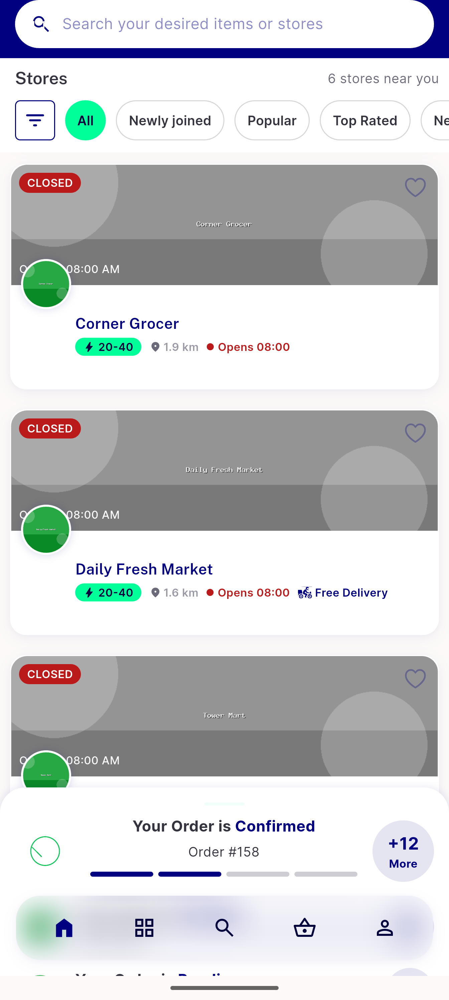
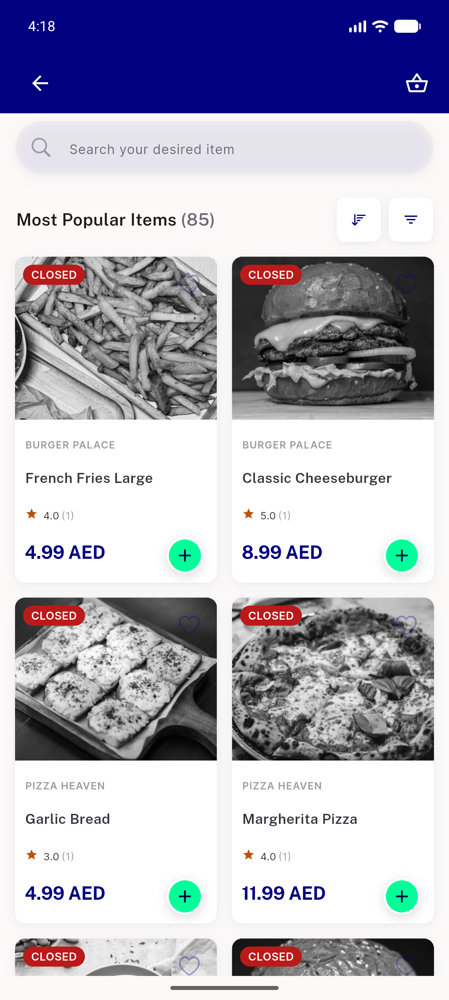
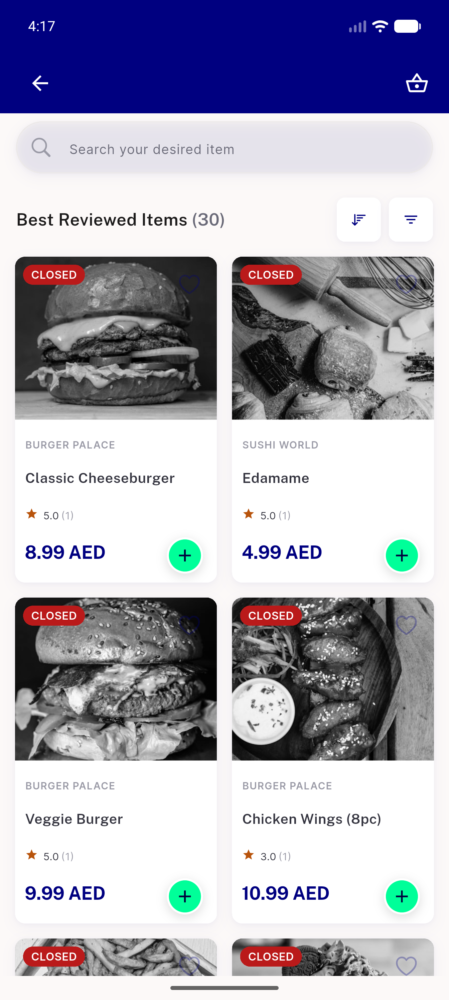

# QA Evidence — NEARS-2181

**PASS — surviving popular/reviewed view-all axes unaffected by 3-way->2-way ItemController refactor; grid render, pagination, filter/sort/reset all live-confirmed; flutter test +4318 ~2 all passed**

**4 screenshot(s).** Click any thumbnail for full resolution.

<table>
<tr>
<td align="center" width="33%"> grocery home nothing open</td>
<td align="center" width="33%"> mostpopular viewall</td>
<td align="center" width="33%"> reviewed filtered</td>
</tr>
<tr>
<td align="center" width="33%"> reviewed viewall</td>
</tr>
</table>

---
*From `nears/docs/qa-evidence/NEARS-2181/` · public-repo scrub policy (no live secrets; verified clean).*
