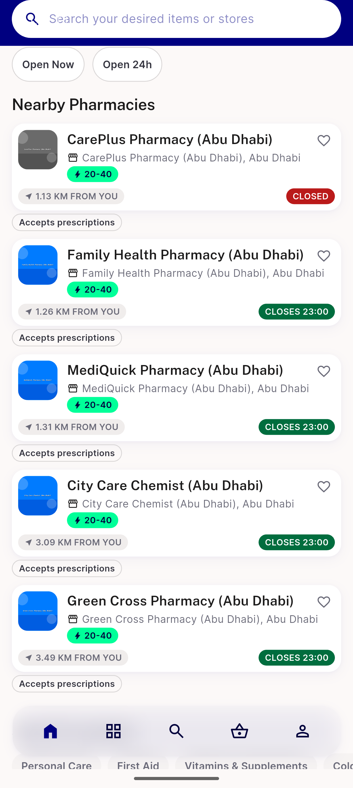

# QA Evidence — NEARS-2182

**PASS - AC-1 verified via automated guard test (verifyNever), AC-2 verified via automated positive-control test + live device run (getConditionsWiseItem dispatched, /api/v1/common-condition/items/1 200)**

**1 screenshot(s).** Click any thumbnail for full resolution.

<table>
<tr>
<td align="center" width="33%"> pharmacy conditions rail</td>
</tr>
</table>

---
*From `nears/docs/qa-evidence/NEARS-2182/` · public-repo scrub policy (no live secrets; verified clean).*
