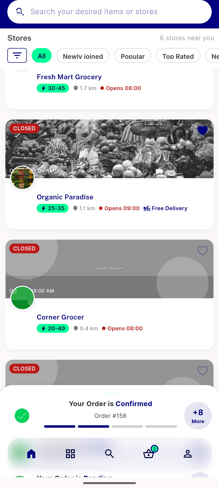
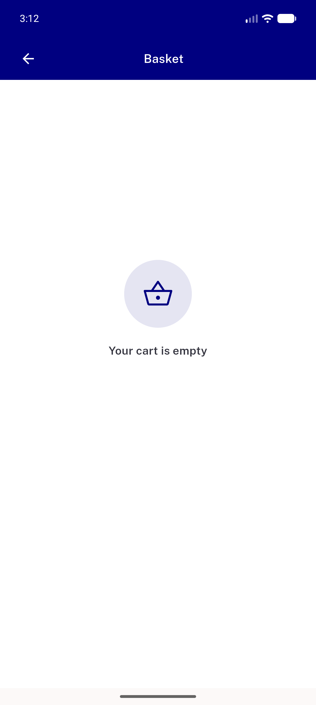

# QA Evidence — NEARS-2184

**PASS with 2 task_bugs — stale moduleId header cleared on sector back-out (wire-captured)**

**3 screenshot(s).** Click any thumbnail for full resolution.

<table>
<tr>
<td align="center" width="33%"> ac sector picker after backout</td>
<td align="center" width="33%"> ac1 grocery home after backout</td>
<td align="center" width="33%"> bug cart empty no sector</td>
</tr>
</table>

### Other artifacts
- [`ac1-wire-capture-moduleid-header.log`](ac1-wire-capture-moduleid-header.log)
- [`ac2-cachemoduleid-pref-pre-post.log`](ac2-cachemoduleid-pref-pre-post.log)
- [`bug-403-module-id-required-after-backout.log`](bug-403-module-id-required-after-backout.log)
- [`bug-cart-empty-no-sector.log`](bug-cart-empty-no-sector.log)
- [`bug-silent-403-stores-details.log`](bug-silent-403-stores-details.log)

---
*From `nears/docs/qa-evidence/NEARS-2184/` · public-repo scrub policy (no live secrets; verified clean).*
