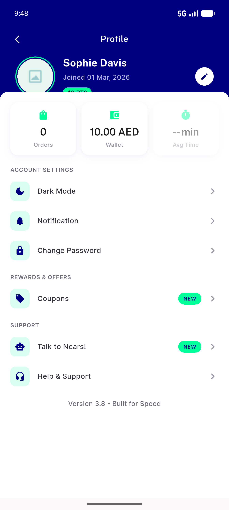
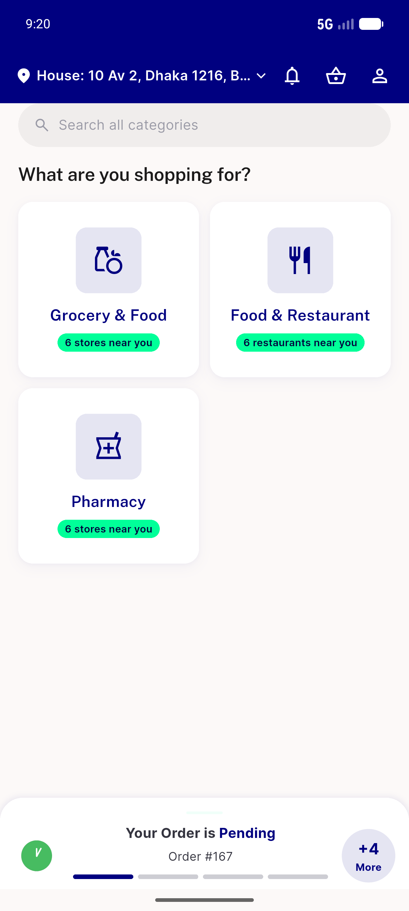
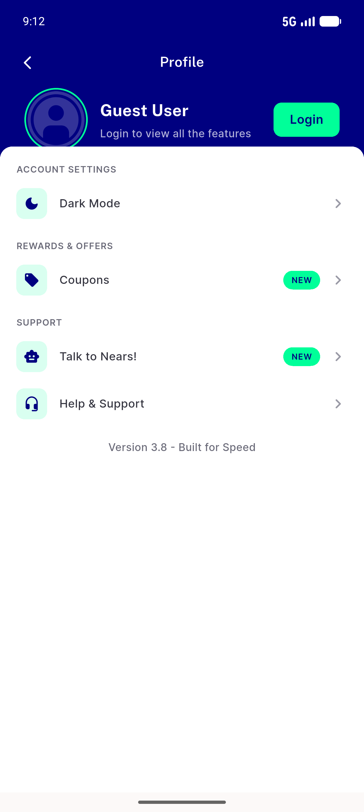
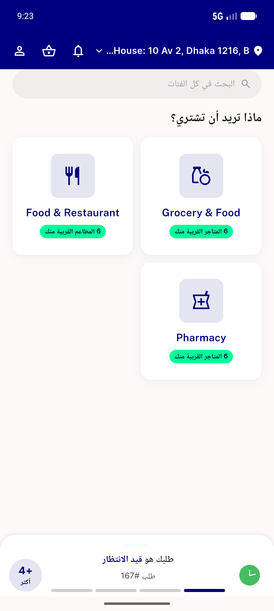
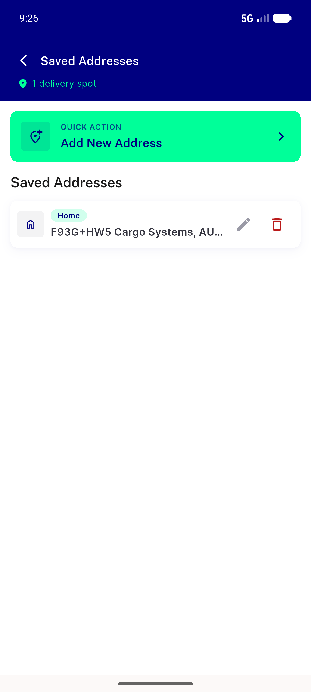
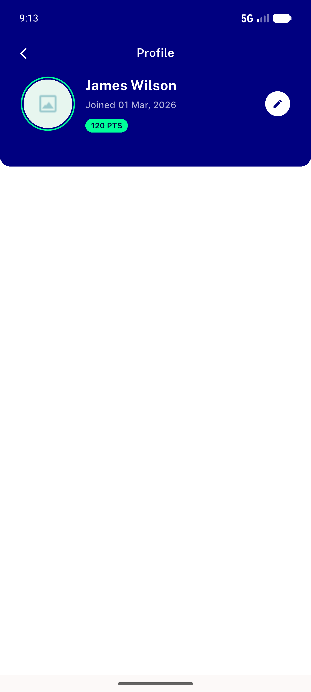

# QA Evidence — NEARS-2188

**delta re-QA cycle1: crash fixed (PASS), but ProfileScreen structurally lacks Addresses+Logout reachability (FAIL, new task_bug)**

**10 screenshot(s).** Click any thumbnail for full resolution.

<table>
<tr>
<td align="center" width="33%"> ac1 no tracker module selection</td>
<td align="center" width="33%"> ac1 profile no tracker fixed</td>
<td align="center" width="33%"> ac2 profile with tracker</td>
</tr>
<tr>
<td align="center" width="33%"> ac2 with tracker module selection</td>
<td align="center" width="33%"> ac4 guest profile screen</td>
<td align="center" width="33%"> ac7 rtl icon cluster</td>
</tr>
<tr>
<td align="center" width="33%"> ac8 address screen no stray icon</td>
<td align="center" width="33%"> bug profile loggedin render crash</td>
<td align="center" width="33%"> bug profile missing address logout</td>
</tr>
<tr>
<td align="center" width="33%"> unexpected login nudge</td>
</tr>
</table>

### Other artifacts
- [`ac2-with-tracker-a11y-dump.xml`](ac2-with-tracker-a11y-dump.xml)
- [`ac7-rtl-a11y-dump.xml`](ac7-rtl-a11y-dump.xml)
- [`bug-profile-loggedin-render-crash-a11y-dump.xml`](bug-profile-loggedin-render-crash-a11y-dump.xml)
- [`bug-profile-loggedin-render-crash.log`](bug-profile-loggedin-render-crash.log)
- [`positive-control-module-selection-a11y-dump.xml`](positive-control-module-selection-a11y-dump.xml)
- [`profile-screen-no-address-logout-a11y-dump.xml`](profile-screen-no-address-logout-a11y-dump.xml)

---
*From `nears/docs/qa-evidence/NEARS-2188/` · public-repo scrub policy (no live secrets; verified clean).*
