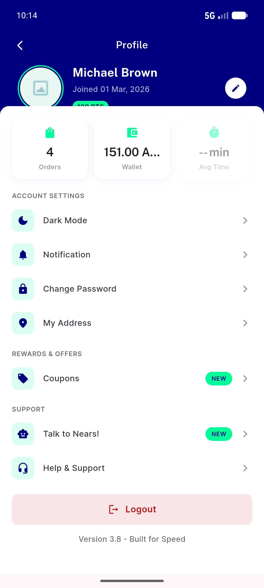
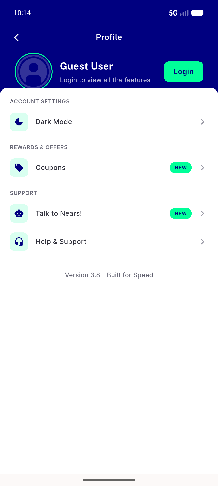

# QA Evidence — NEARS-2188

**cycle2 PASS - AC3 Addresses+Logout wired, post-logout nav coherent (GetBuilder reactivity, not offAllNamed)**

**2 screenshot(s).** Click any thumbnail for full resolution.

<table>
<tr>
<td align="center" width="33%"> cycle2 ac3 profile address logout tiles</td>
<td align="center" width="33%"> cycle2 postlogout transient state</td>
</tr>
</table>

### Other artifacts
- [`cycle2-postlogout-navigation-check.log`](cycle2-postlogout-navigation-check.log)

---
*From `nears/docs/qa-evidence/NEARS-2188/` · public-repo scrub policy (no live secrets; verified clean).*
