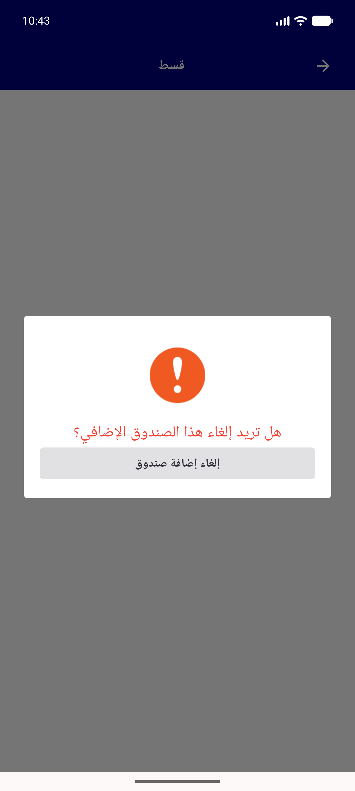

# QA Evidence — NEARS-2190

**cycle3: FAIL - rapid double back-press at ~500ms gap still ends with dialog dismissed (canPop-gate only covers ~200-250ms transition, not the full 500ms window the original repro established); ~150ms gap correctly absorbed (2/2); barrier-tap timing (early absorb / late dismiss) confirmed correct per F1 review fix**

**11 screenshot(s).** Click any thumbnail for full resolution.

<table>
<tr>
<td align="center" width="33%"> ac1 fundpaymentdialog appears on back</td>
<td align="center" width="33%"> ac2 cycle2 trial1 dialog fast</td>
<td align="center" width="33%"> bug cycle2 doubleback recovers on third press</td>
</tr>
<tr>
<td align="center" width="33%"> bug cycle2 trialB doubleback no dialog 6s</td>
<td align="center" width="33%"> bug cycle2 trialC doubleback no dialog</td>
<td align="center" width="33%"> bug rapid back wedge</td>
</tr>
<tr>
<td align="center" width="33%"> checkout cod only config limitation</td>
<td align="center" width="33%"> cycle3 ac3 single back dialog</td>
<td align="center" width="33%"> cycle3 doubleback 150ms trial1</td>
</tr>
<tr>
<td align="center" width="33%"> cycle3 doubleback 500ms trial4 FAIL</td>
<td align="center" width="33%"> regression barrier dismiss state</td>
</tr>
</table>

---
*From `nears/docs/qa-evidence/NEARS-2190/` · public-repo scrub policy (no live secrets; verified clean).*
