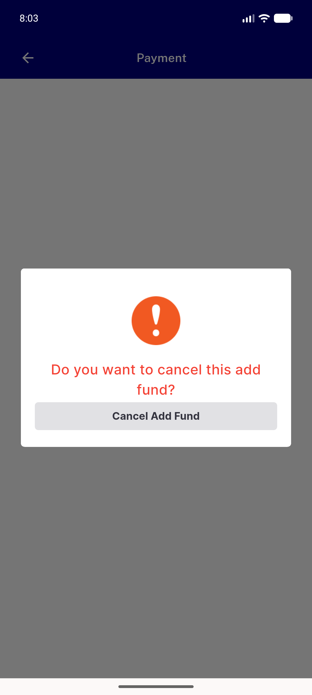
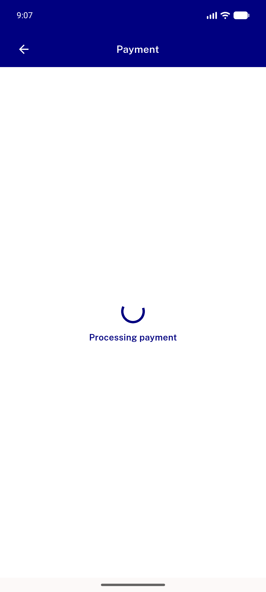
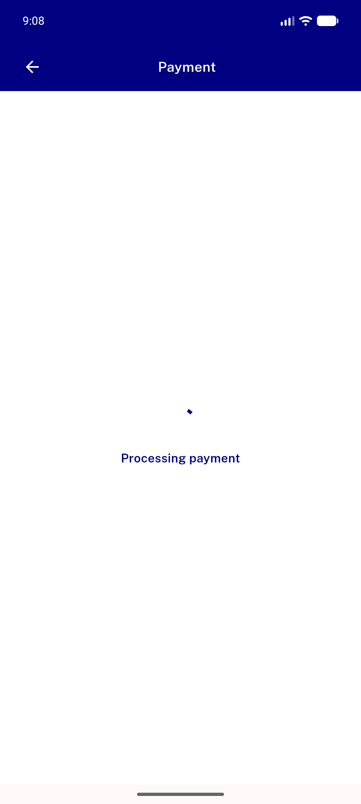
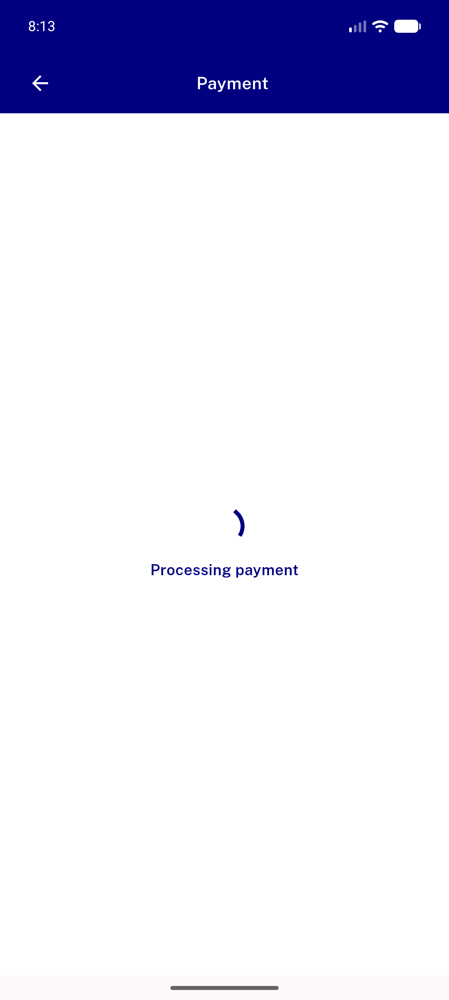
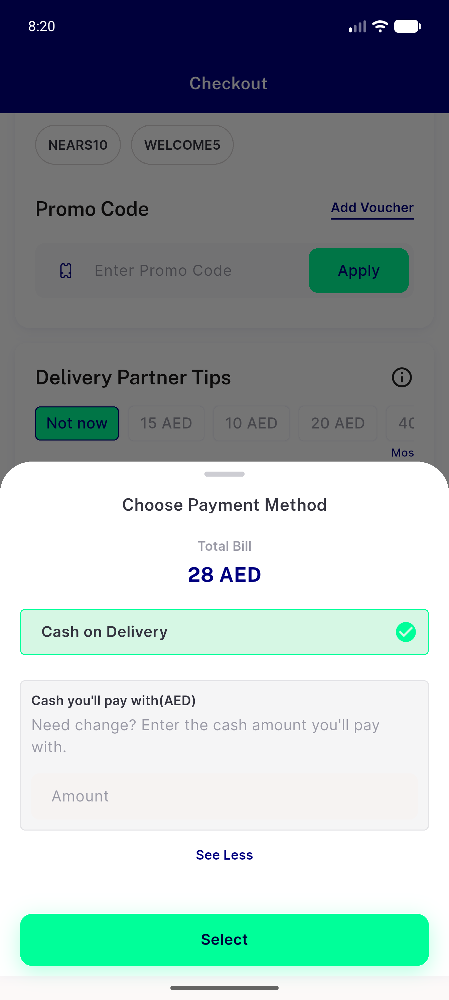

# QA Evidence — NEARS-2190

**cycle-2 delta re-QA: AC2 STILL FAILS -- rapid double back-press silently swallows the exit dialog (needs a 3rd back-press), AC1+barrier-reappear PASS**

**8 screenshot(s).** Click any thumbnail for full resolution.

<table>
<tr>
<td align="center" width="33%"> ac1 fundpaymentdialog appears on back</td>
<td align="center" width="33%"> ac2 cycle2 trial1 dialog fast</td>
<td align="center" width="33%"> bug cycle2 doubleback recovers on third press</td>
</tr>
<tr>
<td align="center" width="33%"> bug cycle2 trialB doubleback no dialog 6s</td>
<td align="center" width="33%"> bug cycle2 trialC doubleback no dialog</td>
<td align="center" width="33%"> bug rapid back wedge</td>
</tr>
<tr>
<td align="center" width="33%"> checkout cod only config limitation</td>
<td align="center" width="33%"> regression barrier dismiss state</td>
</tr>
</table>

---
*From `nears/docs/qa-evidence/NEARS-2190/` · public-repo scrub policy (no live secrets; verified clean).*
