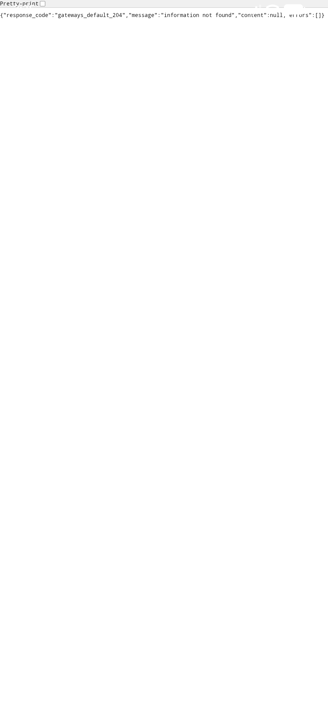
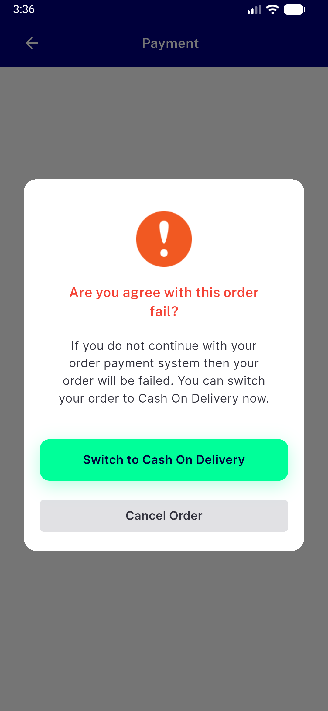

# QA Evidence — NEARS-2196

**PASS: AC3 live smoke (checkout to digital payment webview) + _exitApp back-press guard, no crash/FAIL**

**2 screenshot(s).** Click any thumbnail for full resolution.

<table>
<tr>
<td align="center" width="33%"> ac3 payment screen webview</td>
<td align="center" width="33%"> exitapp guard paymentfaileddialog</td>
</tr>
</table>

---
*From `nears/docs/qa-evidence/NEARS-2196/` · public-repo scrub policy (no live secrets; verified clean).*
