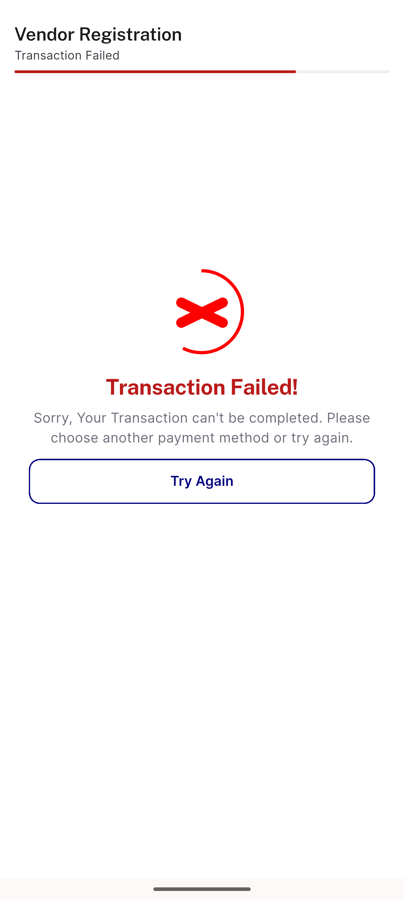
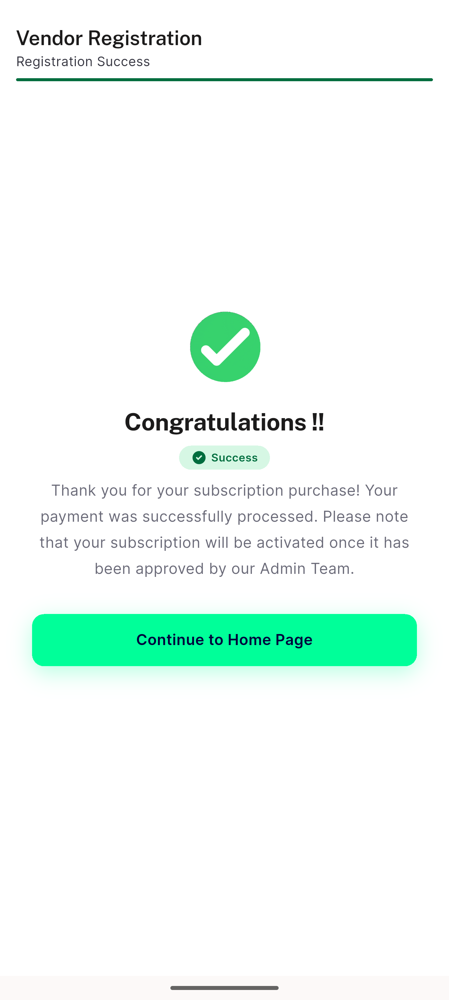
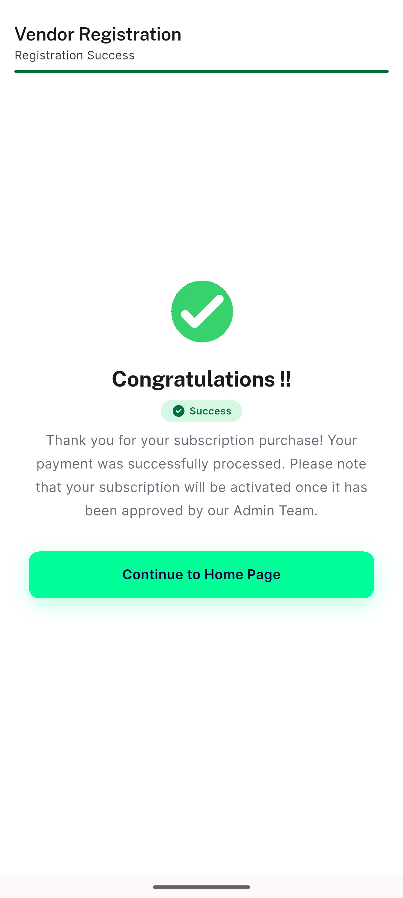
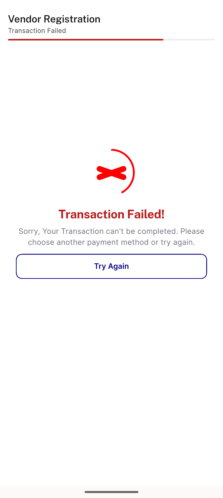
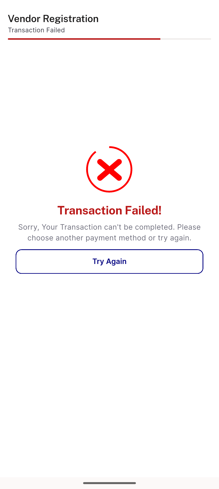
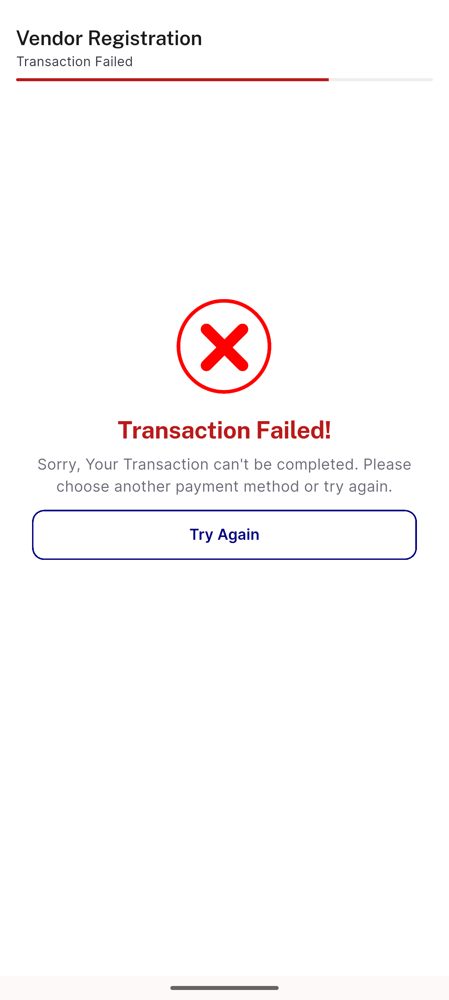
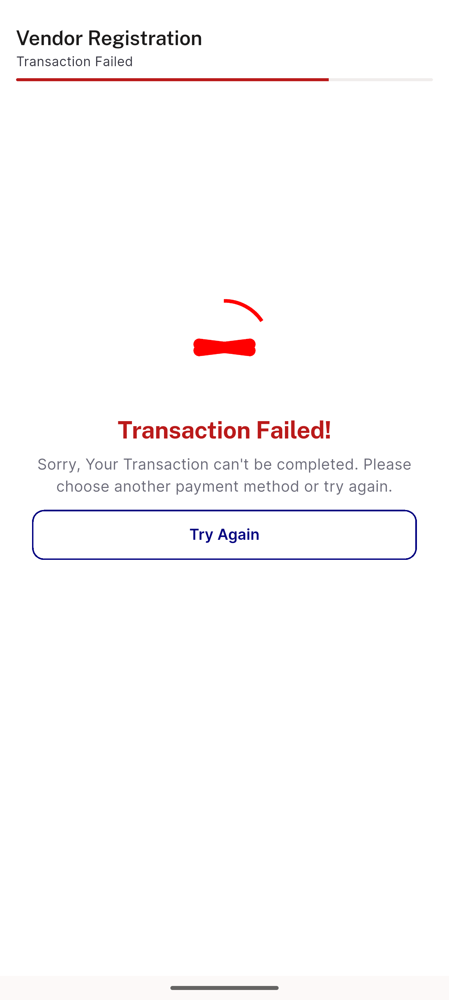

# QA Evidence — NEARS-2198

**PASS — subscription outcome now classified from ?flag=; failure/cancel land on _FailedBody with registration prefs unwritten; success regression + wallet path intact**

**10 screenshot(s).** Click any thumbnail for full resolution.

<table>
<tr>
<td align="center" width="33%"> ac1 flag fail failedbody</td>
<td align="center" width="33%"> ac1 live fail doubleamp</td>
<td align="center" width="33%"> ac3 flag success successbody</td>
</tr>
<tr>
<td align="center" width="33%"> ac3 live success tokenfirst doubleamp</td>
<td align="center" width="33%"> ac4 flag cancel failedbody</td>
<td align="center" width="33%"> ac4 live cancel doubleamp</td>
</tr>
<tr>
<td align="center" width="33%"> edge live emptyflag doubleamp</td>
<td align="center" width="33%"> edge live noquery</td>
<td align="center" width="33%"> edge no query failedbody</td>
</tr>
<tr>
<td align="center" width="33%"> prefix control BASE build flagfail shows success</td>
</tr>
</table>

### Other artifacts
- [`bug-payment-close-uncaught-assertion.log`](bug-payment-close-uncaught-assertion.log)
- [`bug-payment-route-unencoded-suburl.log`](bug-payment-route-unencoded-suburl.log)

---
*From `nears/docs/qa-evidence/NEARS-2198/` · public-repo scrub policy (no live secrets; verified clean).*
