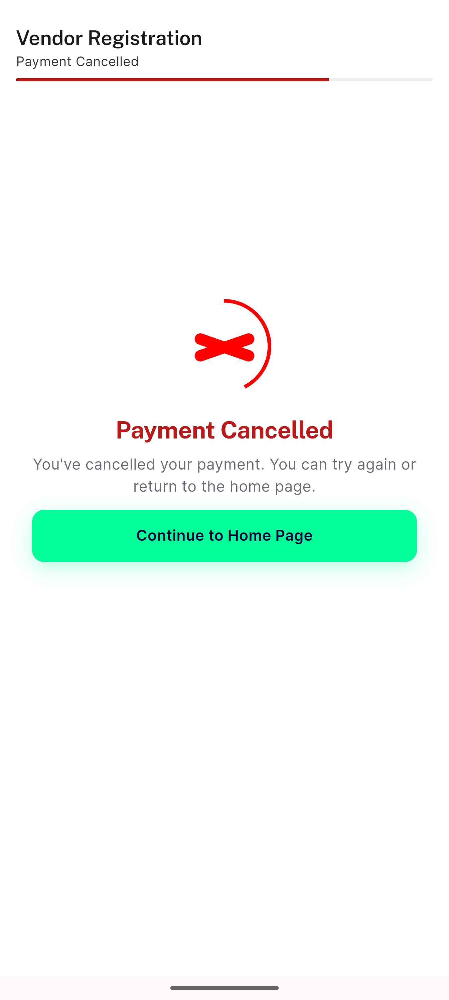
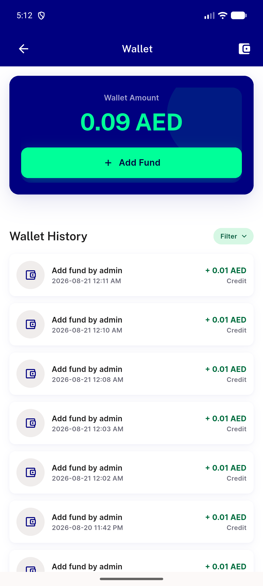

# QA Evidence — NEARS-2199

**PASS — subscription cancel outcome shows distinct 'Payment Cancelled' copy; fail path unchanged; wallet regression clean**

**3 screenshot(s).** Click any thumbnail for full resolution.

<table>
<tr>
<td align="center" width="33%"> ac1 ac2 cancel screen</td>
<td align="center" width="33%"> ac3 fail screen</td>
<td align="center" width="33%"> regression wallet unaffected</td>
</tr>
</table>

### Other artifacts
- [`ac1-ac2-cancel-a11y-dump.xml`](ac1-ac2-cancel-a11y-dump.xml)
- [`ac3-fail-a11y-dump.xml`](ac3-fail-a11y-dump.xml)

---
*From `nears/docs/qa-evidence/NEARS-2199/` · public-repo scrub policy (no live secrets; verified clean).*
