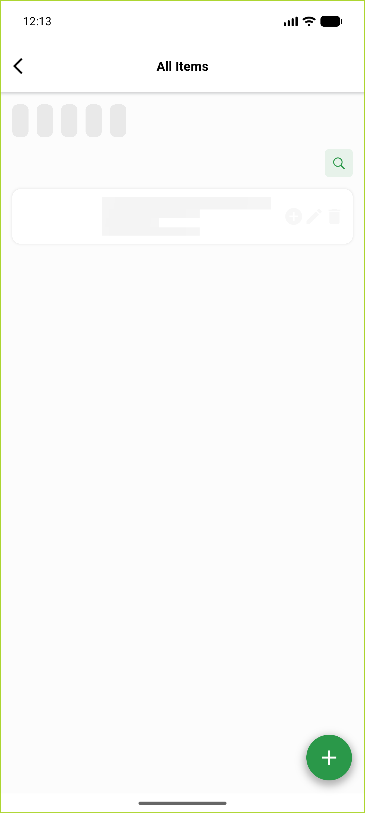

# QA Evidence — NEARS-2202

**PASS — 4/4 ACs demonstrated live; 2 pre-existing VendorApp regressions filed**

**1 screenshot(s).** Click any thumbnail for full resolution.

<table>
<tr>
<td align="center" width="33%"> bug vendorapp items list shimmer</td>
</tr>
</table>

### Other artifacts
- [`ac1-ac2-ac3-api-shape.log`](ac1-ac2-ac3-api-shape.log)
- [`ac2-ac4-prefix-vs-postfix-ab.log`](ac2-ac4-prefix-vs-postfix-ab.log)
- [`bug-vendorapp-customer-review-null-check.log`](bug-vendorapp-customer-review-null-check.log)
- [`bug-vendorapp-itemmodel-offset-type.log`](bug-vendorapp-itemmodel-offset-type.log)
- [`progress.md`](progress.md)

---
*From `nears/docs/qa-evidence/NEARS-2202/` · public-repo scrub policy (no live secrets; verified clean).*
